# 面向异构供应商的插件化景区门票交易系统设计与实现

**Design and Implementation of a Plugin-based Ticket Transaction System for Tourist Attractions with Heterogeneous Suppliers**

| 项目 | 内容 |
| --- | --- |
| 学生姓名 | 罗于迪 |
| 学号 | SA24225275 |
| 导师 | 邢凯 |
| 实践导师 | 汪伟 |
| 院系 | 中国科学技术大学软件学院 |
| 学科专业 | 软件工程 |
| 研究方向 | 应用系统设计 |
| 原稿提交日期 | 二〇二六年九月十七日 |
| 修改稿版本 | V0.20，2026年10月8日 |

# 中国科学技术大学学位论文原创性声明

本人声明所呈交的学位论文，是本人在导师指导下进行研究工作所取得的成果。除已特别加以标注和致谢的地方外，论文中不包含任何他人已经发表或撰写过的研究成果。与我一同工作的同志对本研究所做的贡献均已在论文中作了明确的说明。

作者签名：                  签字日期：

# 中国科学技术大学学位论文使用授权声明

作为申请学位的条件之一，学位论文著作权拥有者授权中国科学技术大学拥有学位论文的部分使用权，即：学校有权按有关规定向国家有关部门或机构送交论文的复印件和电子版，允许论文被查阅和借阅，可以将学位论文编入《中国学位论文全文数据库》等有关数据库进行检索，可以采用影印、缩印或扫描等复制手段保存、汇编学位论文。本人提交的电子文档的内容和纸质论文的内容相一致，如因不符而引起的学术声誉损失由本人自负。控阅的学位论文在解除控阅后也遵守此规定。

☑ 公开　□ 控阅（　年）

作者签名：                  导师签名：

签字日期：                  签字日期：

# 人工智能工具使用说明（待按学校模板填写）

> 本页为提交材料占位，不是学校正式声明。本文修改过程中使用了生成式人工智能工具辅助结构调整和文字编辑。正式提交时，须按学校当时适用的模板如实说明使用范围，由作者核对论文内容、引用与证据后填写并签署。

# 摘要

在线旅游平台需要持续接入大量景区门票供应商，各家的接口协议、调用时机和定制需求差异大且变化频繁。传统交易系统把全部对接逻辑放在同一个交易集群中：供应商越多，协议分支和私有依赖越多，代码复杂度逐渐失控，迭代和维护成本随之升高；任何一家供应商的改动都要重新发布整个集群，一次发布耗时 3 至 5 小时；一家供应商的依赖冲突或运行异常还会波及其他供应商。本文的目的是通过插件化架构降低供应商接入的开发成本，提高发布效率，并降低运维成本。

本文设计并实现了一个面向异构供应商的插件化景区门票交易系统。系统按业务阶段和操作目的划分扩展点，一家供应商对应一个插件包，鉴权、报文转换、外部调用和私有依赖都封装在插件中，可以单独开发、构建和发布。插件运行时基于 PF4J 完成装载、能力发现和调用分派，并为每个插件分配独立的类加载器，使插件之间依赖互不干扰，单个插件的失败不扩散到其他插件。宿主中的交易执行引擎统一负责状态更新、幂等控制、结果确认和失败处理，保证不同插件返回的结果对上游具有一致含义。本文以两家调用时机不同的脱敏供应商为案例，说明扩展点对阶段差异的容纳方式。

本文完成了需求分析、概要设计、详细设计和测试设计，给出了插件调用分派、标准结果条件应用和组合商品价格库存计算三项算法，并采用场景法、等价类与边界值和决策表设计了测试用例。现有日志材料验证了供应商业务拒绝和标准价格库存响应两类结果，其余用例的执行记录有待补充。设计表明，在共享契约兼容的前提下，新增供应商或修改单家对接逻辑只需交付对应插件，无需重新发布整个交易集群。

关键词：插件化架构　扩展点　类加载隔离　异构供应商　门票交易系统

# ABSTRACT

Online travel platforms must keep integrating a large number of scenic-area ticket suppliers whose protocols, call timing and customization requirements differ widely and change often. A conventional transaction system places every supplier integration in one cluster. As suppliers are added, protocol branches and private dependencies accumulate, code complexity grows out of control, and iteration and maintenance become costly. Any change for one supplier requires the whole cluster to be released again, which takes three to five hours, and a dependency conflict or runtime failure in one integration can affect the others. This thesis aims to reduce development cost, improve release efficiency and lower operations cost through a plugin architecture.

The thesis designs and implements a plugin-based ticket transaction system for heterogeneous suppliers. Extension points are defined by business stage and operation purpose. Each supplier is delivered as one plugin package that contains its authentication, message conversion, external calls and private dependencies, so it can be developed, built and released on its own. A plugin runtime built on PF4J loads plugins, discovers their capabilities and dispatches calls, and gives each plugin its own class loader, so plugin dependencies do not interfere with each other and the failure of one plugin stays within its call boundary. A transaction execution engine in the host handles state updates, idempotency, result confirmation and failure processing, so results returned by different plugins carry one meaning for upstream systems. Two anonymized suppliers with clearly different protocols and call timing are used as cases to show how the extension points absorb stage differences.

The thesis completes the requirements analysis, high-level design, detailed design and test design of the system. It presents algorithms for plugin invocation dispatch, conditional application of standard results, and price and stock calculation for combined products, and designs functional and non-functional test cases using scenario-based testing, equivalence partitioning with boundary values, and decision tables. Existing log evidence confirms two kinds of results, a supplier business rejection and a standard price-stock response; execution records for the remaining cases are still to be collected. The design shows that, under a compatible shared contract, adding a supplier or changing one supplier's integration only requires delivering the corresponding plugin, without releasing the whole transaction cluster again.

KEYWORDS: plugin architecture, extension points, class loader isolation, heterogeneous suppliers, ticket transaction system

# 目录

- 第1章 绪论
  - 1.1 研究背景及意义
    - 1.1.1 研究背景
    - 1.1.2 研究意义
  - 1.2 国内外研究现状
    - 1.2.1 异构系统集成与接口适配
    - 1.2.2 插件化架构与类加载隔离
    - 1.2.3 票务系统与跨系统交易可靠性
    - 1.2.4 研究现状总结
  - 1.3 主要问题
  - 1.4 本文主要工作
  - 1.5 论文组织结构
- 第2章 相关技术分析
  - 2.1 插件化架构与扩展点
  - 2.2 PF4J 插件框架
  - 2.3 Java 类加载与插件隔离
  - 2.4 异构接口适配与契约设计
  - 2.5 系统开发相关技术
  - 2.6 本章小结
- 第3章 系统需求分析
  - 3.1 需求概述
  - 3.2 需求导出
  - 3.3 功能性需求
    - 3.3.1 门票交易功能需求
    - 3.3.2 价格库存同步功能需求
    - 3.3.3 插件化接入功能需求
  - 3.4 非功能性需求
    - 3.4.1 可扩展性需求
    - 3.4.2 可维护性需求
    - 3.4.3 可靠性需求
    - 3.4.4 性能需求
    - 3.4.5 安全性需求
  - 3.5 本章小结
- 第4章 系统概要设计
  - 4.1 系统边界与总体架构
    - 4.1.1 业务边界与调用关系
    - 4.1.2 宿主与插件的组件结构
    - 4.1.3 技术组织
    - 4.1.4 逻辑分层与部署视图
  - 4.2 插件化总体设计
    - 4.2.1 从供应商差异划分扩展点
    - 4.2.2 依赖隔离与故障隔离
    - 4.2.3 插件独立发布与契约演进
  - 4.3 交易执行引擎设计
    - 4.3.1 标准命令与本地执行记录
    - 4.3.2 状态约束与业务不变量
    - 4.3.3 幂等与本地一致性
    - 4.3.4 标准结果解释与查询确认
    - 4.3.5 失败处理与补偿决策
    - 4.3.6 通知收敛与上游回传
  - 4.4 插件运行时设计
    - 4.4.1 装载、能力发现与可调用状态
    - 4.4.2 路由上下文与调用分派
    - 4.4.3 维护窗口内的生命周期与替换
  - 4.5 供应商插件与价格库存设计
    - 4.5.1 外部协议转换与阶段适配
    - 4.5.2 本地价格日历同步
  - 4.6 数据模型设计
    - 4.6.1 逻辑实体与关联
    - 4.6.2 持久化约束与恢复依据
  - 4.7 设计对照与适用条件
  - 4.8 本章小结
- 第5章 系统详细设计与实现
  - 5.1 共享契约与插件运行机制
    - 5.1.1 Plugin API 的组织
    - 5.1.2 制品构建与类加载
    - 5.1.3 装载、发现与启停处理
    - 5.1.4 路由上下文与调用入口
  - 5.2 交易执行引擎的实现
    - 5.2.1 统一命令入口与执行单关联
    - 5.2.2 调用前校验与宿主幂等
    - 5.2.3 标准结果解释与本地应用
    - 5.2.4 出票查询与结果确认
    - 5.2.5 建单失败后的决策
    - 5.2.6 通知处理、凭证与退款执行
  - 5.3 典型供应商插件适配
    - 5.3.1 供应商 A 的占位调用链
    - 5.3.2 供应商 A 的查询、释放与错误转换
    - 5.3.3 供应商 B 的支付阶段调用与定时查询
    - 5.3.4 协议通知与标准事件的区别
  - 5.4 价格库存同步的详细处理
    - 5.4.1 场次与产品模型转换
    - 5.4.2 组合商品价格与库存
    - 5.4.3 缓存与日历更新
  - 5.5 对外与内部接口设计
    - 5.5.1 面向上游的标准交易接口
    - 5.5.2 内部调用与异常语义
  - 5.6 本章小结
- 第6章 系统测试
  - 6.1 测试概要
    - 6.1.1 测试对象与范围
    - 6.1.2 测试环境
    - 6.1.3 测试方法
  - 6.2 测试分析
    - 6.2.1 测试需求获取
    - 6.2.2 需求与测试用例的对应
  - 6.3 测试用例设计
    - 6.3.1 场景法：交易主流程
    - 6.3.2 等价类与边界值：组合商品计算
    - 6.3.3 决策表：插件调用分派
    - 6.3.4 其余功能测试用例
    - 6.3.5 非功能测试用例
  - 6.4 测试执行记录与结论
    - 6.4.1 已有执行证据
    - 6.4.2 执行情况统计
    - 6.4.3 覆盖度与缺陷统计
    - 6.4.4 发布范围与性能评价口径
    - 6.4.5 测试结论与局限
  - 6.5 本章小结
- 第7章 总结与展望
  - 7.1 本文总结
  - 7.2 未来展望

# 插图清单

- 图1-1 论文组织结构图
- 图3-1 门票直连交易用例图
- 图3-2 价格库存同步用例图
- 图3-3 插件治理子系统用例图
- 图3-4 系统运维用例图
- 图4-1 系统边界与插件化总体架构
- 图4-2 系统逻辑分层图
- 图4-3 系统部署图
- 图4-4 宿主、共享 Plugin API 与供应商插件的依赖图
- 图4-5 供应商侧交易执行的业务状态约束图
- 图4-6 一次交易经过交易执行引擎、插件运行时和供应商插件的时序
- 图4-7 价格库存同步流程
- 图4-8 核心逻辑实体关系图（E-R 图）
- 图5-1 Plugin API 类图
- 图5-2 宿主、Plugin API 与供应商插件的工程和制品关系
- 图5-3 插件装载与可调用注册流程
- 图5-4 维护窗口内插件停止与替换流程
- 图5-5 宿主核心协作类图
- 图5-6 交易执行引擎职责协作图
- 图5-7 交易结果确认时序
- 图5-8 核销或退款通知进入宿主状态更新的时序
- 图5-9 供应商 A 与供应商 B 的阶段适配对照
- 图5-10 价格库存拉取与更新时序
- 图6-1 原有订单锁库存业务校验失败日志
- 图6-2 原有价格库存查询与标准化结果日志
- 图6-3 支付后出票处理中的原有界面
- 图6-4 出票成功与凭证展示的原有界面
- 图6-5 本地价格库存日历的原有界面

# 附表清单

- 表2-1 常见供应商接入方式比较
- 表2-2 理论或方法与分析对象的对应关系
- 表2-3 系统主要开发技术的职责与选型依据
- 表3-1 系统参与方与职责边界
- 表3-2 两家案例供应商的异构特征与需求
- 表3-3 系统主要功能需求
- 表3-4 执行门票出票用例规约
- 表3-5 查询交易结果用例规约
- 表3-6 处理核销结果用例规约
- 表3-7 执行供应商退款用例规约
- 表3-8 同步价格库存用例规约
- 表3-9 接入供应商插件用例规约
- 表3-10 非功能性需求的量化指标
- 表4-1 插件化架构的职责划分
- 表4-2 扩展点与设计依据
- 表4-3 集中式集群发布与插件发布的对比
- 表4-4 交易执行的状态更新约束
- 表4-5 标准结果语义与执行引擎决策
- 表4-6 逻辑实体与保存内容
- 表4-7 系统边界与架构设计对照
- 表5-1 共享扩展契约的业务含义
- 表5-2 PF4J 与本文工作的边界
- 表5-3 插件分派的检查与失败处理
- 表5-4 结果应用与恢复职责
- 表5-5 建单失败后的决策顺序
- 表5-6 供应商 A 调用步骤与结果处理
- 表5-7 供应商 A 的状态映射
- 表5-8 标准通知处理需要的信息类别
- 表5-9 标准对外接口的业务设计
- 表5-10 内部异常与宿主处理
- 表6-1 测试对象与主要观察内容
- 表6-2 测试环境配置
- 表6-3 需求与测试用例的对应关系
- 表6-4 交易场景与测试用例
- 表6-5 用例 T-12：同一业务身份重复占位
- 表6-6 用例 B-01 至 B-03：供应商 B 的阶段调用与定时查询
- 表6-7 组合计算的等价类与边界值用例
- 表6-8 插件调用分派决策表
- 表6-9 门票交易正常流程测试用例
- 表6-10 门票交易异常与幂等测试用例
- 表6-11 价格库存同步测试用例
- 表6-12 插件接入与运行测试用例
- 表6-13 非功能测试用例
- 表6-14 测试用例执行情况
- 表6-15 发布范围对照的采集口径

# 第1章 绪论

## 1.1 研究背景及意义

### 1.1.1 研究背景

随着在线旅游服务的发展，景区门票的预约、购买和凭证交付逐步转移到线上。国务院《“十四五”旅游业发展规划》提出深化“互联网 + 旅游”，推进景区数字化改造[1]。在线平台需要与景区及票务供应商协作，完成库存确认、出票、核销和退订等业务。旅游数字化研究指出，数据格式不统一和跨主体协作困难仍是系统建设中的主要障碍[2-4]。

景区供应商通常由不同组织独立建设。同一项门票业务，在不同供应商处可能采用不同的鉴权方式、数据结构、交互步骤和状态含义。以本文的两家案例供应商为例：供应商 A 在占位阶段先锁库存、再创建订单；供应商 B 在下单阶段不需要调用供应商，用户支付后才发起外部请求，出票结果还要由本系统定时查询取得。因此，本文所说的“异构”，既包括接口表示的差异，也包括外部调用时机和结果获取方式的差异。

供应商数量较少时，把对接代码直接写进交易应用，可以较快完成接入。但平台要接入的供应商越来越多，各家的定制需求也在不断变化。传统交易系统把所有对接逻辑放在同一个集群中，协议分支、私有依赖和定制处理不断叠加在交易主干上，带来三方面的问题。

第一，代码复杂度失控，开发和维护成本持续升高。新增一家供应商，或修改一家供应商的签名、字段和调用步骤，都要在交易主干中定位并修改相关分支，改动容易牵连其他供应商，回归范围也随之扩大。

第二，发布效率低。即使只改了一家供应商的对接逻辑，也必须重新构建并发布整个交易集群。在本文所针对的既有交易集群中，一次发布需要 3 至 5 小时。供应商定制需求越频繁，整集群发布的代价越突出。仅在代码层面做接口抽象，并不能把构建和发布从集群中拆分出来。

第三，故障和依赖相互影响，运维成本高。各家供应商的签名库、序列化组件等私有依赖共用同一条类路径，版本冲突会影响其他供应商；一家供应商的对接代码出现异常，排查和恢复也往往要在整个集群范围内进行。

本文研究的系统位于上游订单交易平台、商品平台与下游供应商之间，负责供应商侧的交易执行和价格库存同步。上游负责用户订单、支付和商品主数据，本文系统负责占位、出票、查询、释放和退款的执行，并向上游回传标准结果。具体业务边界在第3章展开。

### 1.1.2 研究意义

针对上述问题，本文采用插件化架构：按业务阶段和操作目的定义扩展点，每家供应商的对接逻辑作为一个独立插件交付。其意义体现在以下三个方面。

（1）降低开发成本。在共享契约兼容、且不超出现有能力范围时，新增供应商只需新建插件，修改一家供应商只需修改对应插件，交易主干中不再增加供应商分支，开发人员也无需理解其他供应商的代码。

（2）提高发布效率。单家供应商的协议变更只需构建并发布对应插件，不必重新发布整个交易集群，从而避免一次小改动引发 3 至 5 小时的整集群发布。

（3）降低运维成本。各插件使用独立的类加载器，私有依赖互不覆盖；一个插件的业务失败或可捕获异常停留在该插件的调用边界内，不影响其他插件，问题也能按插件定位和单独恢复。

为了让扩展点保持稳定，宿主需要统一规定插件结果的含义以及本地状态如何更新，否则每家插件各自解释“受理”“完成”和“结果未知”，上游就无法得到一致的结果。本文将这部分统一规则集中在宿主的交易执行引擎中。本文的工程价值在于，把大量供应商接入和频繁迭代的需求落实为清晰、可检查的扩展点和插件边界，为同类多供应商接入系统提供参考。

## 1.2 国内外研究现状

### 1.2.1 异构系统集成与接口适配

软件架构研究强调通过结构与交互约束组织复杂系统[5-6]。企业集成模式归纳了消息转换、路由和端点等机制，用于协调不同应用之间的数据表示和交互方式[7]；服务适配研究进一步关注接口和交互不一致对服务组合的影响[8]。近年来的异构系统研究也持续讨论互操作与集成架构问题[9-10]。

适配器模式通过接口转换连接不同的实现，网关和数据映射器则把外部访问与内部模型分离[11-12]。这些方法为供应商适配提供了基础。但接口表示统一，并不意味着交易语义已经统一。对门票业务而言，还需要区分“受理”与“出票完成”，并处理不同外部步骤对内部执行规则的影响。

### 1.2.2 插件化架构与类加载隔离

Parnas 提出的信息隐藏原则主张围绕易变的设计决策划分模块[13]。组件化研究强调契约和组合边界[14]。微内核等架构模式把相对稳定的公共部分与可扩展部分分离[15-16]；插件装配研究和可插拔电子商务平台实践，进一步讨论了接口约定与扩展的组织方式[17-18]。

在 Java 生态中，开放服务网关协议（Open Service Gateway initiative，OSGi）、Java 平台模块系统（Java Platform Module System，JPMS）和 Java 插件框架（Plugin Framework for Java，PF4J）分别提供动态模块、模块依赖和应用级插件机制[19-21]。Java 类加载规则为共享接口与私有依赖的运行时隔离提供了基础[22]。这些机制可以支持扩展的组织、装载和依赖隔离，但不会自动给出门票业务的扩展点。扩展点怎样划分、哪些规则必须由宿主统一，仍需结合领域需求确定。

### 1.2.3 票务系统与跨系统交易可靠性

旅游信息化和智慧旅游研究关注数字技术、服务渠道和多方协作[23-24]。国内的票务协同平台研究和铁路客票系统实践，分别从多系统协作和交易处理的角度讨论票务基础设施建设[25-26]。这些工作说明，票务业务需要同时处理外部接入和交易连续性，但没有专门讨论供应商适配如何独立交付。

跨系统调用可能出现超时、重复请求和消息重复，调用结果不确定也不等同于业务失败。分布式系统研究讨论了幂等、持久化状态、结果确认和恢复机制[27-28]，Saga 则提供了以局部事务和补偿组织长流程的思路[29]。这些方法为门票交易的执行协调提供了依据，但具体约束需要结合业务状态和供应商能力来确定。

### 1.2.4 研究现状总结

已有研究在异构接口转换、模块化扩展和交易恢复方面已经提供了较成熟的方法。微服务通过独立服务形成部署和运行边界[30]，插件化则在同一应用内组织可替换的扩展。但对于“供应商数量多、对接逻辑变化频繁、各供应商技术栈一致且无需独立伸缩”的场景，现有工作较少讨论如何结合业务阶段划分扩展点，如何让单家供应商的变更独立发布，以及如何在同一进程内限制依赖冲突和插件故障的影响范围。

本文以已有模式的工程应用为主，将插件化架构、类加载隔离和交易可靠性方法结合到门票供应商接入场景中。相关技术的原理和选型依据在第2章说明。

## 1.3 主要问题

本文的主要方案是插件化架构和按业务阶段划分的扩展点：一家供应商对应一个插件包，对接逻辑、私有依赖和构建制品都随插件交付。围绕开发成本、发布效率和运维成本，本文需要解决以下三个问题。

（1）如何设计合理的扩展点，降低供应商接入的开发成本。扩展点既要能容纳不同供应商的协议和调用时机，又要足够稳定，使新增供应商时宿主不必增加该供应商的协议分支。为此，宿主需要统一插件结果的含义和本地状态的更新规则，使不同插件对上游返回含义一致的结果。

（2）如何让单家供应商的对接逻辑独立迭代和发布，避免每次变更都牵动整个交易集群。单家供应商的协议、签名或字段变更应限定在对应的插件制品内，在共享契约兼容时可以单独构建和发布；共享契约本身发生变化时，也需要明确兼容条件和协同升级方式。

（3）如何把依赖冲突和插件故障限制在单个插件内，降低运维成本。各插件的私有依赖应互不影响；一个插件的业务失败或可捕获异常不应扩散到其他插件；插件出现问题时，应能按插件定位、停用和替换。

上述问题分别在第3章导出需求，在第4章完成扩展点、独立发布和隔离边界的设计，在第5章给出实现，在第6章设计对应的测试用例。本文应用信息隐藏、插件机制、适配器和状态约束等已有方法开展设计，不以提出新的架构理论为目标。

## 1.4 本文主要工作

本文围绕异构门票供应商的插件化接入，完成了以下工作。

（1）分析供应商侧交易执行的业务范围和参与方分工，结合两家典型供应商梳理协议和调用时机的差异，导出功能需求和非功能需求，其中包括独立发布、依赖隔离和故障隔离的量化要求。

（2）设计插件化总体架构。按业务阶段和操作目的划分七个扩展点；设计插件运行时的装载、能力发现和调用分派；设计以独立类加载器为基础的依赖隔离和以调用边界为基础的故障隔离；设计插件独立发布与共享契约演进的规则；设计宿主交易执行引擎的状态约束、幂等、结果确认和失败处理规则。

（3）基于 PF4J 实现插件机制，完成交易执行引擎、两家典型供应商插件和价格库存同步的详细设计。针对类加载身份、调用分派、结果条件更新、阶段差异和组合计算五项关键技术难点，给出对应的类、接口和处理算法。

（4）设计系统测试。采用场景法、等价类与边界值和决策表设计功能测试用例，针对独立发布、依赖隔离、故障隔离、分派性能和端到端性能设计非功能测试用例，并给出发布范围对照和性能评价的采集口径。测试结论以能够追溯的执行记录为依据。

## 1.5 论文组织结构

全文共七章，各章关系如图1-1所示。第1章介绍研究背景、研究现状、主要问题和主要工作。第2章分析支撑系统设计的相关技术，说明技术选型依据。第3章明确业务边界，分析供应商差异，导出功能需求和非功能需求。第4章给出总体架构、扩展点、隔离与发布设计、交易执行规则和数据模型。第5章给出关键技术难点的处理方法，以及插件运行机制、交易执行和典型供应商适配的详细设计与实现。第6章开展系统测试，包括测试分析、用例设计和执行记录。第7章总结全文工作并展望后续方向。图1-1右侧标出了1.3节三个问题与需求、设计和测试章节的对应关系。

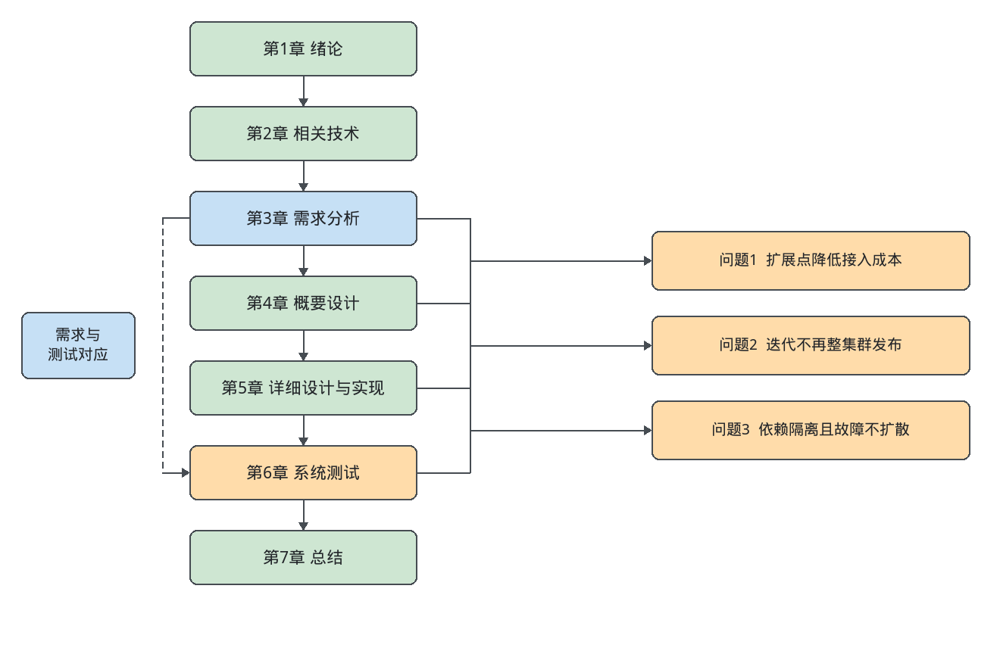

图1-1 论文组织结构图

# 第2章 相关技术分析

如果供应商对接全部放在同一个交易集群中，协议分支、私有依赖和发布范围都会随供应商数量一起扩大。围绕开发成本、发布效率和插件间隔离三个目标，本章依次分析插件化架构与扩展点、PF4J 插件框架、Java 类加载与插件隔离、异构接口适配与契约设计，以及宿主侧的开发技术，并说明各项技术的选型依据。

## 2.1 插件化架构与扩展点

模块化设计需要区分相对稳定的职责和随外部环境变化的实现。Parnas 的信息隐藏原则主张围绕可能变化的设计决策划分模块，使调用方通过明确的接口使用能力，而不依赖其内部实现[13]。组件化研究进一步强调契约和组合边界[14]。这些原则为接入系统划分公共流程和外部适配提供了依据。

插件化把扩展实现组织为独立制品，通过预先约定的扩展点接入宿主，通常由宿主、扩展契约、插件管理器和插件实现四部分组成。宿主只依赖公共契约，插件保存具体实现和私有资源，管理器负责发现、装载和生命周期管理。插件装配要求接口明确，宿主不能依靠推测插件内部结构来调用它[17]。电子商务领域的可插拔平台以及国内的平台扩展实践也采用了类似的组织方式[18,31-32]。微内核模式同样把稳定的公共部分与可扩展部分分开[15-16]；本文借鉴这一分离思路，但设计的重点是扩展点如何划分以及插件如何独立交付。

扩展点的划分决定插件化能否真正降低成本。扩展点过粗，不同供应商的差异会被迫写进宿主；扩展点过细或直接照搬某家供应商的接口顺序，换一家供应商就要修改契约。本文的划分原则是：按业务阶段和操作目的定义扩展点，凡是随供应商变化的协议细节都留在插件内，凡是所有供应商都必须遵守的结果含义和状态规则都由宿主统一。

接口解耦、独立制品和进程隔离属于不同层次。普通的策略类可以隐藏实现，但通常仍随宿主一起编译和发布；插件在此基础上增加了独立制品和生命周期边界；独立服务则进一步提供进程和部署边界，同时带来远程调用和运行管理的成本[30]。常见接入方式的比较如表2-1所示。

表2-1 常见供应商接入方式比较

| 接入方式 | 扩展单元 | 依赖边界 | 交付特点 | 适用限制 |
| --- | --- | --- | --- | --- |
| 条件分支 | 宿主内部代码 | 共享类路径 | 随宿主整体发布 | 分支随接入方增加而膨胀 |
| 策略或适配器 | 普通接口实现 | 通常共享类路径 | 通常随宿主整体发布 | 接口解耦不等于独立交付 |
| 独立微服务 | 服务进程 | 进程级隔离 | 独立部署和伸缩 | 增加远程调用和运维成本 |
| 同进程插件 | 插件包 | 类加载器边界 | 独立构建，契约兼容时可单独发布 | 共享宿主进程资源 |

同进程插件适合技术栈一致、变化主要发生在协议实现层面、且不要求按供应商独立伸缩的场景，本文的门票供应商接入正属于这种情况。宿主与插件之间是进程内方法调用，插件访问外部系统时仍然承担网络通信成本。各插件拥有独立的类加载器，私有依赖互不干扰；插件抛出的可捕获异常可以在调用边界处拦截，因此无需为每家供应商单独部署一个服务进程。其代价是插件与宿主共享同一进程，且独立发布以共享契约兼容为前提。

本文使用的主要方法及其分析对象如表2-2所示。具体的职责划分在第4章展开，工程实现在第5章说明，验证方式在第6章给出。

表2-2 理论或方法与分析对象的对应关系

| 理论或方法 | 关注问题 | 后续分析对象 |
| --- | --- | --- |
| 信息隐藏[13] | 如何封装易变的设计决策 | 供应商协议、私有模型和依赖边界 |
| 插件与扩展点[15,17] | 如何分离公共流程与可变实现 | 扩展点划分、插件交付和宿主统一规则 |
| 适配器与企业应用网关[11-12] | 如何转换接口和数据表示 | 标准请求、标准结果和错误映射 |
| 幂等与补偿方法[27-29] | 如何处理重复请求和跨系统局部失败 | 请求身份、结果确认和恢复流程 |

## 2.2 PF4J 插件框架

PF4J 是 Java 应用级插件框架，提供插件管理器、插件描述、生命周期、类加载和扩展发现等基础机制[19]。插件入口可以继承 Plugin 类，由插件管理器负责装载制品和管理运行状态；扩展接口通过继承 ExtensionPoint 表达能力，插件中的实现类通过相应声明进入发现过程。

装载时，PF4J 依据制品描述识别插件的身份、版本、入口和依赖，再创建运行对象和类加载环境。启动阶段执行插件初始化，停止阶段提供资源清理入口。常见的生命周期状态包括 CREATED、DISABLED、RESOLVED、STARTED 和 STOPPED。应用可以结合这些状态限制业务调用，但插件已启动并不代表其访问的外部服务健康可用。

扩展发现可以利用构建期生成的 META-INF/extensions.idx 索引，运行时按扩展类型取得实现[19]。框架只负责定位实现，宿主与扩展之间仍是普通的方法调用。按什么业务身份选择目标插件、能力缺失时如何反馈，属于应用层的设计内容。

生命周期钩子提供了资源管理的时机。插件创建的客户端、线程或上下文需要分别关闭，卸载方法返回也不代表类加载器已经被回收。加载、启停等管理操作的并发协调由应用负责[19]，本文的受控处理流程在4.4节说明。

## 2.3 Java 类加载与插件隔离

插件之间能否做到依赖隔离，取决于 Java 虚拟机（Java Virtual Machine，JVM）的类加载规则。JVM 在运行时完成类的加载、链接和初始化，应用可以通过自定义类加载器从目录或 Java 归档文件（Java Archive，JAR）中装入字节码[22,33]。类在运行时的身份由全限定名和定义它的类加载器共同决定[22,34]：同名的类如果由不同的类加载器定义，JVM 会把它们视为两种不同的类型。

这一规则对本文有两点约束。第一，宿主与插件之间共享的扩展接口、标准请求、标准结果和公共异常，必须由同一个类加载器提供。本文把这些类型集中在宿主与插件共享的应用程序编程接口（Application Programming Interface，API）模块中，下文称为 Plugin API。如果插件包里再打入一份 Plugin API，即使类名和字段完全相同，也会导致扩展无法识别或出现类型转换异常。第二，供应商的私有依赖应留在各自插件的类加载器中。PF4J 默认为每个插件创建独立的类加载器，并采用插件优先的查找顺序，系统类和框架类仍由上层加载器提供[19]。因此，即使两家供应商依赖同一组件的不同版本，也不会在同一条类路径上直接冲突。

多类加载器环境也改变了资源读取和组件管理的方式。证书模板、映射配置等插件资源应通过插件自己的类加载器读取，不能假定它们已经并入宿主类路径。插件如果使用 Spring 组件，可以在启动时建立受限的子上下文，停止时随插件一起关闭，避免扫描到宿主内部的业务组件。

在此基础上，本文的隔离分为两层。一是依赖隔离：一家供应商的签名库或序列化组件只存在于自己的类加载器中，不进入其他插件，也不进入宿主的公共类路径。二是调用隔离：插件抛出的普通异常在调用边界被转换为标准结果，宿主不会因此改调其他插件，也不会中断对其他插件的后续调用。需要说明的是，插件与宿主仍共享同一进程，进程崩溃或内存耗尽无法依靠类加载器隔离，插件也不是安全沙箱。由于供应商插件均由平台自行开发和审核，本文选择同一 JVM 内的插件边界，而不为每家供应商单独建立进程。

## 2.4 异构接口适配与契约设计

异构接口的差异体现在消息结构、鉴权方式、交互顺序和结果含义上。企业集成模式中的规范数据模型（Canonical Data Model）建立内部公共表示，消息转换器（Message Translator）完成外部表示与公共表示之间的转换[7]；适配器则通过接口转换连接调用方和已有实现[11]。二者共同支持把外部变化限制在适配边界之内。

公共契约既要约定数据形式，也要约定业务含义。技术响应正常、请求已受理和业务已完成是三个不同的事实，接口转换必须保留调用方做决策所需的这些差别。交互适配还应能容纳多步骤的外部流程，不要求一个内部方法必须对应一个外部 HTTP 接口。

契约是否稳定，取决于能力粒度和类型边界。共性对象用于跨边界交互，私有模型和客户端留在适配实现内部。共享契约变更时，应检查方法形态、字段约束和语义是否兼容，而不能只比较制品的版本号。

跨系统操作无法由单个本地数据库事务完整覆盖。幂等通过稳定的业务身份控制重复副作用，持久化记录和查询用于恢复外部事实，补偿则在满足业务条件时协调已经发生的步骤[27-29]。这些是可靠性设计的通用原则，本系统的状态、查询和恢复规则在4.3节展开。

## 2.5 系统开发相关技术

宿主侧技术按宿主组织、插件运行、数据持久化、短期访问和异步传递五类职责选择，各项技术的职责和选型依据如表2-3所示。

运行环境采用 Java 开发工具包（Java Development Kit，JDK）17。Spring Boot 3.x 要求 JDK 17 及以上版本，二者版本因此保持一致[35]。Spring Boot 用于组织宿主的 Web 接口和业务组件，其自动配置和内嵌服务器可以减少基础工程配置[35]。插件框架选择 PF4J 而不是 OSGi，原因是本文只需要插件发现、类加载、生命周期和扩展查找四项能力，PF4J 可以直接嵌入 Spring Boot 宿主，概念比 OSGi 完整的模块与服务模型少，对既有工程的改造也更小[19-20]。

数据层选用关系数据库 MySQL 8.0，保存执行单、供应商订单关联、凭证、商品关联和价格日历，这些数据需要事务和唯一约束的支持[36]。Redis 只缓存短期场次数据和配置，用于降低高频读取压力，不作为交易事实的来源[37]。Kafka 用于结果回传等不必在主请求中同步完成的消息传递，消息重复和消费失败仍由应用层通过幂等处理[38]。宿主与外部供应商之间使用超文本传输协议（Hypertext Transfer Protocol，HTTP）通信，报文格式为 JavaScript 对象表示法（JavaScript Object Notation，JSON）[39]。

表2-3 系统主要开发技术的职责与选型依据

| 技术 | 在系统中的职责 | 选型依据 | 职责边界 |
| --- | --- | --- | --- |
| JDK 17 | 运行环境与类加载基础 | Spring Boot 3.x 的最低版本要求 | 不决定供应商交易语义 |
| Spring Boot 3.2.5 | 宿主 Web 接口与组件组织 | 自动配置与内嵌服务器，减少基础配置 | 不替代插件类加载机制 |
| PF4J | 插件发现、装载、生命周期和扩展查找 | 可嵌入既有 Java 应用，概念少于 OSGi | 不负责交易状态一致性 |
| MySQL 8.0 | 执行记录、凭证、关联与价格日历持久化 | 需要事务与唯一约束 | 不管理内存中的扩展实例 |
| Redis | 短期场次数据与配置缓存 | 降低高频读取压力 | 不作为交易事实来源 |
| Kafka | 结果回传等异步消息传递 | 主请求之外的解耦传递 | 业务幂等仍由宿主负责 |

## 2.6 本章小结

本章分析了系统的技术选型依据。选择同进程插件，而不是条件分支或策略类，是因为插件同时提供独立制品、独立类加载器和调用边界：单家供应商可以单独开发、构建和发布，其私有依赖和可捕获异常也不会扩散到其他插件。不按供应商拆分为独立微服务，是因为各供应商适配的技术栈一致且无需独立伸缩，进程内调用可以避免为每家供应商增加一套远程调用和运维成本。选择 PF4J，是因为它能直接嵌入 Spring Boot 宿主，并提供插件发现、类加载和扩展查找能力。类加载规则要求 Plugin API 由宿主类加载器统一提供，私有依赖必须留在插件内。MySQL、Redis 和 Kafka 分别承担持久化、短期访问和异步传递，交易事实以数据库记录为准。

# 第3章 系统需求分析

第1章概括了供应商异构的问题和系统定位。本章进一步明确参与方和业务边界，以典型供应商的差异为依据导出需求。功能需求包括门票交易、价格库存同步和插件化接入三部分；非功能需求包括可扩展性、可维护性、可靠性、性能和安全性五个方面，其中独立发布、依赖隔离和故障隔离直接对应1.3节提出的问题。

## 3.1 需求概述

本文系统是供应商侧的交易执行系统，位于上游订单交易平台、商品平台与景区供应商之间。它接收标准交易命令并执行外部履约，不覆盖面向用户的完整销售流程。各参与方的职责边界如表3-1所示。

表3-1 系统参与方与职责边界

| 参与方 | 主要职责 | 与本文系统的交互 |
| --- | --- | --- |
| 上游订单交易平台 | 用户订单、支付、发起退款、接收履约结果 | 提交占位、出票、查询、释放与退款命令，接收标准结果 |
| 上游商品平台 | 商品主数据与售卖，接收或发布价格日历 | 提供商品关联所需身份，使用同步结果 |
| 本文系统 | 供应商侧交易执行、状态协调、插件调用、本地价格日历同步和结果回传 | 统一命令与结果，维护本地执行记录 |
| 外部供应商 | 库存、外部订单、出票、退款及核销事实 | 接收协议请求，返回响应或查询结果；协议支持时发送核销或退款通知 |
| 运维人员 | 插件部署、启停与替换，接入配置维护，异常核对 | 通过运维管理接口操作插件和查看运行记录 |

系统中的本地交易执行单是供应商侧的执行记录，不能替代上游的用户订单。本文系统可以判断供应商退款是否完成，但不承担平台的资金退款结算；可以拉取供应商价格库存并形成本地日历，但不负责商品主数据建设。供应商是其库存、订单和核销事实的来源，本文系统负责把这些事实统一解释后写入本地状态。

与只处理内部服务和统一数据库的典型交易系统相比，本文系统面临四个特殊问题：外部事实不可直接控制，受理与完成不一致，各供应商的能力范围不同，协议还在持续变化。业务调用方不应承担每家供应商的字段和签名适配，供应商的对接代码也不应掌握本地状态的写入规则。因此，本系统的需求重点是契约标准化、协议适配边界、外部不确定结果的状态协调，以及对接逻辑的独立交付，而不是重新建设用户订单和支付中台。

系统面向持续接入的多家供应商。供应商 A、B 是两家脱敏案例，用于说明异构性和相应的设计，并不表示系统只接入两家供应商。路由上下文由业务身份、供应商标识和能力类型组成，后文分别记为 bizIdentity、supplierId 和 capability，系统据此确定目标供应商的对接实现，而不是只用单一的供应商编码路由。

## 3.2 需求导出

需求导出首先区分共性业务和外部变化。上游提交商品、游客、日期、数量和请求身份，系统围绕本地执行单组织交易；各供应商的对接实现依据实际协议执行外部动作，并返回标准信息。两家案例供应商的差异按五个维度整理，如表3-2所示。

表3-2 两家案例供应商的异构特征与需求

| 维度 | 供应商 A | 供应商 B | 导出的需求 |
| --- | --- | --- | --- |
| 通信与鉴权 | 使用 RSA 签名 | 使用 HMAC-SHA256 签名 | 鉴权实现和密钥留在各自的对接实现内 |
| 数据模型 | 以场次、票种、外部产品和组合关系表达交易资源；建单后保存外部订单号、tradeNo 和 longOrderId | 支付阶段返回外部订单号，此前没有外部订单号 | 标准请求与外部身份之间保持可恢复的关联 |
| 业务交互 | 占位阶段先锁库存、再创建供应商订单；支付阶段没有外部调用 | 下单阶段不请求供应商；支付阶段单独发起外部请求 | 统一的业务阶段要能容纳不同的外部调用时机 |
| 结果获取 | 通过查询接口确认出票结果 | 由本系统每 60 秒查询一次，最多 30 轮，只查询尚未确认出票的执行单 | 阶段处理完成与最终出票确认分开表达 |
| 业务能力 | 占位、查询、释放、价格库存、退款与通知解析 | 支付阶段处理与查询；不提供占位、退款和通知解析 | 供应商不具备的能力由系统明确返回“能力不支持” |

表3-2说明，供应商之间的差异不仅体现在字段上，还体现在外部调用发生在哪个阶段。下单阶段在本地处理完成，并不意味着供应商已经锁定库存或建立了外部订单。因此，统一契约需要表达当前阶段的处理结果和已经取得的外部事实，而不能强制所有供应商在同一阶段执行同样的请求。

创建供应商订单失败时，对接实现应返回失败原因和已有的执行进展，由宿主决定重试还是进入逆向处理；对接实现只报告失败事实，不自行结束整笔交易。此时用户尚未支付，逆向处理针对的是供应商侧已经占用的资源，不属于用户退款。后文涉及支付前失败时均按此处理，不再逐一说明。

供应商 B 的出票查询由本系统驱动，需求只关注待确认的交易、查询结果和状态更新，不要求另建完整的任务调度平台。价格库存同步与交易执行分开组织。供应商对接逻辑需要能够单独交付，这又要求共享类型保持一致、私有依赖互不干扰。

系统的主要功能需求如表3-3所示，3.3节展开相应的用例。其中 R01 至 R05 构成门票业务范围，R06 至 R09 提供独立交付所需的插件运行机制。供应商没有相应能力时，系统返回明确错误，既不提供掩盖能力缺失的空实现，也不改由其他供应商处理。

表3-3 系统主要功能需求

| 编号 | 需求 | 说明 |
| --- | --- | --- |
| R01 | 占位、出票与释放 | 承接上游命令，执行供应商占位、出票和占位释放，维护本地执行单与凭证 |
| R02 | 交易查询 | 返回已知状态，必要时查询供应商并确认结果 |
| R03 | 核销结果处理 | 转换核销通知，校验重复事件与核销数量 |
| R04 | 退款执行 | 接收上游退款命令，执行外部退款并回传结果 |
| R05 | 价格库存同步 | 拉取供应商价格库存并更新本地价格日历 |
| R06 | 插件装载与发现 | 识别插件元数据和所提供的能力 |
| R07 | 业务身份与插件绑定 | 维护业务身份、供应商标识与可用插件之间的关系 |
| R08 | 扩展调用分派 | 按路由上下文和能力类型定位唯一的实现 |
| R09 | 插件启停、替换与状态查看 | 控制插件的可调用状态，在维护窗口内替换插件版本 |

## 3.3 功能性需求

### 3.3.1 门票交易功能需求

门票交易功能包括供应商侧占位、支付阶段处理、出票结果查询、占位释放和售后执行。上游提交标准请求并接收执行结果；系统需要适配不同供应商的调用时机，保留本地执行关联，并向上游提供含义一致的进度和凭证。主要用例如图3-1所示。上游订单交易平台是执行门票出票、查询交易结果、释放门票占位和执行供应商退款四个用例的主执行者，供应商系统作为辅助执行者参与这些用例，同时是处理核销结果的主执行者。出票尚未完成时，查询交易结果以扩展关系接续执行门票出票，也可以由本系统的定时确认任务发起。


图3-1 门票直连交易用例图

下单阶段，系统接收商品标识、游玩日期、数量、游客信息和请求身份，完成参数和关联检查后，建立供应商侧执行记录。对供应商 A，此阶段需要锁库存并创建外部订单；对供应商 B，此阶段不请求供应商，因此 B 在下单阶段的处理结果不能理解为已经取得了外部资源。

进入支付阶段后，系统依据上游提供的阶段信息执行供应商侧的处理，但不承担资金支付。供应商 B 在此阶段发起外部请求，之后由本系统定时查询出票结果；供应商 A 在此阶段没有外部调用，出票结果同样通过查询取得。接口响应、订单关联和有效凭证需要分别记录，只有取得确定的出票事实，才能把执行单记为已出票。

上游重试会使同一请求重复到达。系统按请求身份 requestId 和操作范围识别重复请求，占位、支付阶段处理、释放和退款分属不同的操作范围，因此同一上游订单可以先后进行一次占位和一次退款。网络超时、且无法确认供应商是否已经受理时，不能直接判定失败后重新下单，而应记为结果待确认，再通过供应商订单查询或人工核对确认最终结果。

执行门票出票用例的规约如表3-4所示。

表3-4 执行门票出票用例规约

| 项目 | 内容 |
| --- | --- |
| 用例名称 | 执行门票出票 |
| 用例描述 | 上游提交下单或支付阶段的标准命令，系统按目标供应商在该阶段的能力执行外部交易，取得出票结果并保存凭证 |
| 主执行者 | 上游订单交易平台 |
| 辅助执行者 | 供应商系统 |
| 优先级 | 高 |
| 触发条件 | 上游提交下单阶段或支付阶段的执行命令 |
| 前置条件 | 商品关联有效；目标供应商的插件处于可调用状态 |
| 后置条件 | 本地执行单记录当前阶段的进展；取得确定的出票事实时保存凭证并回传上游 |
| 基本事件流 | （1）接收阶段请求，校验参数和请求身份；（2）确定目标供应商及其在当前阶段的能力；（3）执行外部调用并取得标准结果，A 在下单阶段先锁库存后建单，B 在支付阶段请求供应商；（4）系统按结果更新执行单；（5）出票未完成时转入查询确认，取得出票结果后保存凭证 |
| 异常事件流 | （1）重复请求返回已有执行进度；（2）锁库存或建单被明确拒绝时保存拒绝原因，由系统决定重试或进入逆向处理；（3）调用结果未知时记为待确认，不立即重新建单 |
| 用例边界 | 不处理用户支付和资金结算；B 在下单阶段不请求供应商，该阶段的结果不表示已取得外部资源 |

查询交易结果用于向上游提供统一的订单状态和电子凭证。系统收到查询后，先按本地执行单号读取本地记录：状态已经终结且信息完整的，直接返回本地结果；仍在处理中，或上游明确要求获取最新状态的，再根据执行单中的业务身份、供应商标识和外部订单关联查询目标供应商。

查询所得的订单状态、出票结果和凭证信息先转换为平台标准模型，再由系统按合法的状态变化更新本地执行单，不直接用供应商的原始状态覆盖本地状态。已经出票的订单，还要保存二维码内容、取票码或其他形式的电子凭证。供应商查询接口暂时不可用时，如果本地已有确认事实，就返回该事实并注明记录时间；如果本地没有确认事实，则返回查询失败。两种情况下都不覆盖已确认的结果，也不用其他供应商的结果替代。查询交易结果用例的规约如表3-5所示。

表3-5 查询交易结果用例规约

| 项目 | 内容 |
| --- | --- |
| 用例名称 | 查询交易结果 |
| 用例描述 | 系统按上游请求或定时确认任务读取本地执行单，必要时查询供应商，向上游提供统一的状态与凭证 |
| 主执行者 | 上游订单交易平台；定时确认由本系统发起 |
| 辅助执行者 | 供应商系统 |
| 优先级 | 高 |
| 触发条件 | 上游发起查询，或定时确认任务选出待确认的执行单 |
| 前置条件 | 本地执行单存在，能够定位业务身份、供应商和外部订单关联 |
| 后置条件 | 返回当前状态；取得新的确定事实时，按条件更新执行单与凭证 |
| 基本事件流 | （1）读取本地执行单；（2）状态已终结且信息完整时直接返回；（3）否则查询供应商；（4）校验标准结果；（5）按合法的状态变化更新执行单与凭证并返回 |
| 异常事件流 | 缺少关联、能力不支持或查询失败时，返回明确原因或本地已知状态，不覆盖已确认的结果，也不用其他供应商的结果替代 |
| 用例边界 | 查询只确认已经发生的外部事实，不再次发起出票 |

释放门票占位用于撤销尚未出票的供应商侧资源占用，例如用户超时未支付或上游取消订单。上游提交执行单号、请求身份和释放原因后，系统先校验当前执行是否允许释放：已出票的执行不能释放，应改走退款；建单结果尚未确认的执行，需要先查询确认，不能无条件解锁或取消；没有外部占用的执行（如 B 在支付前取消）只需在本地完成释放。校验通过后，系统请求供应商取消或解锁。外部明确完成时，执行单记为已释放并回传上游；外部只返回受理时，保留处理中状态，等待后续确认。释放与退款的前置条件、外部动作和资金含义都不同，因此作为两个独立的用例处理。

核销用于记录游客实际使用门票的结果。核销动作通常发生在景区闸机或供应商票务系统中，本系统主要接收供应商发送的核销通知，也可以按需主动查询核销状态。通知进入统一回调入口后，系统先根据供应商标识确定对应的对接实现，由其校验通知签名、解析报文，并把外部订单号、凭证标识、核销数量和核销时间转换为标准核销结果。

随后，系统根据外部订单号或凭证标识定位本地执行单，进行重复校验，再更新订单和凭证状态。对允许分次入园或部分核销的产品，要记录累计核销数量，全部核销后才把整笔订单更新为已完成。重复通知既不能重复增加核销数量，也不能重复向上游发送业务事件。无法定位订单、签名校验失败或数据格式错误的通知应拒绝处理，并保留必要的异常记录。处理核销结果用例的规约如表3-6所示。

表3-6 处理核销结果用例规约

| 项目 | 内容 |
| --- | --- |
| 用例名称 | 处理核销结果 |
| 用例描述 | 系统接收供应商的核销通知，经校验和转换后更新凭证使用数量，并回传上游 |
| 主执行者 | 供应商系统 |
| 辅助执行者 | 上游订单交易平台 |
| 优先级 | 中 |
| 触发条件 | 供应商发送核销通知 |
| 前置条件 | 执行单已出票，通知能够关联到本地执行单或凭证 |
| 后置条件 | 凭证的累计核销数量得到更新；全部核销后执行单记为已完成；结果回传上游 |
| 基本事件流 | （1）统一回调入口接收通知；（2）确定目标供应商的对接实现；（3）按协议校验并转换为标准核销结果；（4）关联执行单，校验事件是否重复以及核销数量；（5）更新凭证并回传结果 |
| 异常事件流 | 校验失败、无法关联或数量不合法时拒绝更新并保留异常记录；重复的有效通知返回已有处理结果 |
| 用例边界 | 通知只用于核销和已发起的退款，不作为出票完成的依据 |

退款用于处理尚未使用、或符合供应商退订规则的订单。上游发起退款时，应提供本地执行单号、退款数量和退款原因。系统校验订单是否存在、是否已经核销、是否正在退款，以及申请数量是否超过可退数量，校验通过后，向目标供应商提交所需的订单标识和退款参数。

供应商同步返回退款成功、退款失败或处理中三种结果之一，系统将其转换为平台标准的退款状态，并更新本地执行单和凭证。处理中的退款要保留供应商退款流水号，之后通过查询或通知确认最终结果。重复的退款请求应通过幂等控制返回原有处理结果，不再向供应商提交。供应商不支持部分退款时，系统向上游反馈明确的能力限制，不在内部擅自拆单。执行供应商退款用例的规约如表3-7所示。

表3-7 执行供应商退款用例规约

| 项目 | 内容 |
| --- | --- |
| 用例名称 | 执行供应商退款 |
| 用例描述 | 上游发起退款后，系统校验可退范围，调用供应商退款能力，并保存受理或完成结果 |
| 主执行者 | 上游订单交易平台 |
| 辅助执行者 | 供应商系统 |
| 优先级 | 高 |
| 触发条件 | 上游提交退款命令，包含执行单号、退款数量和原因 |
| 前置条件 | 执行单已出票且未全部核销；满足供应商退订条件；目标供应商提供退款能力 |
| 后置条件 | 保存退款记录与供应商退款流水；退款完成时更新凭证有效性并回传上游 |
| 基本事件流 | （1）读取执行单；（2）校验可退数量和请求是否重复；（3）请求供应商退款；（4）保存受理或完成结果；（5）回传上游 |
| 异常事件流 | 能力不支持或被明确拒绝时返回原因；不支持部分退款时返回能力限制，不擅自拆单；结果未知时先查询确认，不重复退款 |
| 用例边界 | 只执行供应商侧退订，不承担平台资金退款结算 |

综合以上业务可以看出，系统需要区分阶段结果、最终完成和结果不确定三种情况，并把重复请求、外部拒绝与后续处理关联起来。结果的具体解释和状态更新规则在4.3节定义。

### 3.3.2 价格库存同步功能需求

价格库存同步用于维护平台商品与供应商产品之间的可售数据。不同供应商组织产品、票种、游玩日期、结算价格和库存的方式各不相同，系统需要先建立平台商品与供应商产品的关联。关联至少包含平台商品标识、供应商编码、供应商产品标识和启用状态，用来确定数据从哪里来，以及交易请求发给哪家供应商。价格库存同步的用例如图3-2所示：同步任务按商品关联触发同步，供应商数据经转换后更新本地价格日历，并记录异常范围和原因；组合商品的价格库存计算以扩展关系附加在同步用例上；运维人员维护商品关联并查看同步结果；上游商品平台获取本地价格日历。

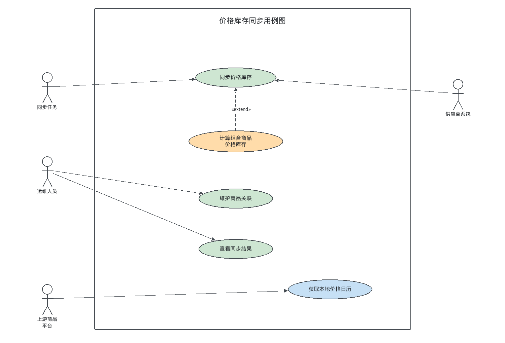

图3-2 价格库存同步用例图

同步任务可以由定时调度触发，也可以由供应商的数据变更通知触发。任务开始后，系统根据商品关联确定供应商，请求其价格库存数据，并将外部的价格日历、库存数量和销售状态转换为平台标准数据，经过基本校验后再更新本地价格库存记录。

价格数据至少包含销售日期、币种、结算价格和有效状态，库存数据包含销售日期、可售数量或库存状态。对于只提供“有库存”“无库存”标识的供应商，应转换为平台能够识别的库存类型，而不能虚构精确的库存数量。对于按日期返回价格库存的供应商，必须保证外部日期与平台销售日期一一对应。

同步过程中可能遇到商品关联缺失、返回数据不完整、部分日期处理失败或接口暂时不可用等情况。系统应记录每次任务的处理范围和结果，不能因为一个商品或一个日期出错，就把其他有效数据一并覆盖。供应商明确返回停售时，更新对应日期的可售状态；因网络异常未能取得数据时，同步任务记为失败，同时保留已有的日历记录，既不把它们写成零库存，也不把“未取得数据”解释为“无库存”。写入前应按商品、日期或场次与已有记录比较，内容没有变化则跳过更新。同步价格库存用例的规约如表3-8所示。

表3-8 同步价格库存用例规约

| 项目 | 内容 |
| --- | --- |
| 用例名称 | 同步价格库存 |
| 用例描述 | 同步任务按商品关联拉取供应商价格库存，经转换和校验后更新本地价格日历 |
| 主执行者 | 同步任务 |
| 辅助执行者 | 供应商系统、运维人员 |
| 优先级 | 中 |
| 触发条件 | 定时调度到期，或收到供应商的数据变更通知 |
| 前置条件 | 商品关联有效，目标供应商提供价格库存能力 |
| 后置条件 | 有效变化写入本地价格日历；同步范围和异常原因被记录 |
| 基本事件流 | （1）确定同步范围；（2）确定目标供应商的价格库存能力；（3）拉取外部数据并转换为标准日历；（4）校验并与已有记录比较；（5）只写入有变化的记录 |
| 异常事件流 | 外部响应缺失时保留原有有效数据；单个商品或日期异常不影响其他有效数据；区分停售与获取失败 |
| 用例边界 | 不维护商品主数据；不改变任何交易执行单的状态 |

### 3.3.3 插件化接入功能需求

插件化接入是本系统区别于硬编码适配的核心功能。组织规则是一家供应商对应一个插件包，多个业务身份可以绑定同一个插件。每家供应商的协议模型、签名算法、HTTP 客户端、状态转换和特有业务规则都封装在各自的插件包中；宿主只依赖公共扩展契约，不直接依赖任何供应商的实现类或私有软件开发工具包（Software Development Kit，SDK）。公共扩展契约按业务能力定义多个扩展点，例如占位、查询、退款和价格库存。一个供应商插件可以实现多个扩展点，但对同一扩展点最多提供一个有效实现。供应商不具备的能力可以不实现对应的扩展点，此时系统返回“能力不支持”，而不是改调其他供应商的插件。

插件加载时，系统读取插件标识、版本和入口等元数据，结合业务配置取得路由所需的身份信息并检查其完整性，然后为插件建立独立的类加载环境。加载完成后，系统发现插件提供的扩展实现，并建立供应商、插件与扩展类型之间的注册关系。业务调用时，系统先根据业务身份和供应商标识确定当前插件，再根据扩展类型定位目标实现。版本信息用于发布管理和调用审计，业务请求不能指定已停止或已卸载的历史版本。

调用插件前，系统依次校验供应商绑定、插件运行状态和所需扩展是否存在：目标插件不存在时返回“插件未配置”；插件已停止时返回“插件不可用”；插件未提供所需扩展点时返回“能力不支持”；同一插件存在多个相同扩展的实现时视为注册冲突，阻止调用。任何一项匹配失败时，都不能任选一个实现，也不能把请求转给其他供应商。

插件应支持加载、启动、停止、替换和状态查看。插件启动成功后才能注册为可调用；停止时，先阻止新的交易请求进入该插件，再清除宿主对其扩展实例的引用，并关闭插件持有的上下文、线程池和连接池等资源。插件治理的用例如图3-3所示：接入供应商插件包含插件描述与契约基线校验、扩展能力的发现与注册两个步骤；替换插件版本和停止插件都包含阻断新调用和释放插件资源的步骤，替换还需要对新制品重新校验。

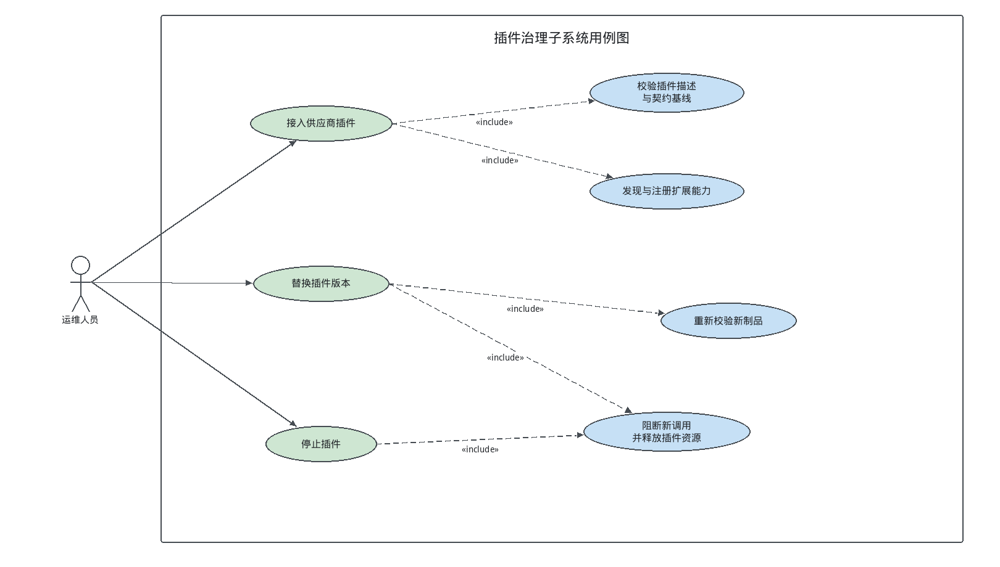

图3-3 插件治理子系统用例图

接入供应商插件用例的规约如表3-9所示。

表3-9 接入供应商插件用例规约

| 项目 | 内容 |
| --- | --- |
| 用例名称 | 接入供应商插件 |
| 用例描述 | 运维人员部署插件制品，系统完成装载、能力发现与业务绑定，使插件进入可调用状态 |
| 主执行者 | 运维人员 |
| 辅助执行者 | 宿主插件运行时 |
| 优先级 | 高 |
| 触发条件 | 运维人员在维护窗口内部署、启动或替换插件 |
| 前置条件 | 插件符合共享契约与元数据要求，制品来源受控 |
| 后置条件 | 插件能力注册完成并启用业务绑定，后续请求可以分派到该插件 |
| 基本事件流 | （1）读取插件描述；（2）装载并启动插件；（3）发现扩展能力；（4）检查能力冲突；（5）启用业务绑定；（6）业务调用时校验目标与扩展后执行 |
| 异常事件流 | 描述缺失、启动失败、绑定冲突、能力缺失或同一能力存在多个实现时，拒绝注册或调用并记录原因；该插件的失败不影响其他插件的装载和调用 |
| 用例边界 | 不支持同一业务身份的多个版本同时生效；插件之间不互相调用 |

插件化接入还要求分清宿主共享的依赖和插件私有的依赖。公共扩展契约中的接口、标准数据传输对象（Data Transfer Object，DTO）、必要的枚举和公共异常由宿主提供，插件不能再打包一份相同的类型；供应商专用的 SDK、签名工具和 HTTP 依赖则随插件交付。这一边界需要通过检查构建产物来核对，防止供应商的私有依赖进入宿主的公共类路径。交易调用一律由宿主按路由上下文分派，插件之间不互相调用。

面向运维人员的运行管理用例如图3-4所示，包括查询调用记录、检索脱敏日志、人工核对待确认交易、重试结果回传和维护供应商接入配置。其中，人工核对需要与供应商系统确认外部事实，重试结果回传面向上游订单交易平台。错误信息和运行日志应包含供应商编码、插件标识、插件版本、业务类型、调用耗时和结果类型，以便按插件定位问题，同时避免记录敏感报文的全文。

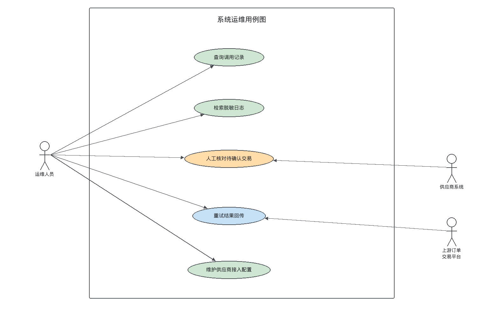

图3-4 系统运维用例图

## 3.4 非功能性需求

除业务功能外，系统还需要满足可扩展性、可维护性、可靠性、性能和安全性方面的要求。其中，可扩展性对应“降低接入开发成本”，可维护性中的独立发布和依赖隔离对应“提高发布效率”，可靠性中的故障隔离对应“降低运维成本”。各项需求的量化指标统一汇总在3.4.5节的表3-10中，并与第6章的测试用例一一对应。

### 3.4.1 可扩展性需求

系统的主要扩展对象是供应商适配能力。新增供应商时，应通过新建独立插件并实现所需的扩展点完成接入；在共享契约兼容、且不超出现有能力范围时，不修改宿主的交易执行主干，也不在交易流程中增加针对该供应商的条件判断。增加新插件后，系统应能根据路由上下文完成定位和调用。

系统还应允许供应商能力不完整。例如，只支持下单和查询的供应商可以只实现相应的扩展点，不必为不支持的退款能力提供空实现。该项需求可以通过新增一个案例供应商插件，比较接入前后宿主代码和构建产物的变化来核对。

### 3.4.2 可维护性需求

可维护性需求包括独立发布、依赖隔离和职责边界三个方面。

（1）独立发布。单家供应商的协议、签名或字段发生变化，且共享契约保持兼容时，只需重新构建和发布对应的插件制品，宿主制品不重新发布，其他供应商的插件也不受影响。插件发布应在维护窗口内完成，包括制品校验、各节点上的停止与替换以及启用绑定，单插件发布耗时应明显低于既有交易集群 3 至 5 小时的整集群发布耗时，具体目标值见表3-10。

（2）依赖隔离。供应商插件应能独立编译和构建，制品包含自身实现和必要的私有依赖，但不包含公共扩展契约的重复类型。两家供应商依赖同一组件的不同版本时，应能在同一宿主中同时运行，互不覆盖。

（3）职责边界。宿主、公共扩展契约和供应商插件之间应有清晰的职责边界：宿主负责交易执行规则、插件运行和调用分派；供应商插件负责私有数据模型、鉴权签名、外部接口调用和状态转换。公共扩展契约应保持精简，只包含插件与宿主共同使用的类型，不向插件暴露宿主的内部服务和基础设施实现。标准请求和响应发生变化时，需要评估对已有插件的影响。

### 3.4.3 可靠性需求

（1）故障隔离。一个插件在执行中抛出未处理的异常、返回无法解析的响应或启动失败时，系统应把影响限制在该插件范围内：该插件的调用返回明确错误，其他插件的装载和调用不受影响，宿主的公共处理流程也不被打断。插件未处理的异常应在调用边界转换为平台异常，不直接穿透到上游。

（2）异常区分。系统应区分插件不存在、插件未启动、能力不支持、扩展重复、供应商超时和供应商业务拒绝等异常。单个供应商调用失败时，返回该供应商对应的错误，不改调其他供应商。

（3）幂等与结果确认。订单写入、供应商调用和状态更新之间存在跨系统交互，系统应保留必要的请求流水号、供应商订单号和处理状态。下单和退款等可能产生重复副作用的操作需要幂等控制；网络超时造成的未知结果，必须通过查询或人工核对再确认。

（4）停止时的在途调用。停止插件时应禁止新调用进入，并妥善处理已经开始的调用，避免扩展引用被提前清除。

### 3.4.4 性能需求

插件化调用发生在宿主 JVM 内部，额外开销主要来自供应商绑定查找、扩展实例查找、状态校验和调用统计。与供应商的 HTTP 请求相比，这部分开销应保持在较低水平，不能成为交易链路的主要耗时。设计验收目标为：稳定状态下单次分派的附加耗时 P95 不超过 2 毫秒；在 50 并发、测试桩固定延迟的条件下，查询与占位接口的端到端响应时间 P95 不超过 800 毫秒。稳定状态下的调用应复用已经发现的扩展能力，不重新扫描插件制品。

性能测试应分别测量不含外部网络请求的插件分派开销，以及包含供应商调用的端到端响应时间。与直接调用相同业务实现的基线对比，可以评估插件化机制带来的延迟和吞吐损耗。

### 3.4.5 安全性需求

交易调用方访问系统接口时，应经过身份认证和权限校验，敏感接口应限制调用来源。供应商访问凭证、签名密钥和接口地址属于敏感配置，不能硬编码在插件代码中，也不能写入普通日志。对外通信使用安全传输协议，并按供应商要求完成签名、时间戳或随机数校验。

供应商通知进入系统后，由目标插件按实际协议完成来源校验和必要的重复处理。验签失败、时间范围异常或供应商标识不匹配的请求，不能进入订单状态更新流程。日志中的身份证件号码、手机号、电子凭证和密钥等信息需要脱敏，避免排障时泄露游客和供应商的敏感信息。

插件包在宿主进程内执行，来源必须受控。插件只能由具备权限的运维人员部署，加载前校验插件标识、描述信息和文件完整性。

系统非功能性需求的量化指标及对应测试如表3-10所示。表中 P95 指把响应时间从小到大排列后第 95 百分位的数值。性能指标和发布耗时指标是设计验收目标，在测试执行之前不作为测量结果。

表3-10 非功能性需求的量化指标

| 质量属性 | 需求约束 | 量化指标 | 对应测试 |
| --- | --- | --- | --- |
| 可扩展性 | 已有能力范围内新增供应商，不增加宿主的协议分支 | 宿主执行主干新增供应商分支数为 0；公共扩展契约修改数为 0 | N-02 |
| 可维护性（独立发布） | 单家供应商协议变更只发布对应插件 | 需重新发布的宿主制品数为 0；受影响的其他插件数为 0；单插件发布耗时不超过【待确认】分钟 | N-08 |
| 可维护性（依赖隔离） | 共享契约不重复打包，同一组件的不同版本可以共存 | 插件制品中公共扩展契约的重复类数为 0；双版本场景下类冲突与类型转换异常数为 0 | N-01、N-06 |
| 可维护性（职责边界） | 宿主、运行时与插件的依赖方向明确 | 宿主对供应商实现的编译依赖数为 0 | N-01 |
| 可靠性（故障隔离） | 单个插件失败不影响其他插件 | 一个插件注入运行时异常或启动失败期间，另一插件的调用失败数为 0 | N-07、G-09 |
| 可靠性（异常区分） | 目标不可用时不误调其他供应商，未知结果不盲目重放 | 改调其他供应商次数为 0；结果未知后的重新建单次数为 0 | G-05、G-06、T-11 |
| 可靠性（幂等） | 相同业务请求不重复产生供应商副作用 | 同一请求身份的外部建单与退款请求各不超过 1 次 | T-12、T-16 |
| 性能（分派） | 插件分派开销不成为交易链路的主要耗时 | 稳定状态单次分派附加耗时 P95 不超过 2 毫秒 | N-03 |
| 性能（端到端） | 端到端响应满足上游调用要求 | 50 并发、测试桩固定延迟下，查询与占位接口 P95 不超过 800 毫秒 | N-04 |
| 安全性 | 按供应商协议验证通知，敏感日志脱敏 | 校验失败的通知引起的状态更新数为 0；日志中敏感字段明文条数为 0 | T-14、N-05 |

## 3.5 本章小结

本章明确了参与方和业务范围，从供应商 A、B 在交互阶段和结果获取方式上的差异出发，导出统一的执行需求，并按门票交易、价格库存同步和插件化接入三部分完成功能需求分析。非功能需求覆盖可扩展性、可维护性、可靠性、性能和安全性，其中独立发布、依赖隔离和故障隔离分别对应1.3节的三个问题，并给出了可测试的量化指标，为后续的架构设计和验收提供依据。

# 第4章 系统概要设计

本章根据第3章的需求，给出系统的总体架构和主要设计。设计主线是插件化架构：随供应商变化的协议实现放在独立插件中，通过按业务阶段划分的扩展点接入宿主；插件运行时负责装载、依赖隔离和调用分派；插件可以在维护窗口内单独发布和替换。为了让扩展点保持稳定，所有插件都必须遵守的结果含义和状态更新规则集中在宿主的交易执行引擎中。本章依次说明系统边界与总体架构、插件化总体设计、交易执行引擎、插件运行时、供应商插件与价格库存、数据模型，最后给出设计对照与适用条件。

## 4.1 系统边界与总体架构

### 4.1.1 业务边界与调用关系

系统处于上游订单交易平台、商品平台与外部供应商之间。上游订单交易平台确定用户购买、支付和发起退款等业务事实，并把供应商侧的执行命令提交给本文系统。本文系统不重新组织完整的用户订单流程，而是为外部交易保存执行记录，调用供应商并协调本地执行状态，最后向上游回传标准结果。商品平台维护商品主数据；本文系统只保留调用供应商所需的商品关联，负责拉取供应商价格库存并形成本地价格日历。

系统边界不仅限定了接口，也限定了各类事实由谁解释。用户是否已支付由上游的支付与订单体系确定；供应商是否已出票，以当次外部响应或后续查询为依据；本地执行单如何推进，由宿主的交易执行引擎决定。插件既不能代替上游判定支付结果，也不能绕过执行引擎直接写入本地执行状态。

例如，支付阶段的调用如果只返回“受理”或“处理中”，宿主只记录当前进度，不能向上游报告出票成功。出票凭证必须以该次调用中的确定结果或之后的查询结果为依据，执行引擎核对结果与当前状态一致后，才保存凭证并回传。统一执行语义并不要求各供应商的外部步骤相同，但要求标准结果对上游的含义一致。

价格库存同步的边界与交易不同。它只更新商品关联下的售卖日历，不创建交易执行单，也不推动出票或退款状态。同步任务与交易命令共用插件运行时和调用记录，但走不同的业务入口，避免把价格同步失败误判为某笔订单失败。

### 4.1.2 宿主与插件的组件结构

系统由宿主和供应商插件两部分组成。宿主包括接入接口、交易执行引擎、价格库存同步模块和插件运行时；Plugin API 是双方共享的契约模块，在编译层面连接宿主与插件，在业务层面规定跨边界传递的标准命令、请求、结果和通知。总体组件关系如图4-1所示。

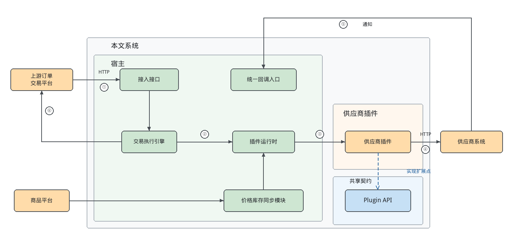

图4-1 系统边界与插件化总体架构

图4-1中的带圈序号表示一次交易命令的主要路径：上游以 HTTP 提交标准命令（①），交易执行引擎经 JVM 内调用进入插件运行时（②），运行时按扩展点类型分派到目标插件（③），插件以 HTTP 访问供应商（④），标准结果经执行引擎处理后回传上游（⑥）。供应商发起的核销或退款通知（⑤）经统一回调入口进入宿主。图中插件以虚线空心箭头指向 Plugin API，表示插件实现共享的扩展点接口。

交易执行引擎负责命令前置条件、请求身份、状态更新、结果确认、补偿协调和上游回传，它不包含任何外部 SDK 或供应商报文解析逻辑。这些规则对所有供应商都相同，如果交给各插件分别实现，上游就会收到含义不一致的结果，因此统一放在宿主中。用户订单、支付结算和商品主数据由上游负责，宿主不重复建设。

插件运行时负责管理扩展是否存在、是否可调用。它装载插件、发现能力、解析路由并调用目标扩展，但不判断一次供应商受理是否应转为出票成功，也不判断退款完成后哪些凭证需要失效。供应商插件则负责外部参数、鉴权、调用、映射和供应商特有的局部流程。各组成部分的职责划分如表4-1所示。

表4-1 插件化架构的职责划分

| 组成部分 | 主要职责 | 跨边界约束 |
| --- | --- | --- |
| 交易执行引擎 | 标准命令、执行记录、状态校验、幂等、本地一致性、结果确认、补偿决策、通知收敛与上游回传 | 不引用供应商 DTO、SDK、原始状态常量或签名实现 |
| 插件运行时 | 装载、生命周期、业务身份绑定、能力发现、路由解析、调用分派与记录、类加载边界 | 不决定订单或退款的业务状态，不拼装外部报文 |
| Plugin API | 标准请求、标准结果、扩展点、公共异常与受控上下文 | 不暴露执行单持久化入口，不携带供应商私有类型 |
| 供应商插件 | 鉴权签名、外部 DTO、客户端、错误与状态映射、供应商特有的局部步骤和恢复动作 | 不直接更新本地执行状态，不选择其他供应商 |
| 价格库存同步模块 | 同步范围、商品关联、标准数据校验、本地日历更新与同步结果记录 | 不进入交易状态机，不承担商品主数据管理 |

标准命令的调用方向是执行引擎到运行时、运行时到插件、插件到供应商。返回方向相反，但返回数据不携带修改本地状态的权限。通知由外部发起，同样先由运行时定位解析能力，再由插件转换为标准通知，最后交给执行引擎处理。可见，调用方向变化并不改变状态写入的职责归属。

### 4.1.3 技术组织

系统采用 JDK 17、Spring Boot 与 PF4J 的技术组合。Spring Boot 组织宿主的 HTTP 接口和业务组件，PF4J 管理插件制品、类加载器、生命周期和扩展发现。宿主与供应商插件位于同一 JVM 中，扩展调用是进程内的方法调用；上游到宿主、插件到供应商之间则通过外部接口通信。

持久化层保存执行单、供应商订单关联、凭证、退款执行结果、配置和价格日历。缓存用于短期场次信息、配置和访问优化，不替代持久化的交易事实；异步消息用于结果回传等非即时处理。插件制品独立归档，在受控目录中装载。设计基线为 JDK 17、Spring Boot 3.2.5、MySQL 8.0，插件框架为 PF4J，缓存和消息分别使用 Redis 和 Kafka。

工程依赖应满足以下要求：宿主依赖共享契约和插件框架；插件依赖共享契约和自身的私有组件；宿主不依赖任何供应商实现模块。公共类型由共享的类加载边界提供，供应商私有依赖随插件交付。这样组织后，协议代码与宿主的构建过程相互分离，但这并不保证将来新增的任何能力都不影响共享契约，契约演进规则见4.2.3节。

### 4.1.4 逻辑分层与部署视图

按调用方向，系统自上而下分为五层，如图4-2所示。接入层提供面向上游的标准交易接口、供应商通知回调入口和运维管理接口，负责身份认证、参数校验和请求身份提取。核心交易层由交易执行引擎和价格库存同步模块组成：前者负责执行单、幂等、状态校验、结果确认和失败决策，后者负责本地价格日历的同步；两者共用插件运行层，但同步模块不经过交易状态的更新入口。插件运行层负责插件装载、能力发现、路由解析和调用分派。供应商插件层由各供应商插件组成，负责协议转换、鉴权和外部调用。基础设施层提供 MySQL、Redis 和 Kafka 的访问能力。

各层只调用相邻的下层或基础设施层：核心交易层不直接调用供应商插件，必须经过插件运行层；供应商插件层不能访问核心交易层的持久化入口，只能通过 Plugin API 提供的受控上下文读取配置或访问短期缓存。Plugin API 被核心交易层、插件运行层和供应商插件层共同依赖，是三者之间的契约，本身不构成一个调用层次。

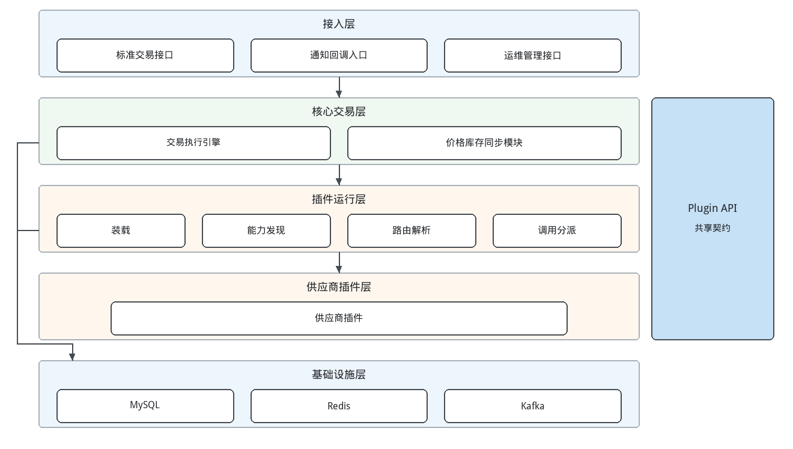

图4-2 系统逻辑分层图

系统的部署视图如图4-3所示。宿主应用以 Spring Boot 可执行包部署在应用节点上，插件制品放在各节点的受控插件目录中，由宿主在启动时或维护窗口内装载。多节点部署时，各节点装载相同版本的插件制品，插件版本由发布流程统一控制；各节点分别维护本节点的插件运行状态，持久化的插件记录只作为管理视图。MySQL、Redis 和 Kafka 作为共享基础设施供各节点访问。宿主通过外部网络以 HTTP 访问供应商接口，供应商通知经统一回调入口进入宿主。

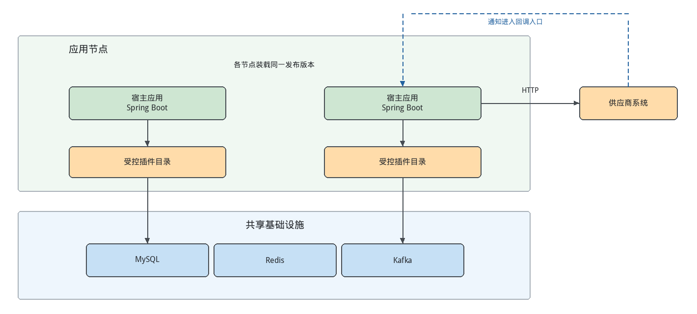

图4-3 系统部署图

## 4.2 插件化总体设计

### 4.2.1 从供应商差异划分扩展点

扩展点按业务阶段和操作目的划分，而不照搬某家供应商的接口顺序。这样划分的好处是：新增一家供应商时，只要它的业务落在已有的阶段和操作内，插件实现已有扩展点即可完成接入，宿主和契约都无需修改，从而降低接入的开发成本。

具体而言，下单阶段的处理可能包含供应商占位，也可能只完成本地的阶段衔接；发生占位时，返回实际取得的资源或订单关联。支付阶段的处理用于执行该阶段的供应商请求；查询用于获取外部事实；释放和退款分别对应不同的逆向目的。前置条件和副作用不同的能力，都设计为独立的扩展点。支付阶段的调用与出票完成分开表达：出票完成以当次调用中的确定结果或后续查询为依据，不把供应商的出票通知作为完成路径。

通知解析扩展用于处理核销通知，以及上游已发起退款后的供应商退款通知。它完成鉴权和转换后，把标准事件交给执行引擎，本身不写执行单，也不承担出票完成。价格库存扩展只返回标准的售卖信息，与交易命令分开。一个插件按实际能力实现多个扩展点，不具备的能力不提供“空成功”的实现。七个扩展点的设计名称为 ForwardOrderOccupySpi、ForwardOrderPayStageSpi、ForwardOrderQuerySpi、ForwardOrderReleaseSpi、ForwardOrderRefundSpi、SupplierNotifyParseSpi 和 PullPriceStockSpi，各扩展点的设计依据如表4-2所示。

表4-2 扩展点与设计依据

| 能力 | 宿主需要的标准语义 | 插件封装的差异 | 主要约束 |
| --- | --- | --- | --- |
| 下单阶段／占位 | 阶段结果与实际取得的外部关联 | A 锁库存后建单；B 无外部请求 | 本地阶段处理不伪造外部占位事实 |
| 支付阶段处理 | 当前外部处理结果及后续确认依据 | 支付阶段请求与最终结果分阶段获取 | 阶段响应与出票完成分别判断 |
| 查询 | 外部订单事实与凭证 | 多字段组合状态、查询协议和错误语义 | 查询失败不覆盖已确认结果 |
| 释放 | 资源占用的取消结果 | 解锁、取消未完成订单 | 校验前置状态和外部结果的确定性 |
| 退款 | 退款受理或完成情况 | 退订接口、部分退款限制、后续查询 | 资金结算仍属于上游平台 |
| 通知解析 | 核销或已发起退款的标准事件 | 签名、字段、回执与原始状态 | 不用于完成出票；经宿主幂等与状态校验后更新 |
| 价格库存 | 标准日期、场次、价格与可售信息 | 产品编码、场次结构、组合换算 | 不进入交易状态机 |

七个扩展点按缺失时的含义分为两类。占位和支付阶段处理属于阶段类扩展点：供应商在某个阶段没有外部动作时（如 B 的下单阶段、A 的支付阶段），插件不实现对应扩展点，执行引擎只在本地完成阶段衔接。查询、释放、退款、通知解析和价格库存属于操作类扩展点：插件未实现时，系统返回“能力不支持”。为了防止插件漏打包某个扩展而被误当作“该阶段无外部动作”，供应商接入配置中需要声明该供应商在各阶段是否有外部动作，插件启用绑定时，运行时核对声明与实际发现的扩展是否一致，不一致则拒绝启用。

扩展契约只表达共性的业务字段，外部票种对象、签名参数和 SDK 对象都不跨越边界。受控的扩展信息可以保存后续查询所必需的外部关联，但不能借此把供应商的任意字段都转移到宿主中，这些字段仍由对应插件解释。

### 4.2.2 依赖隔离与故障隔离

隔离设计分为依赖隔离和故障隔离两部分，目的是让一家供应商的问题只需在该插件范围内定位和处理，从而降低运维成本。

依赖隔离以类加载器为基础，需要同时满足共享契约一致和私有依赖隔离两个条件。宿主与插件必须把同一个扩展接口视为同一种运行时类型，如果双方各有一份同名接口，扩展就可能无法识别或转换，因此构建阶段要从插件制品中排除共享 API 的重复类。供应商 SDK 和转换所需的私有库则保留在插件制品中，由该插件的类加载器装入，不进入其他插件，也不进入宿主的公共依赖树。PF4J 默认为每个插件使用独立的类加载器，并采用插件优先的策略，系统类和框架类型仍由上层加载器提供[19]。框架虽然也支持插件之间的依赖查找，但本文按供应商独立组织适配，不以插件互相调用为前提。仅凭使用 PF4J 不能断定任意第三方库的冲突都已消除，依赖边界需要通过构建产物检查和双版本测试来验证。各组件之间的依赖关系如图4-4所示。

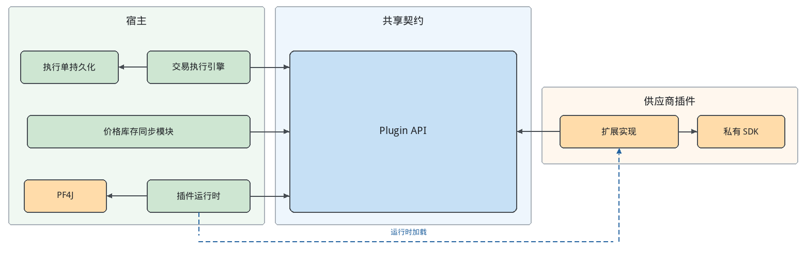

图4-4 宿主、共享 Plugin API 与供应商插件的依赖图

图4-4中，实线表示编译依赖或宿主内部调用，虚线表示运行时加载。交易执行引擎、价格库存同步模块和插件运行时都编译依赖 Plugin API，插件中的扩展实现同样编译依赖该契约并实现扩展点；插件运行时另外编译依赖 PF4J；私有 SDK 只在插件包内。宿主业务模块没有指向任何供应商实现的编译依赖，插件也没有指向执行单持久化模块的依赖。

故障隔离以调用边界为基础，包括三个层面。第一，执行异常隔离：运行时在调用插件时统一捕获插件抛出的异常，并转换为标准结果，异常不会穿透到上游，也不会中断宿主对其他插件请求的处理。第二，装载失败隔离：一个插件描述缺失、启动失败或能力冲突时，只有该插件不进入可调用状态，其他插件照常装载和调用。第三，资源隔离：每个插件持有自己的 HTTP 客户端、连接池和超时配置，一家供应商响应变慢只会占满该插件自己的连接资源。此外，目标插件不可用时，系统返回该插件对应的错误，不把请求转给其他供应商，避免一个插件的问题演变为错误的业务结果。

隔离也有明确的边界：插件与宿主共享同一进程和宿主的请求线程，进程崩溃、内存耗尽，或某家供应商长时间超时占满宿主线程的情况，无法依靠类加载器隔离。本文中的故障隔离，指插件之间在依赖和调用层面互不影响，不是进程级的沙箱。

### 4.2.3 插件独立发布与契约演进

插件独立发布是本文提高发布效率的主要手段。既有交易集群把各家供应商的对接逻辑放在同一个发布单元中，任何一家的改动都要重新构建和发布整个集群，一次发布需要 3 至 5 小时。采用插件化架构后，在共享契约兼容的前提下，一家供应商的协议字段或签名变化只需修改对应插件，构建出新的插件制品，在维护窗口内分发到各节点并替换旧版本，宿主制品和其他插件都不需要重新发布。两种发布方式的对比如表4-3所示。

表4-3 集中式集群发布与插件发布的对比

| 对比项 | 集中式集群发布 | 插件发布 |
| --- | --- | --- |
| 变更单元 | 整个交易应用 | 单个供应商插件 |
| 构建范围 | 全部供应商的对接代码与交易主干 | 该供应商的插件工程 |
| 发布对象 | 交易集群的全部节点重新部署 | 各节点受控目录中的一个插件制品 |
| 发布过程 | 构建、整集群滚动部署，耗时 3 至 5 小时 | 校验制品、阻断新调用、停止并替换旧插件、启用绑定，宿主不重启 |
| 影响范围 | 所有供应商的交易都在发布范围内 | 只涉及该供应商的交易，其他插件照常运行 |
| 回归范围 | 全部供应商的相关流程 | 该插件的功能及路由、共享类型等公共路径 |
| 回退方式 | 回退整个集群版本 | 恢复该插件的上一个可用版本 |

独立发布有一个前提条件，即共享契约兼容。公共契约新增必填字段、删除字段、改变方法签名或状态语义时，已有插件可能不再兼容，此时宿主与相关插件需要协同升级，不能把“插件可以独立构建”理解为“宿主永远不变”。因此，版本管理要同时记录插件制品的版本和它所依赖的共享契约基线，发布前检查二者的兼容关系。

独立发布也不意味着不需要回归。单个插件的改动缩小了直接修改的范围，但路由、共享类型和标准结果处理仍属于公共路径，回归范围应按本次变更的实际影响确定。新增能力超出现有扩展点的范围时，需要先扩展契约，再按协同升级处理。

## 4.3 交易执行引擎设计

扩展点能否保持稳定，取决于各插件返回的结果是否具有统一的含义，本地状态是否按统一的规则更新。交易执行引擎正是承担这部分统一规则的宿主组件，本节依次说明其执行记录、状态约束、幂等、结果解释、失败处理和通知收敛的设计。

### 4.3.1 标准命令与本地执行记录

交易执行引擎围绕本地执行单承接占位、出票、查询、释放和退款命令。命令入口为 ExecutionEngine，调用分派由 PluginDispatcher 完成，结果写入由 ResultApplier 完成，三者的协作见5.2.1节。命令携带上游业务身份、请求标识、所需的商品关联和执行上下文：首次受理时建立执行记录，后续命令读取同一条业务关联。供应商返回的外部订单号用于查询和恢复，凭证保存实际的出票结果，退款执行记录保存逆向请求及其进展。

本地执行单与上游用户订单在生命周期和职责上都不同。上游订单包含用户的销售流程和支付事实，本地执行单只包含供应商侧的执行事实。上游可以发起退款，宿主负责执行和确认供应商退款并回传结果，但不能因为外部退款成功，就认定上游的资金流程也已完成。

调用前的标准业务校验至少覆盖请求身份、关联对象、当前操作是否合法以及必要参数，校验通过后才进入运行时分派。对于已完成或已受理的重复命令，优先返回已有结果。插件不可用等技术错误也要与执行记录关联，避免上游重试时丢失原来的请求身份。

### 4.3.2 状态约束与业务不变量

所有交易类的插件调用都经过统一的执行规则，插件不能直接修改本地执行状态。这里的“统一”并不是把出票、凭证核销和退款强行合并为一条线性状态，而是指状态决策由宿主集中掌握，相关记录之间遵循一致的业务约束。价格库存属于独立的同步业务，不纳入交易状态的迁移。

状态约束以当前阶段、已知的外部事实和更新条件来表达。设计中的状态名称为：阶段处理完成、但尚未形成出票事实时记为 STAGE_DONE；支付阶段已受理、但尚无最终出票事实时记为 TICKET_PENDING；出票事实已确认时记为 TICKET_CONFIRMED；支付前的占用已撤销时记为 OCCUPANCY_RELEASED；退款已受理时记为 REFUND_ACCEPTED；退款已完成时记为 REFUND_DONE。持久化时以这些名称作为状态取值。各类操作的状态更新约束如表4-4所示。

表4-4 交易执行的状态更新约束

| 操作或事件 | 更新前必须核对的事实 | 可以采用的更新依据 | 不允许的处理 |
| --- | --- | --- | --- |
| 下单阶段处理 | 请求身份有效，当前阶段尚未处理 | 本地阶段结果；实际发生外部调用时，保存其结果与关联 | 把无需外部调用的阶段完成解释为外部锁库或建单成功 |
| 支付阶段处理／出票确认 | 上游阶段信息有效，当前执行允许该操作，必要的关联齐全 | 当前请求的结果；最终出票以确定响应或查询结果为依据 | 强制 B 先有外部占位，或把阶段响应直接视为出票完成 |
| 结果查询 | 关联身份可恢复，当前结果尚未确定或需要刷新 | 插件转换后的外部事实与当前合法状态 | 查询失败时清除有效凭证，或用“处理中”覆盖已确认结果 |
| 占位释放 | 当前操作允许释放，外部结果具备确定性 | 供应商取消或解锁的结果 | 外部建单结果未知时无条件解锁或重新建单 |
| 退款执行 | 退款身份和数量有效，符合当前可退约束 | 受理、查询或通知中的退款结果 | 仅受理就标记最终成功，或重复提交同一笔退款 |
| 核销或退款通知 | 协议校验通过且能够关联；退款通知对应上游已发起的退款 | 核销数量或退款进展 | 用通知完成出票；插件绕过宿主写库；重复累加核销数量 |
| 迟到或冲突的结果 | 当前已经具有确定事实，比较事件语义 | 合法后续操作的确定证据 | 迟到的中间结果使已确认的事实倒退 |

终态保护需要结合业务范围理解。出票成功表示出票阶段已经确认，并不意味着该订单此后不能核销或退款。上游发起的退款是一项新的业务操作，可以按规则更新对应的退款和凭证记录；需要禁止的，是旧的出票查询结果或迟到的核销通知把已确认的出票事实回退。如果把所有成功状态都定义为永久不可变，正常的售后流程就无法进行，因此设计以操作范围和业务不变量来约束更新。

业务不变量包括：同一请求身份不产生重复的供应商副作用；供应商订单关联必须能对应到正确的执行单；只有确认了出票事实才能保存有效凭证；已核销数量不因重复通知而重复增加；退款受理与退款完成必须区分；插件的返回值不能跳过宿主的状态校验；查询失败和不确定的响应不能抹除已有的确定事实。

这些不变量与当前状态共同构成写入的前置条件。宿主先读取当前记录，判断命令和结果是否允许改变状态，再执行条件更新。唯一约束负责身份和关联的去重，业务条件负责判断阶段和结果的含义，两者分别承担数据层面和业务层面的约束。业务状态约束如图4-5所示。

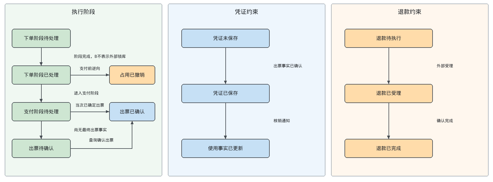

图4-5 供应商侧交易执行的业务状态约束图

图4-5把执行阶段、凭证约束和退款约束分为三组表示，而不是合并为一条状态链。“下单阶段已处理”对应 STAGE_DONE，对供应商 B 只表示本地衔接完成，不表示外部已锁库或建单。支付阶段若只被受理，则进入 TICKET_PENDING，查询失败或仍在处理中时保留已有事实；出票事实确认后记为 TICKET_CONFIRMED，迟到的中间结果不能使其回退。凭证只有在出票事实确认后才保存，核销只更新使用数量。退款受理（REFUND_ACCEPTED）与退款完成（REFUND_DONE）分开记录，资金结算仍由上游负责。支付前撤销占用记为 OCCUPANCY_RELEASED。图4-5表达的是分组约束，调用的先后顺序见图4-6、图5-7和图5-8。

### 4.3.3 幂等与本地一致性

平台级幂等由宿主负责。幂等身份对应一次业务意图，在上游重试时保持不变。宿主收到重复命令时读取已有的执行记录：已确认完成的，返回已有结果；已受理但未完成的，返回当前进度；结果未知的，进入确认流程。

交易命令的幂等键由 requestId 和操作范围共同组成，操作范围分为占位、支付阶段处理、释放和退款四种。同一上游订单可以合法地先产生一次占位、之后再产生一次退款，二者不会因为属于同一订单而被误判为重复操作。核销等供应商通知不是上游命令，按标准事件中的 eventId 去重。插件在签名中使用的随机数，或某次 HTTP 连接的标识，都不能代替 requestId。

本地一致性要求执行状态与关联、凭证和退款记录协调一致。确认出票成功时，不能只更新状态而遗漏凭证；确认退款结果时，要同步维护执行记录，并按退款范围处理凭证。适合放在本地事务中的更新在事务内完成，外部 HTTP 调用不纳入本地数据库事务。

一次跨系统执行可以分为三步：调用前的持久化准备、事务外的供应商调用和调用后的本地结果应用。准备阶段保留请求身份和查询所需的信息，外部调用阶段由插件按协议执行，结果阶段由执行引擎校验并写入。这种结构避免了数据库事务长时间等待外部响应，但无法消除“外部已成功、本地写入失败”的窗口，这种情况需要由后续的查询确认和恢复处理来弥补。

缓存可以提高重复读取的效率，但缓存过期不能导致已执行的业务重新开始，恢复时应以持久化事实和外部查询为准。消息发送与本地事务之间同样可能存在间隙，因此结果回传需要保留可核对的执行身份和重试依据。由于回传消息可以根据已保存的执行事实重新生成，回传的可靠性并不依赖于消息本身的持久性。

### 4.3.4 标准结果解释与查询确认

宿主依据当前命令和插件返回的信息，把结果区分为成功、处理中、明确失败和结果未知四类。这种分类服务于状态更新和后续决策：同一个技术响应在不同业务阶段可能有不同的含义，必须结合已有的执行事实来解释。四类结果的判断依据和处理方式如表4-5所示。

表4-5 标准结果语义与执行引擎决策

| 语义 | 判断依据 | 宿主处理 | 插件职责 |
| --- | --- | --- | --- |
| 成功 | 外部操作具有当前命令所要求的确定完成证据 | 校验状态，保存结果，必要时回传上游 | 提供标准业务信息与必要的关联 |
| 处理中 | 外部明确受理，但最终执行尚未完成 | 保留执行记录并进入结果确认 | 如实区分受理与完成，保留后续查询所需的关联 |
| 明确失败 | 能够确定当前外部动作被拒绝或未完成 | 保存原因与已有进展，决定重试或进入逆向处理 | 转换失败原因及已有的外部事实 |
| 结果未知 | 没有足够信息判断是否受理或完成 | 保留上下文，先查询确认，避免盲目重放 | 保留可查询的身份，执行查询并转换结果 |

“成功”需要结合命令和阶段来判断。B 的下单阶段不调用外部系统，该阶段处理完成只说明本地流程可以继续，不表示供应商已经占位；A 的外部占位成功也不代表出票完成。支付阶段的调用完成后，如果尚未取得最终的出票事实，仍然需要继续确认。HTTP 状态码 200 不能单独作为出票成功的依据。

何时查询确认、如何更新状态由执行引擎决定，插件负责实现 ForwardOrderQuerySpi 并返回标准结果。查询优先使用 supplierOrderId；A 在此之外还保存 tradeNo 和 longOrderId，查询和释放都读取供应商订单关联中的这三个字段。B 在支付阶段返回 supplierOrderId 后进入 TICKET_PENDING，由本系统的定时任务查询确认，即时查询与定时查询使用同一套状态规则，具体的间隔和轮次见5.2.4节。查询接口失败时，已有的确认事实原样返回并附上记录时间；没有确认事实时返回查询失败，均不覆盖已确认的结果。

### 4.3.5 失败处理与补偿决策

创建订单失败时，插件向执行引擎返回失败原因、当前阶段和已有的外部进展，由执行引擎按固定顺序决策，插件不自行结束整笔交易。决策的依据是当前阶段和已有的外部事实，而不只是异常的类型。总体原则有三条：结果未知时先查询，不盲目重新建单；外部资源已被占用而后续步骤被明确拒绝时，通过释放扩展撤销占用；请求确定尚未发出时，才可以用原请求身份重试。完整的决策顺序见5.2.5节的表5-5。

支付前的逆向只撤销供应商侧的占用，不记为用户退款，也不调用 ForwardOrderRefundSpi；只有上游另行发起的退款才使用退款扩展，资金结算仍由上游负责。外部恢复动作执行之后，插件仍须返回结果，执行引擎据此记录进度，不把“已经发出恢复请求”记为“恢复已经完成”。

补偿设计借鉴了长流程恢复的思想[29]，在本系统中落实为业务决策和相应的恢复动作，而不是一个独立的补偿引擎。状态决策、动作执行和结果确认形成闭环，同一恢复动作被重复触发时，同样要经过请求身份和当前状态的检查。

### 4.3.6 通知收敛与上游回传

出票完成只有两条确认路径：当次调用中的确定结果，或随后的查询结果。供应商主动发送的通知不用于完成出票，只用于核销，以及上游已发起退款、且供应商提供退款通知时的结果更新。

通知进入宿主入口后，由插件完成协议校验和转换，再由执行引擎关联执行单，核对是否重复以及当前状态。核销通知只更新使用事实，不把执行单改为已出票；退款通知只更新已发起退款的进展；重复的有效事件返回已有的处理结果；无法关联的通知不写入任何执行单。

上游回传发生在本地结果应用之后。回传内容包含稳定的业务身份、标准结果和必要的凭证信息，使上游能够与用户订单对应。回传失败属于结果传递问题，不能反过来把已确认的供应商出票改为失败，而应围绕已保存的事实重试或核对，这样可以避免把履约事实与消息是否送达混为一谈。一次交易的完整时序如图4-6所示。

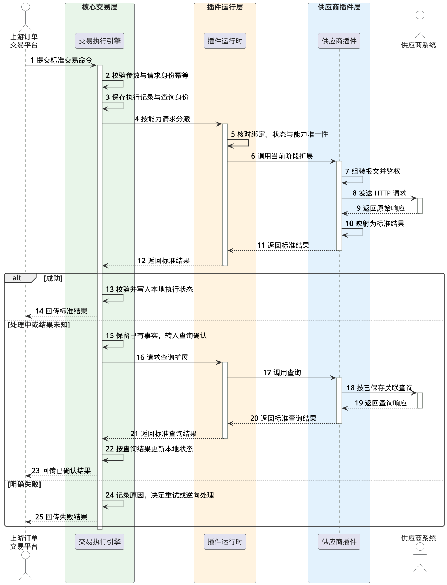

图4-6 一次交易经过交易执行引擎、插件运行时和供应商插件的时序

图4-6按核心交易层、插件运行层和供应商插件层分栏。调用前先校验参数和请求身份，并保存执行记录与查询身份；发往供应商的 HTTP 请求不放在本地事务中。返回后按“成功”“处理中或结果未知”“明确失败”三条分支处理，其中处理中或结果未知时转入查询确认。

## 4.4 插件运行时设计

### 4.4.1 装载、能力发现与可调用状态

插件制品包含入口、描述信息、扩展实现、资源和私有依赖。运行时先读取描述，检查基础元数据和共享契约的兼容性，再交由 PF4J 装载和启动。扩展能力按接口类型发现，运行时既不根据宿主的猜测查找供应商类名，也不把一次交易请求广播给所有插件。

装载成功、启动成功和供应商可调用是三个不同的条件。PF4J 的状态描述本节点上插件的生命周期，业务绑定决定当前请求能否进入该插件，外部配置和服务可用性决定实际调用能否成功。持久化的管理视图不能代替节点内的实际运行状态。

目标插件对同一能力出现多个实现时，运行时拒绝模糊选择并报告冲突；插件未提供某项能力时，返回“能力不支持”。运行时不能为了让调用成功而选取列表中的第一个扩展，也不能改调另一家供应商。能力缺失可能是供应商本身的正常限制，也可能是制品配置错误，因此处理时需要保留可追踪的原因。

### 4.4.2 路由上下文与调用分派

路由上下文 RouteContext 由 bizIdentity、supplierId 和 capability 组成，插件运行时据此解析出唯一的扩展。一家供应商对应一个插件包，多个 bizIdentity 可以绑定同一个插件。

路由缓存的键由 bizIdentity、supplierId 和 capability 拼接而成。调用分派依次核对目标绑定、当前节点上的插件状态、能力是否存在以及实现是否唯一，全部通过后执行类型化的扩展调用，并记录调用结果。插件版本、业务能力、链路身份、耗时和异常摘要用于排障，日志中不记录完整的证件号、手机号、密钥和凭证。

扩展发现复用 PF4J 的运行时管理，每次交易都不重新扫描制品。PluginDispatcher 只在插件状态为 STARTED 时持有扩展实例，插件停止或重载后立即丢弃，下一次分派取得当前有效的实现。Redis 只保存业务关联和短期场次数据，不保存 Java 扩展实例。

### 4.4.3 维护窗口内的生命周期与替换

插件替换采用维护窗口内单活替换的方式，这是4.2.3节插件发布的具体执行过程。停止前先阻断新调用，按既定策略处理在途调用，然后释放宿主持有的扩展引用和插件自有的资源，再卸载旧制品并装载新制品。新制品装载失败时，按发布流程恢复上一个可用版本。“单活”指同一业务身份在任一时刻只由一个插件版本处理，不默认支持两个版本同时生效。

生命周期钩子只提供资源清理的时机，并不证明清理已经完成。插件持有的连接、线程、定时任务和 Spring 上下文需要分别关闭；宿主缓存和线程上下文还可能残留对类加载器的引用，因此不能把卸载方法返回成功等同于类已被垃圾回收、元空间已经释放。

存量执行单保存了必要的外部关联，使替换后的兼容插件能够继续执行查询、释放或退款。调用时的插件版本可以作为审计信息，但请求不能随意选择已停止的历史插件。升级时需要验证新版本对历史关联的解释是否保持兼容，不能仅以版本号存在作为充分依据。

## 4.5 供应商插件与价格库存设计

### 4.5.1 外部协议转换与阶段适配

供应商插件负责请求转换、鉴权、外部通信和响应映射。协议的私有类型留在插件内部，跨越边界的只有标准结果和后续处理所需的关联。

插件按业务阶段实现扩展点，而不复制外部接口的调用顺序。供应商在某个阶段没有外部调用时，插件不实现对应的阶段类扩展点，由执行引擎在本地完成阶段衔接，插件也不会伪造锁库存或外部订单；操作类能力确实缺失时，按“能力不支持”处理。A 的锁库与建单、B 的支付阶段调用见第5章。

宿主通过4.2.1节的七个扩展点驱动流程，插件把当前阶段映射为供应商的实际操作。供应商之间的差异留在适配边界之内，执行引擎仍然依据4.3节的规则决定状态和后续处理。

### 4.5.2 本地价格日历同步

同步任务读取商品关联和日期范围，通过价格库存扩展拉取外部数据，插件负责转换场次、票种、价格和库存，宿主的同步模块校验后更新本地日历。商品主数据仍由上游商品平台维护，同步得到的日历可供其接收或发布。

同步失败与停售必须区分。没有取得有效响应时，同步任务记为失败，并保留已有的日历记录，不把它们写成零库存；供应商明确停售时，按可售语义更新对应范围。部分范围出现异常时，保留其他有效结果和最近一次可用的记录，不能用不完整的响应覆盖全部日历。更新时结合稳定的业务键和内容差异判断，避免重复任务产生多份相同的记录。

组合票的可售数量由必要子票种的库存和组合配比共同决定，组合价格由子票种价格按配比加权求和。这项计算由了解外部产品结构的插件承担，宿主只保存标准的聚合结果，不在同步主干中解析供应商的产品编码。价格库存同步流程如图4-7所示。

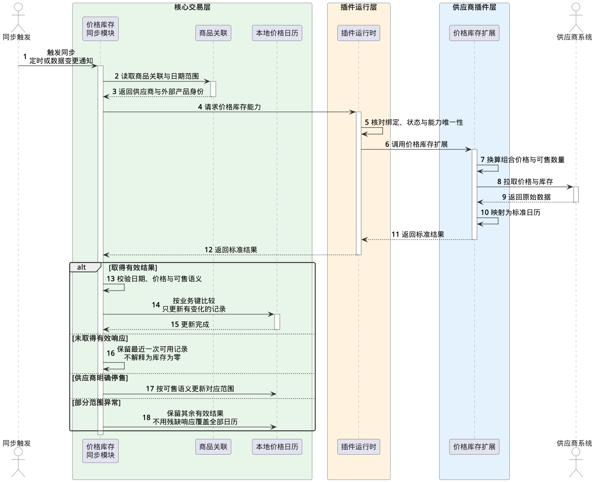

图4-7 价格库存同步流程

图4-7所示的流程与交易执行相互独立。同步任务先读取商品关联，再经插件运行时调用价格库存扩展，组合价格和可售数量在插件内换算。宿主收到标准结果后进行校验，只把有变化的记录写入本地价格日历。本流程不创建执行单，也不进入交易状态机。

## 4.6 数据模型设计

### 4.6.1 逻辑实体与关联

交易执行事实需要事务、唯一约束和条件更新的支持，因此执行单、外部订单关联、凭证、退款记录和价格日历都保存在 MySQL 中。Redis 只保存短期场次数据和配置的副本，缓存失效后可以从数据库或供应商重新取得；Kafka 只承载结果回传消息，消息内容可以由数据库中的执行事实重新生成。数据模型围绕供应商侧的执行事实组织，主要逻辑实体及其保存内容如表4-6所示。

表4-6 逻辑实体与保存内容

| 实体 | 主要保存内容 | 关联与约束 |
| --- | --- | --- |
| 业务身份与供应商配置 | 接入身份、供应商标识、各阶段是否有外部动作的声明、接口配置引用、启用范围 | 提供路由和协议配置依据，敏感密钥不进入普通日志 |
| 插件记录 | 制品身份、版本、契约基线、管理状态及错误摘要 | 区分持久化的管理视图与节点的实际运行状态 |
| 商品关联 | 上游商品身份、外部产品身份、产品类型及必要的组合关系 | 服务交易与同步，不替代商品主数据 |
| 本地执行单 | 上游关联、业务请求身份、执行进度及必要上下文 | 重复的业务请求指向同一条已受理的执行 |
| 供应商订单关联 | executionId、supplierOrderId、tradeNo、longOrderId | 与执行单为 1:0..1，可按外部订单号反查执行单 |
| 电子凭证 | 标准凭证、来源关联、使用情况及有效性 | 一笔执行可对应多个凭证，重复结果不重复生成 |
| 退款执行记录 | 退款请求身份、作用范围、外部关联与进度 | 区分受理与完成，支持核对重复请求 |
| 调用记录 | 业务身份、插件版本、能力、结果与脱敏的异常摘要 | 支持恢复、排障与发布审计 |
| 本地价格日历 | 商品关联下的日期或场次、价格、库存、可售情况和同步信息 | 同一业务维度幂等更新，获取失败不清空有效数据 |

供应商订单关联单独作为一个实体，与本地执行单为 1:0..1 的关系，逻辑字段包括 executionId、supplierOrderId、tradeNo 和 longOrderId。A 建单成功后写入 tradeNo 和 longOrderId；B 在支付阶段返回外部订单号之前，supplierOrderId 为空。凭证之所以与执行单分开，是因为一笔交易可能有多张凭证，各凭证的使用和失效并不总是同步发生，部分核销和部分退款都需要按对应的范围处理，不能因为单张凭证的事件就关闭整个执行单。

实体之间的关联如图4-8所示。一个本地执行单对应零个或一个供应商订单关联，对应零个或多个电子凭证、退款执行记录和调用记录；一个商品关联对应多个本地执行单和多条价格日历记录；一个插件记录对应多条调用记录，并可以被多个业务身份配置绑定；退款执行记录与电子凭证之间按退款范围形成多对多的关系，一次退款可以涉及同一执行单下的多张凭证。图中只标出逻辑基数，其中 1:N 包含零个的情况，不给出物理外键和字段名。

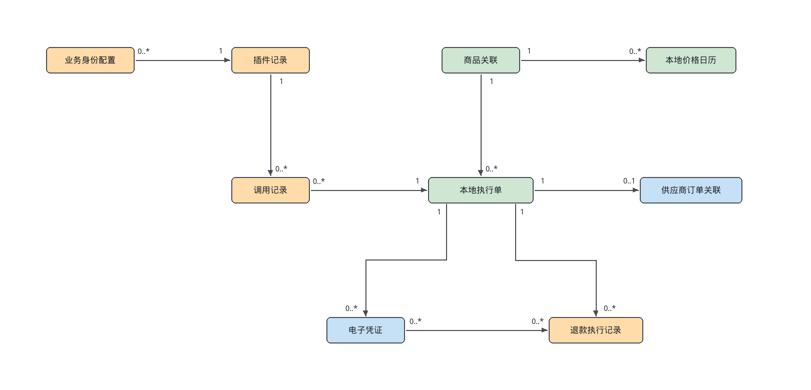

图4-8 核心逻辑实体关系图

### 4.6.2 持久化约束与恢复依据

幂等依赖稳定的业务身份和可恢复的执行记录。执行单身份、外部关联和凭证身份都需要满足相应的唯一性要求，状态写入必须带上当前的业务前置条件。数据库约束用于防止重复记录，应用层规则用于判断业务是否允许变化，两者相互补充。

索引建立在 executionId、requestId 与操作范围、supplierOrderId、商品关联和销售日期上。价格日历的唯一业务维度为商品关联、销售日期和场次。

恢复结果未知的交易，需要保存原请求身份、目标业务身份、所执行的能力和可查询的关联，只记录一条异常文本不足以恢复外部交易。查询和补偿还应保留处理进展和确定证据，使宿主在重试或重启后能够区分“未调用”“已受理”和“尚未确认”三种情况。

外部专有信息应受控保存。必要的外部标识由插件解释，宿主不能利用它们绕过插件直接构造供应商报文。敏感凭证和认证材料按配置与访问权限的要求管理。

## 4.7 设计对照与适用条件

为了说明本文设计的边界，本节把本文系统与两类系统进行对照：一类是典型的内部交易系统或完整交易中台，用于说明研究范围；另一类是把供应商适配写在宿主内部的集中式接入，用于说明插件化带来的交付差异。两类对象不能作为同一个性能基线，也不能据此推出本系统优于所有交易系统。对照结果如表4-7所示。

表4-7 系统边界与架构设计对照

| 比较维度 | 典型内部交易系统或完整交易中台 | 集中式供应商接入 | 本文插件化供应商侧执行系统 |
| --- | --- | --- | --- |
| 主要对象 | 用户订单、支付及内部领域协作 | 外部协议接入与执行流程混合组织 | 从上游命令到供应商履约事实的执行与协调 |
| 外部差异 | 可通过统一内部服务降低 | 私有分支、DTO 和 SDK 进入宿主 | 外部差异留在供应商插件内 |
| 状态决策 | 随业务域组织 | 容易与供应商分支交织 | 交易执行引擎统一掌握，插件返回标准结果 |
| 构建与发布 | 按订单、支付等业务域组织 | 单家协议改动带动整集群发布，一次需 3 至 5 小时 | 契约兼容时单独发布插件，不发布整个集群 |
| 附加机制 | 依业务架构确定 | 通常没有独立的插件生命周期 | 共享契约、路由解析、能力发现、生命周期管理 |
| 运行代价 | 按实际部署与调用路径衡量 | 直接的分支或策略调用 | 增加进程内分派，具体代价需要实测 |
| 隔离边界 | 依服务或模块的部署方式确定 | 各供应商共用依赖路径，一处故障进入同一发布单元 | 独立类加载器隔离依赖，可捕获异常不扩散到其他插件，仍共享宿主进程 |

需要指出的是，插件化并没有减少协议转换本身的工作量，它改变的是交付方式和影响范围：把整集群发布改为按插件发布，把依赖冲突和可捕获异常限制在插件内部。与此同时，它也带来了契约管理、运行时分派和生命周期治理的额外工作。因此，本文方案适用于供应商数量多、对接逻辑迭代频繁、各适配技术栈一致且不需要独立伸缩的场景。表中的 3 至 5 小时是既有集群的发布耗时，插件发布的实际耗时和调用代价，需要按6.4.4节的口径在一致的基线下测量。

## 4.8 本章小结

本章以插件化架构为主线完成了系统的概要设计。扩展点按业务阶段和操作目的划分，使新增供应商时无需修改宿主，从而降低接入的开发成本；独立类加载器和调用边界实现了插件之间的依赖隔离和故障隔离，降低了运维成本；插件在维护窗口内单独发布和替换，避免了整集群发布，提高了发布效率。宿主中的交易执行引擎统一了结果含义和状态规则，保证扩展点的稳定；插件运行时负责装载、隔离和分派；数据模型保留了执行与恢复所需的依据。上述设计为第5章的详细实现和第6章的验收条件提供了基础。

# 第5章 系统详细设计与实现

第4章确定了系统的职责划分与设计约束，本章在此基础上给出类、接口、状态名称和处理步骤，依次说明共享契约与插件运行机制、交易执行引擎、典型供应商插件、价格库存同步以及对外与内部接口的设计。实现过程中有五项关键技术难点，分别涉及类加载身份、调用分派、结果语义、阶段差异和组合计算，概述如下。

（1）共享契约的类加载身份。Plugin API 中的扩展接口和标准对象必须由宿主类加载器统一定义，插件制品中要排除这份 API 的重复类，运行时才能把插件实现识别为同一种接口类型。插件包中如果再打入一份同名类，JVM 会把它当作另一种类型，扩展发现和类型转换都会失败。处理方法见5.1.2节和图5-2。

（2）调用分派的唯一性与故障边界。PluginDispatcher.dispatch 按 bizIdentity、supplierId 和能力类型定位唯一的扩展。目标缺失、插件未启动、能力不支持或同一能力存在多个实现时，分别返回确定的错误，既不选取列表中的第一项，也不改调其他供应商；插件执行中抛出的异常和类链接错误在此处统一拦截，不影响其他插件。处理方法见算法5-1。

（3）四类结果与条件更新。StandardResult 的 outcome 只取成功、处理中、明确失败和结果未知四种值。ResultApplier.apply 更新时携带执行身份和更新前的状态，保证已确认的事实不被迟到的中间结果覆盖。处理方法见算法5-2和表4-5。

（4）供应商 A 与 B 的阶段差异。A 在下单阶段经 ForwardOrderOccupySpi 先锁库存再建单；B 不实现该接口，下单阶段只在本地完成衔接，supplierOrderId 为空，状态记为 STAGE_DONE。B 在支付阶段调用 ForwardOrderPayStageSpi，之后由定时任务对 TICKET_PENDING 的执行单调用 ForwardOrderQuerySpi 确认出票，不再次发起出票。

（5）组合商品的价格与库存。可售份数和组合价格分别按式（5-1）和式（5-2）计算，由 PriceComposer.compose 在插件内完成，宿主只保存标准结果。任一必要子票种缺失或停售时，不生成可售的组合。

## 5.1 共享契约与插件运行机制

### 5.1.1 Plugin API 的组织

Plugin API 保存跨越宿主与插件边界、必须共享的扩展接口、标准业务对象、公共异常和受控调用上下文，不包括执行单持久化入口、宿主内部的交易服务、供应商客户端或私有 SDK。宿主用接口类型表达业务能力，插件通过实现扩展来提供相应的能力。

共享扩展点包括 `ForwardOrderOccupySpi`、`ForwardOrderPayStageSpi`、`ForwardOrderQuerySpi`、`ForwardOrderReleaseSpi`、`ForwardOrderRefundSpi`、`SupplierNotifyParseSpi` 和 `PullPriceStockSpi`。支付阶段不复用占位接口，通知解析不承担出票完成。一个扩展可以组织多个外部步骤，但输出必须准确反映已有的业务事实。各项能力的业务含义如表5-1所示。

表5-1 共享扩展契约的业务含义

| 能力与接口 | 标准输入 | 标准输出 | 处理边界 |
| --- | --- | --- | --- |
| 下单阶段／占位 ForwardOrderOccupySpi | 执行身份、商品关联、日期、数量和所需游客信息 | 当前阶段结果及实际取得的外部关联 | A 先锁库存再建单；B 不实现该接口 |
| 支付阶段处理 ForwardOrderPayStageSpi | 执行关联及上游阶段信息 | 当前外部处理结果及 supplierOrderId | B 只在此阶段调用；A 不实现该接口 |
| 查询 ForwardOrderQuerySpi | supplierOrderId；A 同时使用 tradeNo、longOrderId | 外部状态、凭证及必要信息 | 不覆盖已确认的事实 |
| 释放 ForwardOrderReleaseSpi | 允许撤销的关联与原因 | 解锁或取消未完成订单的结果 | 支付前逆向使用该接口 |
| 退款 ForwardOrderRefundSpi | 退款 requestId、关联和作用范围 | 受理或完成情况与外部关联 | 只处理上游发起的退款 |
| 通知解析 SupplierNotifyParseSpi | 原始报文与协议上下文 | 核销或已发起退款的标准事件 | 不用于完成出票 |
| 价格库存拉取 PullPriceStockSpi | 商品关联、日期或场次范围 | 标准价格库存集合 | 不进入交易状态 |

标准请求保留调用方已经确定的业务事实，插件在转换时不能反过来修改宿主的原始请求。调用上下文可以提供链路身份和受控的配置视图，但不开放数据库事务对象。标准对象不携带供应商的私有 DTO，外部标识只有在后续查询或恢复确有需要时，才作为受控关联传递。扩展的输出保留阶段结果、外部关联和错误信息，供执行引擎按表4-5处理；查询结果中的凭证与订单关联必须对应同一笔执行。

公共契约的兼容性包括接口形态和业务含义两方面。增加可选字段、并为其规定默认语义时，可以保持兼容；改变字段的必填性、方法签名或枚举含义时，则需要同时检查宿主与插件。契约版本因此是兼容性回归的依据，而不只是一个用于展示的制品编号。新增能力超出现有契约时，需要同步调整契约和相关实现。

Plugin API 的类型关系如图5-1所示。ExtensionPoint 由宿主类加载器定义，七个业务扩展点都继承该接口。StandardRequest 携带 requestId 和已经确定的业务事实；StandardResult 只表达四类结果；RouteContext 携带 bizIdentity、supplierId 和 capability；IdempotencyKey 由 requestId 和操作范围组成，操作范围包括占位、支付阶段处理、释放和退款，核销通知则按 StandardEvent 中的 eventId 去重。

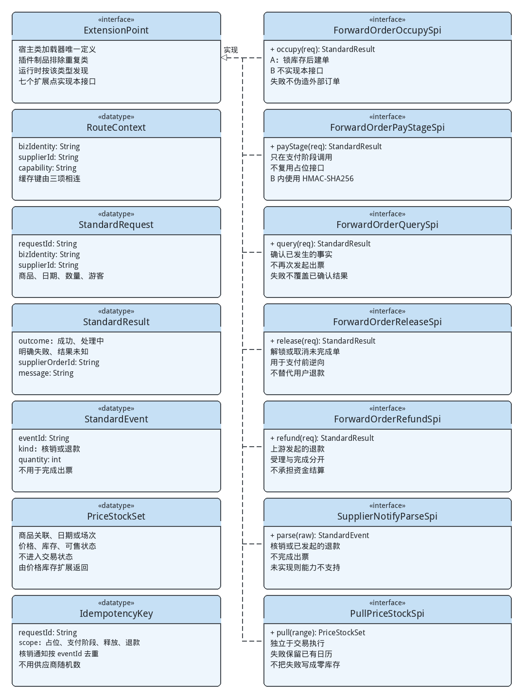

图5-1 Plugin API 类图

### 5.1.2 制品构建与类加载

宿主、共享 API 和供应商插件按 Maven 模块的职责组织。宿主在编译时依赖共享 API 和 PF4J；供应商插件在编译时依赖共享 API，并把外部客户端、转换逻辑和私有资源封装在自己的制品中。第6章使用的供应商测试桩是独立的测试工程，不作为正式插件发布。

插件制品由业务实现、描述信息、扩展索引、资源和私有依赖组成。描述信息用于确定插件的身份、入口和版本，扩展索引用于发现实现。PF4J 支持多种插件描述与扩展发现方式[19]，工程只需按选定的装载方式提供对应的描述文件。

插件以普通 JAR 或合并了私有依赖的 Fat JAR 形式交付，与宿主的 Spring Boot 可执行 JAR 职责不同。共享 API 由宿主一侧提供，插件包中排除其重复类；供应商专用的依赖随插件交付。制品是否正确需要检查归档内容和依赖范围，不能因为构建成功就认定共享类型没有重复。宿主、Plugin API 与供应商插件从开发到运行的关系如图5-2所示。

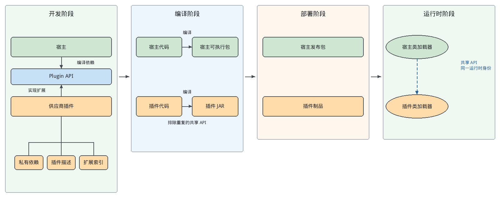

图5-2 宿主、Plugin API 与供应商插件的工程和制品关系

装载时，PF4J 为插件建立类加载环境并发现扩展。共享接口类型在宿主与插件之间保持同一个运行时身份，供应商的私有依赖在插件边界内解析。插件的资源通过其所属的类加载器读取，不能假定资源已经并入宿主类路径。

插件如果使用 Spring 组件，可以把组件的组织与插件生命周期结合起来：用插件的类加载器创建所需的上下文，限定扫描范围，通过明确的接口获得允许共享的配置和监控能力。上下文的创建和关闭对应同一个插件生命周期，不能为了简化依赖注入而让插件扫描宿主的全部业务 Bean。

### 5.1.3 装载、发现与启停处理

插件从制品到成为可调用的扩展，要经历元数据读取、装载、启动、能力发现和启用业务绑定五个步骤，如图5-3所示。PF4J 负责类加载和生命周期操作，宿主的运行时负责检查业务绑定和能力是否满足调用要求。在启用业务绑定之前，运行时还要核对供应商接入配置中声明的阶段动作与实际发现的阶段类扩展是否一致。插件描述缺失、启动失败、共享类型不兼容或声明与实际不一致时，保留明确的错误并阻止新业务进入；这些失败只影响该插件本身，其他插件照常装载和调用。

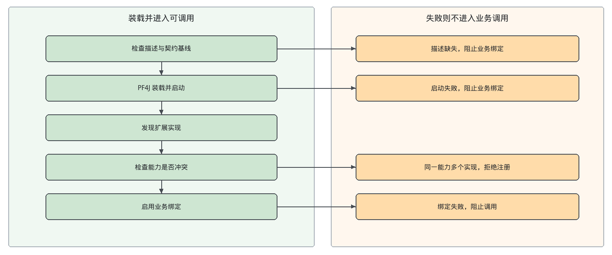

图5-3 插件装载与可调用注册流程

启动后，运行时按扩展接口发现目标实现。某个插件没有提供退款能力，属于可识别的能力缺失，不能用空实现返回成功；一个插件对同一能力发现了多个候选实现时，需要拒绝冲突，不能任意选取。能力集合以运行时的实际发现结果为准，持久化的元数据只用于展示和审计。

停止插件时，首先阻止新的调用进入，再按维护策略处理在途调用，随后移除宿主持有的扩展引用，关闭插件自有的资源，最后卸载，如图5-4所示。PF4J 生命周期操作的返回值不能证明线程、连接和类加载器已经完全释放，还需要检查资源关闭逻辑和运行记录。插件发布时，各节点依次执行这一停止流程，再装载新版本的制品并启用单活绑定，宿主进程不需要重启。

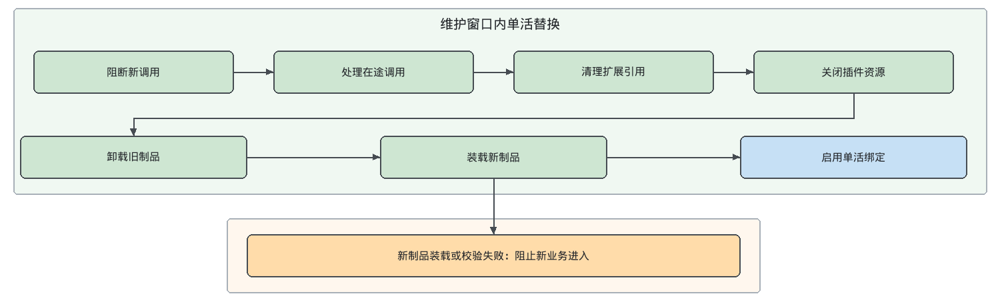

图5-4 维护窗口内插件停止与替换流程

单活替换限定每个业务绑定只有一个当前版本。由于存量交易仍需要查询、释放和退款，新版本必须能够解释已有的外部关联，不能只验证新下单成功就认定升级兼容，也不能允许上游指定历史插件版本来绕过运行状态的检查。

PF4J 提供的是通用的插件机制，本文在此基础上补充了面向门票交易的运行时约束，二者的分工如表5-2所示。

表5-2 PF4J 与本文工作的边界

| 环节 | PF4J 提供的机制 | 本文补充的工作 |
| --- | --- | --- |
| 装载 | 读取插件描述，创建插件类加载器，执行插件的启动与停止 | 装载前检查描述完整性和共享契约基线；装载失败时阻止启用业务绑定，且不影响其他插件 |
| 扩展发现 | 依据扩展索引，按 ExtensionPoint 类型返回实现列表 | 检查同一插件对同一能力是否存在多个实现，冲突时拒绝注册；核对阶段声明与实际扩展 |
| 调用定位 | 不涉及业务路由 | 按业务身份、供应商标识和能力类型解析唯一目标，失败时返回明确语义且不改调其他插件 |
| 生命周期 | 维护插件状态并提供启停钩子 | 停止前阻断新调用、处理在途调用、清理扩展引用和插件自有资源，按维护窗口单活替换 |
| 故障边界 | 不涉及 | 在调用边界统一捕获插件异常和类链接错误，转换为标准结果 |
| 业务语义 | 不涉及 | 定义标准请求与标准结果、四类结果语义，由交易执行引擎应用状态更新 |

### 5.1.4 路由上下文与调用入口

分派的输入为 RouteContext 和标准请求。运行时根据 bizIdentity、supplierId 和 capability 读取有效的绑定，定位插件，再检查当前能力是否可以调用。本次调用哪种能力由业务阶段决定，已有的 supplierOrderId 用于存量执行的后续操作。

对于阶段类能力，执行引擎在分派前先查询目标插件是否声明了该阶段的外部动作：没有声明时，只在本地完成阶段衔接，不进入分派；有声明时再进入分派。这样，B 的下单阶段和 A 的支付阶段都不会被误报为“能力不支持”，而 B 不提供的退款能力仍会按“能力不支持”返回。

调用入口先解析目标，再依次检查当前节点上插件的可用性、能力是否存在以及实现是否唯一，然后执行类型化的扩展调用。上游不能传入任意的 Java 类名或选择已停止的版本，业务层也不根据供应商私有的动作字符串反射调用外部方法。各项检查及其失败处理如表5-3所示。

表5-3 插件分派的检查与失败处理

| 检查环节 | 通过条件 | 失败处理 | 禁止的替代行为 |
| --- | --- | --- | --- |
| 目标解析 | 上下文能够定位当前有效的插件 | 返回目标配置或绑定错误 | 随机选择供应商 |
| 节点状态 | 插件在当前节点允许业务调用 | 返回插件不可用 | 仅凭持久化的管理状态强行调用 |
| 能力检查 | 目标实现了当前所需的能力 | 返回能力不支持 | 提供空成功或改调其他插件 |
| 唯一性检查 | 当前能力有唯一确定的实现 | 返回扩展冲突 | 取候选列表的第一项 |
| 协议执行 | 扩展按标准契约返回可解释的信息 | 捕获异常和类链接错误，转换为标准语义并保留业务关联 | 把未知结果一律判定为明确失败；让异常穿透到上游 |
| 调用结束 | 记录结果并完成运行时清理 | 保留可追踪的异常 | 继续使用已停止的实现处理请求 |

表5-3中的检查按固定顺序执行，任一检查失败即返回，不进入后续环节。该过程由 PluginDispatcher.dispatch 实现，如算法5-1所示。

```text
算法5-1 PluginDispatcher.dispatch
输入：路由上下文 ctx（业务身份、供应商标识），能力类型 cap，标准请求 req
输出：标准结果 res
1  binding ← 读取 ctx 对应的有效业务绑定
2  if binding 不存在 then return 失败(目标未配置)
3  plugin ← 当前节点中 binding 指向的插件
4  if plugin 不处于可调用状态 then return 失败(插件不可用)
5  impls ← plugin 中类型为 cap 的扩展实现集合
6  if impls 为空 then return 失败(能力不支持)
7  if |impls| > 1 then 记录冲突; return 失败(扩展冲突)
8  登记在途调用(plugin)
9  try
10     res ← impls[0].execute(req)
11 catch 异常或类链接错误 e
12     res ← 转换为标准异常语义(e, 外部调用阶段)
13 finally
14     注销在途调用(plugin); 记录调用(ctx, plugin 版本, cap, 耗时, res 摘要)
15 return res
```

算法5-1的第 9 至 12 行构成插件的故障边界：插件内部抛出的运行时异常，以及因依赖缺失引起的类链接错误（如 NoClassDefFoundError），都在这里转换为标准结果，异常不会传播到执行引擎之外，也不会影响其他插件的调用。转换时依据异常发生在外部调用之前还是之后，分别归为明确失败或结果未知。

路由缓存可以保存业务身份与制品之间的关联，扩展对象则属于节点内的运行管理。插件停止和重载后，后续调用应取得当前有效的实现，不把扩展实例长期保存为外部缓存的值。缓存失效和在途调用的处理与插件启停流程保持一致。

调用记录关联业务请求、插件身份、版本、能力、耗时和结果，用于区分目标错误、外部拒绝、结果未知和宿主写入失败等情况，并支持按插件统计故障，但它不是交易状态的最终来源。敏感字段只保留排障所需的摘要。

## 5.2 交易执行引擎的实现

### 5.2.1 统一命令入口与执行单关联

交易执行引擎是宿主中负责统一执行规则的组件，与 PF4J 的插件管理器无关。占位、出票、释放、退款和交易查询都进入统一的命令处理流程：先识别业务意图和执行关联，再校验状态和幂等，随后通过运行时调用扩展，最后解释标准结果并应用本地更新。

下单阶段，执行引擎根据上游请求身份和商品关联建立或读取本地执行记录，检查该阶段是否已经处理过。A 经占位能力发起外部请求；B 在此阶段只完成本地处理，等待支付阶段的请求。重复请求读取已有进度，不重复建立相同的执行。

本地执行身份、上游订单身份和外部供应商订单身份三者含义不同：本地执行身份与上游订单身份保持关联，外部订单身份用于后续的查询和恢复，行文中不能一律称为“平台订单号”。调用记录中的插件版本为审计提供依据，外部订单关联为业务恢复提供依据，版本号不能代替订单关联。

命令入口与具体供应商无关。它不判断外部的支付常量，不构造 RSA 签名原文，也不解析场次编码，这些信息都由插件解释。统一入口也不意味着所有命令的前置条件都相同，释放和退款分别校验各自的操作范围，但执行状态的写入规则集中在宿主。

宿主侧的核心类协作关系如图5-5所示。ExecutionEngine 接收标准命令，调用 PluginDispatcher.dispatch，再把标准结果交给 ResultApplier.apply；ResultApplier 按更新前的状态条件更新 LocalExecution；LocalExecution 与 SupplierOrderLink 为 1:0..1 的关系；TicketConfirmTask 只选出 TICKET_PENDING 的执行单，并且只请求查询能力；PluginDispatcher 在插件离开 STARTED 状态后不再持有扩展引用。

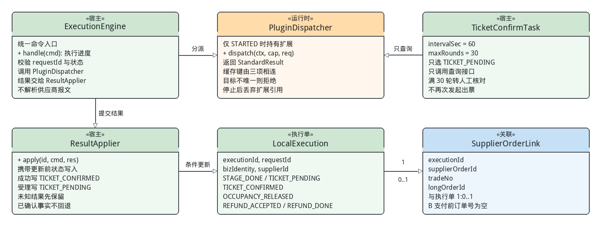

图5-5 宿主核心协作类图

执行引擎内部各项职责的协作如图5-6所示。命令经统一入口进入后，依次经过幂等检查和状态校验，再写入执行记录；执行记录分别关联凭证、退款执行和结果确认，失败时转入补偿协调，需要调用供应商时按能力交给插件运行时分派。

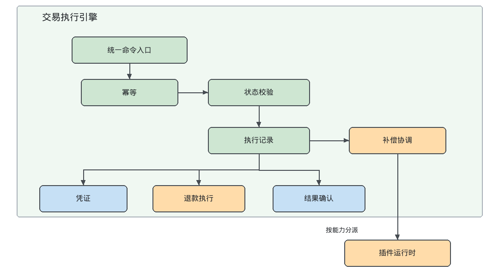

图5-6 交易执行引擎职责协作图

### 5.2.2 调用前校验与宿主幂等

调用前的校验分为标准参数、业务关联和当前状态三部分。参数校验检查数量、日期和所需的游客信息；关联校验保证命令指向正确的商品、供应商侧执行和外部订单；状态校验判断当前命令是否允许执行。任一必要条件不成立时，直接返回错误，而不是先调用供应商、再处理本地错误。

幂等处理先确定当前操作的请求身份，再读取对应的记录，决定是返回已有结果，还是进入尚未结束的确认流程。对重复的占位和退款，需要核对外部调用次数；对重复的通知，需要核对应用次数，这些判断都以持久化记录为依据。

重复请求的返回应保持原有的业务语义：已完成的请求返回已有结果，已受理的请求返回处理中，结果未知的请求返回需要确认的进度。既不能一律以冲突错误拒绝正常的重试，也不能因为上游没有收到响应，就允许再次提交有副作用的动作。

幂等键为 requestId 加操作范围。一次占位和之后的一次退款属于不同的操作范围，不是重复命令；在同一操作范围内，相同的 requestId 返回已有结果，不再向供应商提交第二次。

### 5.2.3 标准结果解释与本地应用

插件执行完成后，执行引擎对返回信息进行语义解释：外部明确完成的，才应用当前命令的完成结果；明确受理但尚未完成的，保留处理中；确定被拒绝的，保留失败原因；缺少足够判定信息的，保留为结果未知。这一规则对所有供应商一致，不依赖供应商原始状态的字面值。

结果应用首先确认当前命令和执行关联，再读取当前状态，检查标准结果是否具备本阶段所需的事实：取得确定的出票结果时保存凭证；尚待出票时保存进度；建单失败时转入失败决策；信息不足时保留确认依据。B 在下单阶段的本地完成不会进入凭证保存的路径。

状态应用按照“读取当前事实、检验结果能否应用、满足条件后更新”的顺序进行。已有的确定出票事实不能被中间查询结果抹除，已完成的退款记录不能因为旧通知又退回受理状态；但合法的后续退款和核销仍按各自的业务范围处理，不能把阶段成功误解为整个执行单此后不可变更。

本地事务用于相关记录的原子写入，例如同时保存出票结果和凭证。外部调用在事务之外执行，因此必须区分外部失败、本地应用失败和回传失败三种情况。外部已经出票而本地写入失败时，应利用执行身份和外部关联恢复确认，不能让上游的重试直接导致重复出票。各场景下宿主需要保存的内容和后续职责如表5-4所示。

表5-4 结果应用与恢复职责

| 场景 | 宿主需要保存或核对的内容 | 后续职责 |
| --- | --- | --- |
| 外部明确完成 | 当前命令、执行关联、完成事实与凭证或退款信息 | 校验后应用本地结果并回传 |
| 外部受理未完成 | 已受理的身份与当前执行进度 | 进入结果确认，由后续查询取得出票事实 |
| 响应未知 | 原请求身份、目标能力与可恢复的关联 | 先确认外部事实，避免重复副作用 |
| 外部完成、本地应用失败 | 已有请求及外部关联 | 恢复本地结果，不重新发起原交易 |
| 本地已确认、回传失败 | 已确认的结果与上游业务关联 | 重试结果传递，不回退履约事实 |
| 建单失败待处理 | 失败原因、已有外部步骤及决策结果 | 由执行引擎决定重试或进入逆向处理 |

标准结果由 ResultApplier.apply 写入。更新时同时携带执行身份和更新前的状态，只有当前状态仍与读取时一致才写入。各状态的写入规则为：出票完成写入 TICKET_CONFIRMED，出票尚未完成的受理写入 TICKET_PENDING，阶段衔接完成写入 STAGE_DONE，支付前释放完成写入 OCCUPANCY_RELEASED，退款受理写入 REFUND_ACCEPTED，退款完成写入 REFUND_DONE。处理过程如算法5-2所示。

```text
算法5-2 ResultApplier.apply
输入：执行身份 id，当前命令 cmd，标准结果 res
输出：应用后的执行进度
1  rec ← 读取执行单(id)
2  if rec 已具有 cmd 范围内的确定事实 then return rec.进度
3  switch res.语义
4    case 成功:
5      if res 不含 cmd 所需的完成事实 then 按结果未知处理
6      开启本地事务
7        n ← 条件更新执行单(id, 期望状态 = rec.状态, 新状态 = cmd 的完成状态)
8        if n = 0 then 回滚; 重新读取 rec 并返回
9        保存凭证或退款结果(res)
10     提交事务; 登记上游回传
11   case 处理中:
12     条件更新执行进度并保存受理关联; 加入待确认集合
13   case 明确失败:
14     保存失败原因与已有外部进展; 按5.2.5节进行失败决策
15   case 结果未知:
16     保存原请求身份与可恢复关联; 加入待确认集合
17 return 读取执行单(id).进度
```

### 5.2.4 出票查询与结果确认

确认流程接收尚未取得最终结果的执行关联，读取原请求和已有的外部身份，经运行时调用查询扩展。插件取得供应商响应后生成标准结果，执行引擎按4.3节的规则更新执行进度和凭证，交互时序如图5-7所示。

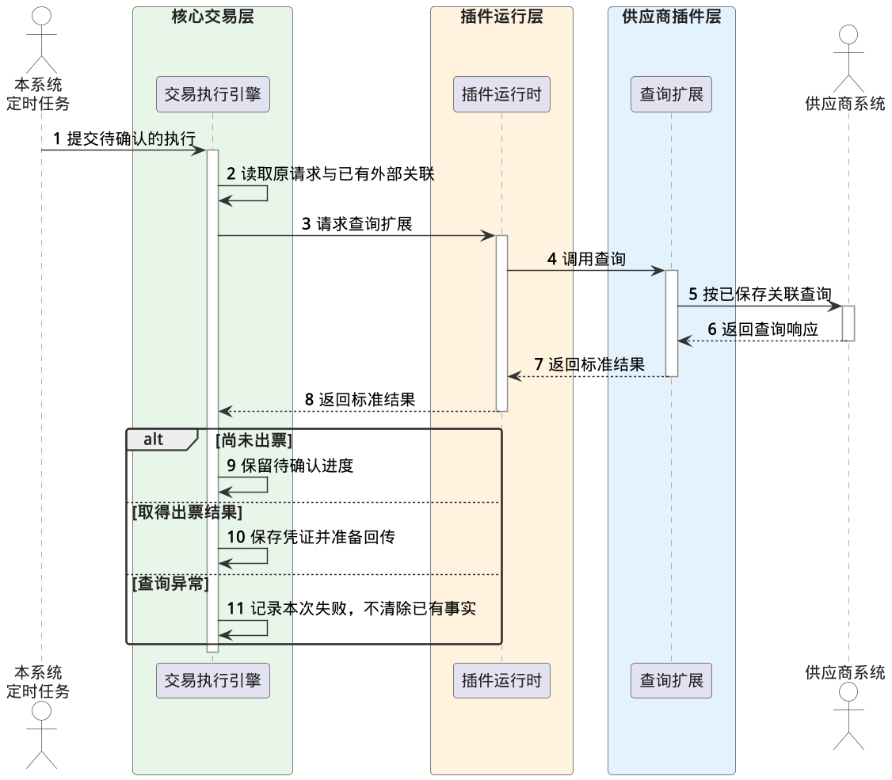

图5-7 交易结果确认时序

B 的查询由 TicketConfirmTask 触发。该任务只读取状态为 TICKET_PENDING 的 LocalExecution，每 60 秒查询一次，同一执行单最多查询 30 轮。查询只调用 ForwardOrderQuerySpi，不再次调用 ForwardOrderPayStageSpi，也不再次发起出票。某一轮取得出票事实时，ResultApplier 写入 TICKET_CONFIRMED 并保存凭证；30 轮后仍未取得最终出票事实时，保持 TICKET_PENDING 并转人工核对。查询异常只记录本次失败，不清除先前的事实。

原操作结果未知时，也走同一条查询路径。查询身份取供应商订单关联中的 supplierOrderId，A 还同时读取 tradeNo 和 longOrderId。查到外部订单时，按受理或完成应用，不再重新建单。

### 5.2.5 建单失败后的决策

插件返回失败或结果未知后，ExecutionEngine 按表5-5的顺序决策，插件不自行结束整笔交易。支付前的逆向只撤销供应商侧的占用，不记为用户退款，也不调用 ForwardOrderRefundSpi；只有上游另行发起的退款，才进入 ForwardOrderRefundSpi。

表5-5 建单失败后的决策顺序

| 顺序 | 条件 | 处理 |
| --- | --- | --- |
| 1 | 结果未知 | 先调用 ForwardOrderQuerySpi；查到外部订单时按受理或完成应用，不再重新建单 |
| 2 | 锁库存被明确拒绝 | 记录原因，不调用 createOrder，也不做逆向 |
| 3 | 锁库存成功，但建单被明确拒绝 | 调用 ForwardOrderReleaseSpi 解锁或取消未完成的订单，逆向完成前保持待处理 |
| 4 | 请求确定尚未发出的技术失败 | 用同一 requestId 重试当前步骤；请求可能已经到达供应商时，按结果未知回到第 1 步 |
| 5 | 需要撤销支付前的占用 | 只调用 ForwardOrderReleaseSpi，不调用 ForwardOrderRefundSpi |

决策之后的结果仍由 ResultApplier 记录。恢复动作尚未确认完成时，执行记录保留待处理的进度，不清除原有的关联。

### 5.2.6 通知处理、凭证与退款执行

通知入口先定位解析能力，由插件完成协议校验和转换，再由执行引擎校验关联、重复性和当前状态，时序如图5-8所示。通知的处理范围限于核销，以及上游已发起退款时的退款结果，出票凭证不从通知写入，供应商私有的字段只在解析阶段使用。

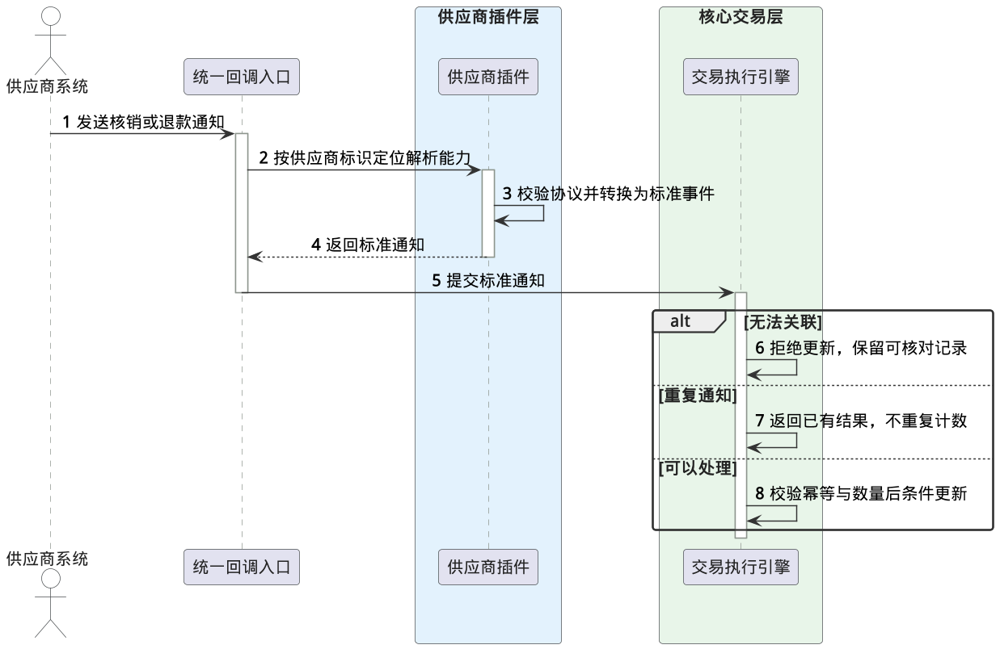

图5-8 核销或退款通知进入宿主状态更新的时序

重复的核销通知不再增加核销数量。部分使用时，宿主维护已使用的数量，不因一张凭证的使用就结束整笔交易。无法关联的事件不更新业务数据，但保留可供核对的信息。重复的出票查询结果不会新增凭证，这一约束由结果确认路径保证，与通知无关。

退款由上游发起，宿主校验可退条件和请求身份后，经插件执行供应商退订。退款受理时保持处理中；明确完成后，更新对应的退款结果并处理相关凭证的有效性。部分退款按作用范围处理，对不支持部分退款的供应商，不擅自拆分请求。资金退款结算仍由上游承担。

迟到的核销或退款通知不覆盖已确认的出票事实。协议回执表示外部通知是否被本系统接受，上游回传表示执行结果是否送达平台，二者含义不同。回传失败也不会把已确认的出票改为失败。

## 5.3 典型供应商插件适配

### 5.3.1 供应商 A 的占位调用链

供应商 A 通过 `ForwardOrderOccupySpi` 承接占位。插件读取标准请求中的商品、日期、数量和游客信息，结合外部产品、票种和场次生成请求，按供应商协议调用 `lockOrder` 锁定库存；锁定成功后再调用 `createOrder` 创建订单，形成外部订单关联，最后向执行引擎返回本次结果。

分时票需要匹配场次，日历票按游玩日期组织，组合票按子票种的配比展开数量。例如，一份组合需要两张同种子票，购买三份就对应六张该子票。场次转换和数量展开都在插件内完成，执行引擎无需解析外部票种的结构。

锁库存被明确拒绝时，当前调用返回明确失败，不继续建单，也不做逆向。建单成功后，供应商订单关联写入 supplierOrderId、tradeNo 和 longOrderId，后续的查询和释放都读取这三个字段。建单失败时，插件返回失败状态和已有的执行信息，由 ExecutionEngine 按表5-5决定重试还是调用 ForwardOrderReleaseSpi。A 的各调用步骤及其结果处理如表5-6所示。

表5-6 供应商 A 调用步骤与结果处理

| 步骤或结果 | 插件处理 | 执行引擎处理 |
| --- | --- | --- |
| 输入转换 | 解析外部票种、场次和数量 | 提供当前标准请求与业务关联 |
| `lockOrder` | 调用锁库存接口 | 接收当前扩展的标准结果 |
| 锁库存明确失败 | 转换失败原因，不继续建单 | 记录结果并决定后续业务处理 |
| `createOrder` 成功 | 返回外部订单关联及当前结果 | 应用当前阶段的结果 |
| `createOrder` 失败 | 返回失败状态及已有执行信息 | 决定重试或进入逆向处理 |
| 建单结果不确定 | 保留原请求及可恢复的关联 | 查询或核对后决定后续动作 |
| 后续查询 | 通过查询扩展转换供应商结果 | 应用状态并保存有效凭证 |

请求转换、外部调用和结果转换共同构成一次占位扩展调用。执行引擎只调用这一项能力并处理其标准结果，不分别编排供应商的锁库和建单接口。

### 5.3.2 供应商 A 的查询、释放与错误转换

查询适配先检查响应是否包含可解释的业务信息，再按表5-7把外部状态转换为 StandardResult。A 的状态映射集中在插件内，宿主只处理四类标准结果，不保存供应商的原始状态常量。出票成功还必须带有可保存的凭证信息，没有凭证时不能把该响应映射为成功。

表5-7 供应商 A 的状态映射

| 外部事实 | StandardResult |
| --- | --- |
| 支付且出票完成，并带有凭证 | 成功 |
| 支付失败或取消 | 明确失败 |
| 退款完成 | 退款结果 |
| 其余中间状态 | 处理中 |

释放扩展负责把执行关联转换为供应商的取消或解锁请求，再返回标准结果。它与已受理交易的退款能力不同，调用前由宿主校验当前是否允许释放。外部接口返回成功时，需要按该接口的语义解释，不能把“取消已受理”误记为“释放已完成”。

A 使用 RSA 完成协议签名，签名原文和字段组织遵守供应商的约定。鉴权错误和业务拒绝分别转换，为执行引擎的判断提供各自的错误信息。

### 5.3.3 供应商 B 的支付阶段调用与定时查询

供应商 B 在下单阶段不请求外部系统，插件也不实现 `ForwardOrderOccupySpi`。执行引擎只完成本地执行关联和阶段处理，状态记为 STAGE_DONE，supplierOrderId 为空，然后等待支付阶段的请求。此时还没有供应商建单的事实，不能套用 A 的锁库存流程，也不能填入虚构的外部订单。

进入支付阶段后，系统只调用 ForwardOrderPayStageSpi。插件使用 HMAC-SHA256 完成鉴权，与 A 的 RSA 实现相互独立。插件组织协议参数并转换响应，执行引擎记录当前进展和返回的 supplierOrderId，状态进入 TICKET_PENDING。资金支付由上游承担。B 不实现 ForwardOrderRefundSpi 和 SupplierNotifyParseSpi，宿主对这两项能力返回“能力不支持”。

之后的出票确认由5.2.4节的定时任务完成，该任务只调用 ForwardOrderQuerySpi，不再次请求供应商出票。取得出票事实后写入 TICKET_CONFIRMED 并保存凭证，未取得时保持 TICKET_PENDING。

A 与 B 的差异如图5-9所示：A 的差异体现在下单阶段的两步外部操作上，B 的差异体现在支付阶段的调用及其后的结果查询上。两者都通过公共扩展点和统一的结果应用路径与宿主协作，不要求每个业务阶段都发生相同的外部动作；任何失败结果都回到交易执行引擎，由其决定重试或逆向处理。

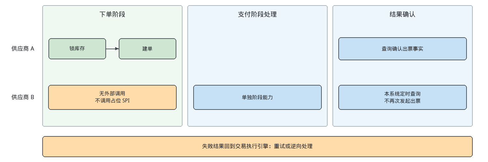

图5-9 供应商 A 与供应商 B 的阶段适配对照

### 5.3.4 协议通知与标准事件的区别

外部通知的字段属于各供应商的协议，不能要求每家供应商都提供相同的 notificationId、nonce 和 signature。宿主需要的是能够校验来源、关联执行和识别事件语义的标准信息，由插件根据实际字段生成。协议没有提供某项保障时，宿主不假定其存在，而是依据执行关联和当前状态保守处理。标准通知处理需要的信息类别如表5-8所示。

表5-8 标准通知处理需要的信息类别

| 信息类别 | 宿主处理用途 | 供应商插件的适配职责 |
| --- | --- | --- |
| 接入身份 | 定位目标配置与解析能力 | 按接口路径或协议上下文解释身份 |
| 订单或执行关联 | 定位正确的本地执行 | 转换外部订单身份及必要的关联 |
| 事件类型和业务结果 | 选择核销或退款处理，不用于完成出票 | 解释外部事件和状态的含义 |
| 事件身份或去重依据 | 避免重复应用 | 使用协议支持的稳定身份或可验证的信息 |
| 凭证或数量范围 | 更新核销数量或退款范围 | 转换外部的使用或退款明细 |
| 协议验证与回执信息 | 判断报文能否处理并正确应答 | 按对端规则校验，并生成协议所需的应答 |

表5-8是标准化的信息需求，不是 A、B 的真实外部字段表。时间戳、随机数和签名只有在对端协议确有约定时才校验。对于重复的有效事件，应返回协议允许的成功处理结果，避免出现“正常重试被当作恶意重放”的语义冲突。

## 5.4 价格库存同步的详细处理

### 5.4.1 场次与产品模型转换

同步任务按商品关联和时间范围发起，运行时取得价格库存扩展，插件读取外部的产品、场次和票种信息，并把有效结果转换为标准日历，宿主的同步模块负责校验和保存，全过程不经过交易状态机，时序如图5-10所示。

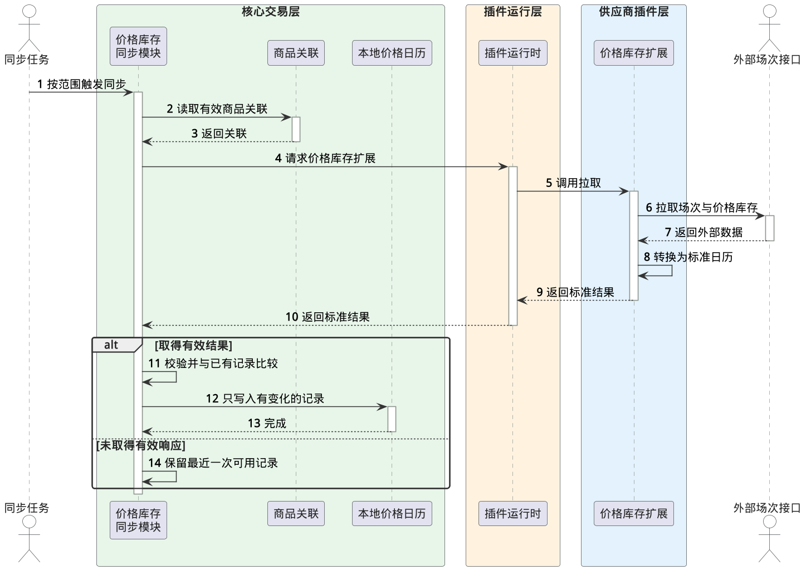

图5-10 价格库存拉取与更新时序

供应商 A 的案例涉及分时票、日历票、期票和组合票，不同产品的外部身份可能包含不同的维度，插件根据关联解析并取得所需的数据。分时票按实际场次时间区分，不把一天内的多个场次合并为一条无法下单的日历记录；日历票按游玩日期组织；期票按有效范围和协议约定表达。

返回的数据先校验完整性和有效性，再进行聚合。外部票种缺失、场次不可售或价格无效时，不能输出完整的可售组合。供应商明确返回不可售时，转换为对应的可售语义；接口失败或响应缺失时，保留为获取失败，不当作停售。

### 5.4.2 组合商品价格与库存

组合商品由若干必要的子票种构成。设每份组合需要第 \(i\) 种子票种的数量为 \(q_i\)，场次 \(t\) 下该子票种的库存为 \(S_{i,t}\)、价格为 \(P_{i,t}\)，共有 \(n\) 种必要子票种，则场次 \(t\) 的组合可售份数 \(S_{p,t}\) 由最紧缺的子票种决定，组合价格 \(P_{p,t}\) 由各子票种价格按所需数量加权求和：

$$
S_{p,t}=\min_{1\le i\le n}\left\lfloor\frac{S_{i,t}}{q_i}\right\rfloor \tag{5-1}
$$

$$
P_{p,t}=\sum_{i=1}^{n}P_{i,t}q_i \tag{5-2}
$$

其中，\(q_i\) 必须大于零，子票种的价格与库存必须属于同一场次和有效配置。必要子票种缺失或被供应商标记为停售时，不生成组合的可售结果；子票种可售但库存为零时，按式（5-1）得到的组合可售份数为零。

例如，一份组合需要 A 票两张和 B 票一张，A 票库存十张、B 票库存六张，则可售组合为五份；A 票单价八十元、B 票单价五十元，则组合价格为二百一十元。同步得到的数值会随外部库存变化，最终能否占位仍以供应商的确认为准。

插件按场次遍历必要的子票种，计算每种子票种可支持的份数并取最小值，同时累加价格。该计算由 PriceComposer.compose 完成，如算法5-3所示。宿主不为 A 的票种代码编写组合分支，外部组合结构只由插件掌握，宿主只保存标准结果。

```text
算法5-3 PriceComposer.compose
输入：场次 t，组合配置 {(i, q_i)}，子票种日历 {(S_i,t, P_i,t)}
输出：组合可售份数 S_p,t 与组合价格 P_p,t，或配置异常
1  if 组合配置为空 then return 异常(配置错误)
2  S ← +∞; P ← 0
3  for each (i, q_i) in 组合配置 do
4    if q_i ≤ 0 then return 异常(配置错误)
5    if 子票种 i 在场次 t 缺失或被标记停售 then return 异常(子票种不可售)
6    S ← min(S, ⌊S_i,t / q_i⌋)
7    P ← P + P_i,t × q_i
8  return (S, P)
```

### 5.4.3 缓存与日历更新

场次转换得到的外部标识和价格还会用于后续的占位请求，因此案例中使用短期场次数据，减少重复拉取。缓存键必须包含能区分业务身份或供应商的命名空间，避免不同插件的同名票种互相覆盖。缓存失效时，应重新取得有效数据或返回可解释的错误，而不能使用推测的场次。

本地日历按照稳定的商品关联和售卖维度更新，相同的同步结果不产生重复记录，内容未变时跳过写入。内容差异、供应商数据时间和完整性检查共同保证更新的正确性。

异常的范围要尽量精确。单个场次无效时，不清空其他有效场次；外部返回空响应时，不覆盖最近一次的有效数据。任务应记录实际的处理范围和失败原因，使商品平台和运维人员能够区分“正常无库存”和“同步未完成”。

## 5.5 对外与内部接口设计

### 5.5.1 面向上游的标准交易接口

对外接口面向上游订单交易平台和商品相关的调用方，提供稳定的业务命令和结果。请求身份用于重试和关联，上游不能传入插件实现类或外部 SDK 对象。响应使用表4-5的四类标准语义，不把供应商私有的错误码变成长期的上游契约。各接口的路径与业务契约如表5-9所示。

表5-9 标准对外接口的业务设计

| 接口 | 路径 | 主要输入 | 主要输出 | 操作约束 |
| --- | --- | --- | --- | --- |
| 下单阶段／占位 | /executions/occupy | requestId、商品、日期、数量及游客信息 | 阶段进度与实际外部结果 | 幂等键为 requestId 加占位范围 |
| 支付阶段处理 | /executions/pay-stage | requestId、执行关联与上游阶段信息 | 当前处理结果与 supplierOrderId | 幂等键为 requestId 加支付阶段范围；有外部动作时只调用 ForwardOrderPayStageSpi |
| 查询 | /executions/query | 本地执行关联 | 标准进度、凭证及退款情况 | 有确认事实时附记录时间返回 |
| 释放 | /executions/release | requestId、执行关联与原因 | 释放结果 | 幂等键为 requestId 加释放范围；支付前逆向走该路径 |
| 退款执行 | /executions/refund | 退款 requestId、数量或明细 | 退款受理或完成结果 | 幂等键为 requestId 加退款范围；不承担平台资金结算 |
| 供应商通知 | /callbacks/supplier | 供应商原始报文 | 协议回执 | 只处理核销或已发起的退款；按 eventId 去重 |
| 价格库存同步 | /price-stock/sync | 商品关联与时间范围 | 同步进度或标准日历 | 失败时保留已有日历 |

原请求重试时，返回原有的执行身份和已有结果。参数不合法、关联缺失、当前状态不允许、目标插件不可用和供应商明确拒绝需要分别返回。结果未知时应明确告知需要确认，既不能伪装成普通的成功，也不能诱导调用方更换请求身份后重复提交。

凭证信息按调用方的数据权限返回，日志中不输出完整的二维码或其他可直接使用的凭证。上游展示的支付状态来自其自身的订单与支付体系，本文系统回传的是供应商出票及履约的执行结果。

### 5.5.2 内部调用与异常语义

内部接口连接交易执行引擎、插件运行时和供应商插件。调用上下文表达目标所需的业务身份，扩展类型表达能力，标准对象表达输入输出，供应商的私有对象不能作为返回类型越过边界。运行时只负责选择目标和治理执行，不承担交易编排。各类内部异常的标准语义和宿主处理如表5-10所示。

表5-10 内部异常与宿主处理

| 情况 | 标准语义 | 宿主处理 |
| --- | --- | --- |
| 参数或商品关联缺失 | 执行前提不成立 | 拒绝调用，反馈可修正的原因 |
| 插件未配置或不可用 | 目标能力暂时无法执行 | 记录路由及状态，不改调其他供应商 |
| 能力缺失或实现冲突 | 契约能力无法确定 | 拒绝当前调用并处理配置 |
| 外部明确业务拒绝 | 确定失败 | 保存原因，按当前操作决定结束或补偿 |
| 外部响应无法判断 | 结果未知 | 保留身份并查询确认 |
| 插件内部异常或类链接错误 | 技术或协议异常 | 在调用边界拦截，根据发生在外部调用前后判断是否存在未知结果 |
| 已受理的重复请求 | 不新增外部操作 | 返回已有结果或当前进度 |

网络异常不能一律归为同一种结果。确定请求尚未发送与请求可能已经到达供应商，两者的外部确定性不同，在没有足够证据时应采用保守的确认路径。转换异常发生在调用前还是响应后，也可能意味着不同的执行事实，宿主需要保留关联，而不是只根据异常的类名决定是否重试。

协议回执按各供应商的约定生成，标准事件则服务于宿主内部的语义，二者不能合并为一份对所有供应商强制相同的通知字段表。公共错误的含义保持稳定，原始的外部错误码只在必要的审计范围内保留，不让上游长期依赖某一家供应商的实现。

## 5.6 本章小结

本章首先归纳了五项关键技术难点，再按运行步骤说明了共享契约、制品构建、插件装载与分派的实现。PluginDispatcher.dispatch、ResultApplier.apply 和 PriceComposer.compose 分别对应算法5-1至算法5-3，其中算法5-1同时构成插件的故障边界；建单失败后的决策顺序见表5-5。供应商 A 以锁库与建单两步操作体现多步协议的适配，供应商 B 以支付阶段调用和每 60 秒一次、最多 30 轮的定时查询体现阶段差异，二者都只通过公共扩展点接入，宿主中没有针对单个供应商的分支。图5-1和图5-5分别给出了契约类型和宿主类的协作关系。这些设计为第6章的测试提供了判定依据。

# 第6章 系统测试

本章依据第3章的需求和第4、5章的设计组织系统测试，内容包括测试概要、测试分析、测试用例设计以及测试执行记录与结论。目前已有的材料包括两张日志截图和若干界面截图，尚没有覆盖全部用例的执行报告。因此，本章将已有证据与待执行的用例分开说明，不以用例的期望结果代替执行结果。

## 6.1 测试概要

### 6.1.1 测试对象与范围

测试对象包括交易执行引擎的执行规则、插件运行时、供应商 A 与 B 的适配插件以及价格库存同步。上游支付、用户订单和商品主数据不属于本文系统，测试中只作为输入来源。外部供应商在集成测试中由测试桩代替，测试桩可以按场景返回成功、明确拒绝、处理中、超时和异常报文。测试桩是测试工具，不属于正式插件，其结果也不能代表真实供应商的全部行为。测试对象及主要观察内容如表6-1所示。

表6-1 测试对象与主要观察内容

| 对象 | 测试范围 | 主要观察内容 |
| --- | --- | --- |
| 交易执行 | 占位、出票、查询、释放、退款与核销结果 | 业务身份、外部调用、执行进度、凭证和退款记录 |
| 价格库存 | 场次转换、组合计算、异常响应与重复同步 | 标准日历、缓存所需信息、更新范围和异常原因 |
| 插件运行时 | 装载、能力发现、绑定、调用与启停 | 节点状态、目标扩展、拒绝原因和生命周期记录 |
| 隔离与发布 | 双版本依赖、单插件故障、单插件发布、新增供应商 | 类冲突异常、其他插件的调用结果、发布耗时与范围、代码差异 |
| 调用性能 | 稳定状态分派与完整业务调用 | 基准输入、参数、原始输出及统计范围 |

### 6.1.2 测试环境

测试环境由宿主应用、供应商插件、供应商测试桩和基础设施组成，配置项如表6-2所示。JDK、Spring Boot 和 MySQL 取设计基线；硬件、操作系统、PF4J 构建版本、Redis、Kafka、测试工具和网络条件在测试执行时按实际记录填写。

表6-2 测试环境配置

| 类别 | 配置项 | 取值 |
| --- | --- | --- |
| 硬件 | 处理器、内存、存储 | 【按执行记录填写】 |
| 操作系统 | 测试节点操作系统及版本 | 【按执行记录填写】 |
| 运行环境 | JDK | 17 |
| 宿主框架 | Spring Boot | 3.2.5 |
| 插件框架 | PF4J | 【按构建记录核对版本】 |
| 数据与中间件 | MySQL | 8.0 |
| 数据与中间件 | Redis、Kafka | 【按执行记录填写版本】 |
| 外部依赖 | 供应商测试桩 | 按用例配置返回结果与延迟 |
| 测试工具 | 接口测试、基准测试、覆盖率统计工具 | 【按执行记录填写】 |
| 网络 | 宿主与测试桩之间的网络条件 | 【按执行记录填写】 |

### 6.1.3 测试方法

功能测试以黑盒方法为主，分别采用场景法、等价类与边界值、决策表设计用例。幂等和结果确认无法只从接口响应判断，因此交易类用例同时采用灰盒方式：在观察接口输出的同时，检查测试桩收到的外部请求次数和本地执行单的前后状态。组合价格库存计算和状态映射适合单元测试；宿主、插件与测试桩之间的协作通过集成测试检查；插件替换后的影响通过回归测试检查。代码覆盖度按单元测试和集成测试的语句覆盖率与分支覆盖率统计。

## 6.2 测试分析

### 6.2.1 测试需求获取

显性测试需求来自第3章的功能需求 R01 至 R09，以及表3-10中的非功能需求。隐性测试需求来自跨系统执行和同进程插件的特点，主要包括：同一请求重复到达；建单或退款的调用结果未知；查询失败或迟到的结果不能覆盖已确认的事实；插件停止时存在在途调用；插件替换后旧实现不再被调用；一个插件出现异常或启动失败时，其他插件不受影响；两个插件依赖同一组件的不同版本。这些情况在正常流程中不会出现，却决定了幂等、状态约束和隔离设计是否成立，因此需要单独设计用例。

### 6.2.2 需求与测试用例的对应

需求与测试用例的对应关系如表6-3所示。用例编号中，T 表示门票交易，B 表示供应商 B 的阶段流程，P 表示价格库存同步，G 表示插件接入与运行，N 表示非功能测试。

表6-3 需求与测试用例的对应关系

| 需求 | 内容 | 对应用例 | 测试级别 |
| --- | --- | --- | --- |
| R01 | 占位、出票与释放 | T-01、T-02、T-04、T-09、T-10、T-12、T-13、T-17、B-01、B-02 | 集成、系统 |
| R02 | 交易查询 | T-03、T-11、B-03 | 集成 |
| R03 | 核销结果处理 | T-05、T-06、T-14、T-15 | 集成 |
| R04 | 退款执行 | T-07、T-08、T-16 | 集成 |
| R05 | 价格库存同步 | P-01 至 P-09 | 单元、集成 |
| R06 | 插件装载与发现 | G-01、G-02、G-13 | 集成 |
| R07 | 业务身份与插件绑定 | G-03、G-05 | 集成 |
| R08 | 扩展调用分派 | G-04、G-07、G-08、G-09 | 单元、集成 |
| R09 | 插件启停、替换与状态查看 | G-06、G-10、G-11、G-12 | 集成、回归 |
| 可扩展性 | 新增供应商不增加宿主协议分支 | N-02 | 系统 |
| 可维护性（独立发布） | 单家供应商变更只发布对应插件 | N-08 | 系统 |
| 可维护性（依赖隔离、职责边界） | 共享契约不重复打包，同一组件不同版本可共存，依赖方向明确 | N-01、N-06 | 配置项、集成 |
| 可靠性（故障隔离） | 单个插件失败不影响其他插件 | N-07、G-09 | 集成 |
| 可靠性（异常区分、幂等） | 不误调其他供应商，不盲目重放，不重复产生副作用 | T-06、T-11、T-12、T-16、G-05、G-06 | 集成 |
| 性能 | 分派开销与端到端响应 | N-03、N-04 | 系统 |
| 安全性 | 通知校验与日志脱敏 | T-14、N-05 | 集成 |

## 6.3 测试用例设计

### 6.3.1 场景法：交易主流程

场景法用于覆盖供应商 A 和供应商 B 的主流程及其备选流。A 的基本流为锁库存、建单、查询出票，备选流包括锁库存被拒绝、建单明确失败、建单结果未知和请求重复提交；B 的基本流为下单阶段本地处理、支付阶段请求供应商、定时查询取得出票结果，备选流为查询多次后才完成。各场景与用例的对应关系如表6-4所示。

表6-4 交易场景与测试用例

| 场景 | 流程 | 对应用例 |
| --- | --- | --- |
| A 基本流 | 锁库存成功，建单成功，查询取得出票结果 | T-01、T-03 |
| A 备选流 1 | 锁库存被明确拒绝 | T-09、T-17 |
| A 备选流 2 | 锁库存成功，建单明确失败 | T-10 |
| A 备选流 3 | 锁库存成功，建单结果未知，转入查询确认 | T-11 |
| A 备选流 4 | 同一请求重复提交 | T-12 |
| B 基本流 | 下单阶段无外部调用，支付阶段请求供应商，定时查询取得出票结果 | B-01、B-02、B-03 |
| B 备选流 | 定时查询先返回未完成，再返回出票结果 | B-03 |

重点场景给出完整的用例规约，如表6-5和表6-6所示。

表6-5 用例 T-12：同一业务身份重复占位

| 项目 | 内容 |
| --- | --- |
| 用例编号 | T-12 |
| 测试目的 | 验证同一请求身份不会在供应商侧产生重复订单 |
| 前置条件 | A 插件已启动并完成业务绑定；商品关联有效；测试桩的锁库存和建单接口均返回成功 |
| 输入数据 | 请求身份、商品、游玩日期、数量和游客信息完全相同的两次占位请求 |
| 测试步骤 | （1）提交第一次请求并等待返回；（2）以相同的请求身份提交第二次请求；（3）读取测试桩的调用记录；（4）读取本地执行单和外部订单关联 |
| 期望结果 | 两次请求返回同一执行关联；测试桩收到的锁库存请求和建单请求各 1 次；本地只存在一条执行单 |
| 判定准则 | 期望结果三项同时满足判为通过，任一项不满足判为不通过 |
| 终止条件 | 第二次请求返回，或超过测试设定的请求超时时间 |

表6-6 用例 B-01 至 B-03：供应商 B 的阶段调用与定时查询

| 项目 | 内容 |
| --- | --- |
| 用例编号 | B-01、B-02、B-03（同一笔交易串联执行） |
| 测试目的 | 验证 B 在下单阶段不调用供应商，支付阶段只调用一次，出票结果由定时查询取得 |
| 前置条件 | B 插件已启动并完成业务绑定；测试桩的查询接口第一次返回未完成，第二次返回出票成功及凭证 |
| 输入数据 | 一笔下单阶段请求，以及同一笔执行的支付阶段请求 |
| 测试步骤 | （1）提交下单阶段请求，读取测试桩调用记录；（2）提交支付阶段请求，读取测试桩调用记录和本地执行单；（3）等待定时查询执行两次；（4）读取本地执行单、凭证和测试桩调用记录 |
| 期望结果 | 步骤（1）后供应商调用次数为 0；步骤（2）后支付阶段请求为 1 次，执行单状态为 TICKET_PENDING；步骤（4）后查询请求为 2 次，支付阶段请求仍为 1 次，执行单状态为 TICKET_CONFIRMED 并已保存凭证 |
| 判定准则 | 各步骤的期望结果全部满足判为通过 |
| 终止条件 | 取得出票结果，或定时查询达到测试设定的最大次数 |

### 6.3.2 等价类与边界值：组合商品计算

组合商品的可售份数和价格按式（5-1）与式（5-2）计算。输入按有效等价类和无效等价类划分，并在库存与配比的整除边界上取值。以一份组合需要 A 票两张、B 票一张为例，设计的用例如表6-7所示，期望输出由公式直接算出。

表6-7 组合计算的等价类与边界值用例

| 编号 | 等价类或边界 | 输入（A 库存，B 库存，q_A，q_B） | 期望输出 |
| --- | --- | --- | --- |
| P-03 | 有效类，库存充足 | 10，6，2，1；单价 80、50 | 可售 5 份，组合价格 210 |
| P-03a | 边界：A 库存比 q_A 的整数倍少 1 | 9，6，2，1 | 可售 4 份 |
| P-03b | 边界：A 库存恰好等于 q_A | 2，6，2，1 | 可售 1 份 |
| P-03c | 边界：A 库存小于 q_A | 1，6，2，1 | 可售 0 份 |
| P-03d | 边界：B 可售但库存为 0 | 10，0，2，1 | 可售 0 份（不按异常处理） |
| P-03e | 无效类：配比不大于 0 | 10，6，0，1 | 不生成可售组合，记录配置错误 |
| P-04 | 无效类：缺少必要子票种 B | 10，缺失，2，1 | 不生成可售组合，记录异常 |

### 6.3.3 决策表：插件调用分派

调用分派依次检查目标绑定、节点状态、能力是否存在和实现是否唯一，这些条件的组合决定了分派结果。按决策表设计的用例如表6-8所示，“—”表示前一条件不满足时，该条件不再检查。

表6-8 插件调用分派决策表

| 条件与动作 | 规则 1 | 规则 2 | 规则 3 | 规则 4 | 规则 5 |
| --- | --- | --- | --- | --- | --- |
| 存在有效绑定 | 否 | 是 | 是 | 是 | 是 |
| 插件处于可调用状态 | — | 否 | 是 | 是 | 是 |
| 提供当前能力 | — | — | 否 | 是 | 是 |
| 能力实现唯一 | — | — | — | 否 | 是 |
| 动作 | 返回目标未配置 | 返回插件不可用 | 返回能力不支持 | 返回扩展冲突 | 执行扩展 |
| 对应用例 | G-05 | G-06 | G-07 | G-08 | G-03 |

### 6.3.4 其余功能测试用例

其余功能用例按场景与输入、期望结果和检查对象列出，如表6-9至表6-12所示。表中的数量和状态是输入条件或期望结果，不是执行结果。

表6-9 门票交易正常流程测试用例

| 编号 | 场景与输入条件 | 期望结果 | 主要检查对象 |
| --- | --- | --- | --- |
| T-01 | A 插件可用，商品关联有效，库存充足，首次占位 | 按协议先锁库存后建单，保存正确的外部关联 | 外部步骤顺序、执行单与关联 |
| T-02 | 已受理的执行，外部返回确定的出票结果和凭证 | 宿主校验后保存凭证与确认结果 | 本地更新、凭证及上游结果 |
| T-03 | 出票尚未完成，外部查询返回成功 | 查询结果进入同一状态校验并补齐凭证 | 查询、状态应用与凭证 |
| T-04 | 当前执行允许释放，外部返回完成 | 执行外部释放并应用正确结果 | 释放前提、外部结果与执行进度 |
| T-05 | 首次有效核销通知，凭证尚未使用 | 协议转换后按范围更新使用事实 | 通知关联、凭证与核销数量 |
| T-06 | 重复提交 T-05 的同一有效事件 | 返回已有处理结果，不重复累加 | 事件身份、使用数量与回传 |
| T-07 | 可退款的执行，外部只返回退款受理 | 保存退款进度，不提前标记最终完成 | 退款记录及原凭证范围 |
| T-08 | 退款处理中，取得明确完成的事件 | 校验后更新退款结果与相关凭证 | 退款事实、凭证有效性 |

表6-10 门票交易异常与幂等测试用例

| 编号 | 场景与输入条件 | 期望结果 | 主要检查对象 |
| --- | --- | --- | --- |
| T-09 | 锁库存明确返回库存不足 | 不继续建单，保留标准拒绝原因 | 外部建单次数与错误转换 |
| T-10 | A 锁库存成功，建单明确失败 | 插件返回失败与已有进展，由执行引擎调用释放扩展，不产生用户退款记录 | 原操作、标准返回、决策及后续动作 |
| T-11 | 建单可能成功但响应丢失 | 保留未知结果，先查询确认，不立即重建或解锁 | 原调用、后续查询及副作用次数 |
| T-12 | 同一业务身份重复占位 | 返回同一执行关联，不重复建立外部订单 | 请求身份、执行单及外部调用 |
| T-13 | 对不允许释放的执行提交释放 | 状态校验拒绝，不执行外部释放 | 前置条件与供应商调用记录 |
| T-14 | 通知被篡改而认证信息未相应更新 | 按实际协议拒绝，业务记录不变 | 协议校验、持久化状态与脱敏日志 |
| T-15 | 通知中的外部身份无法关联本地执行 | 不更新任何执行单，保留核对信息 | 关联判断、回执和记录 |
| T-16 | 退款可能已受理但响应未知 | 不重复退款，查询或核对原结果 | 退款身份、外部请求和进度 |
| T-17 | A 锁库存请求命中“供应商项目未激活”条件 | 保留明确拒绝信息，不误判为出票成功 | 原始拒绝与标准处理 |

表6-11 价格库存同步测试用例

| 编号 | 场景与输入条件 | 期望结果 | 主要检查对象 |
| --- | --- | --- | --- |
| P-01 | 有效商品返回连续日期的场次、票种、价格和库存 | 形成正确的标准日历及后续占位所需数据 | 输入、标准输出与日历 |
| P-02 | 同一天有多个有效场次 | 保留场次维度，不合并为单一日期记录 | 场次转换及业务唯一维度 |
| P-03 | 组合需 A 票两张、B 票一张；单价 80、50，库存 10、6 | 按公式得到组合价 210、可售 5 份；边界取值见表6-7 | 计算输入、插件输出与保存结果 |
| P-04 | 组合缺少必要的 B 票数据 | 不生成完整的可售组合，记录异常 | 完整性与可售输出 |
| P-05 | 返回数据含已停用和日期范围外的场次 | 过滤无效范围，保留其他有效数据 | 过滤结果与更新范围 |
| P-06 | 重复同步相同数据，再输入部分变化 | 不增加重复记录，只应用有效变化 | 前后记录、唯一维度与内容差异 |
| P-07 | 已有有效数据时外部响应缺失 | 保留有效日历，不解释为停售 | 同步错误与本地记录 |
| P-08 | 同步后对相应场次发起占位 | 外部场次、票种与数量关联正确 | 短期数据、转换请求与外部调用 |
| P-09 | 价格库存查询返回有效的标准结果 | 正确识别场次、可售、库存和价格字段 | 查询输出与业务范围 |

表6-12 插件接入与运行测试用例

| 编号 | 场景与操作 | 期望结果 | 主要检查对象 |
| --- | --- | --- | --- |
| G-01 | 装载描述完整的插件制品 | 元数据识别与框架装载正常 | 制品与节点运行记录 |
| G-02 | 启动并发现插件提供的能力 | 能力集合与制品及阶段声明一致 | 描述、扩展索引与实际发现 |
| G-03 | 配置业务绑定后发起交易或同步 | 按实际上下文进入目标插件的能力 | 配置、路由与调用关联 |
| G-04 | 交替调用 A、B 的现有能力 | 不串用外部 DTO、配置与鉴权 | 目标调用及外部请求 |
| G-05 | 缺少有效的目标绑定 | 返回明确错误，不调用其他插件 | 解析失败与外部调用次数 |
| G-06 | 停止目标插件后发起业务 | 拒绝新调用，不进入供应商 | 节点状态、拒绝与调用记录 |
| G-07 | 调用插件未提供的操作类能力 | 返回能力不支持，不返回空成功 | 能力检查及客户端记录 |
| G-08 | 同一目标能力存在冲突的实现 | 拒绝模糊选择并记录冲突 | 实现集合与拒绝记录 |
| G-09 | 插件执行中抛出普通异常 | 转换为稳定的标准语义，保留业务关联，异常不穿透到上游 | 异常边界、宿主与外部事实 |
| G-10 | 存在在途调用时停止插件 | 阻断新调用，按维护策略处理在途调用 | 启停与在途调用记录 |
| G-11 | 停止并重载后再次调用 | 使用当前有效的实现，旧实现不再处理请求 | 实例身份与实际调用 |
| G-12 | 停止插件自有的上下文与资源 | 按创建路径主动关闭资源 | 上下文、连接和线程的关闭证据 |
| G-13 | 制品描述缺失或不符合准入要求 | 拒绝装载或启用，并保存原因 | 制品校验与业务绑定 |

### 6.3.5 非功能测试用例

非功能测试与表3-10的量化指标一一对应，如表6-13所示。其中 2 毫秒、800 毫秒和单插件发布耗时是设计验收目标，相应用例尚未执行，不能视为已经测得的结果。

表6-13 非功能测试用例

| 编号 | 质量属性 | 测试方法 | 判定准则 |
| --- | --- | --- | --- |
| N-01 | 可维护性（依赖隔离、职责边界） | 检查宿主依赖树和插件制品内容 | 插件制品中 Plugin API 的重复类为 0；宿主对供应商实现的编译依赖为 0 |
| N-02 | 可扩展性 | 在同一代码基线上新增一个复用已有能力的供应商插件，统计宿主、Plugin API 和插件的代码差异 | 宿主执行主干新增供应商分支为 0；Plugin API 修改为 0 |
| N-03 | 性能（分派） | 在同一 JVM 中比较直接调用与经插件分派调用同一业务实现，预热后多轮测量 | 单次分派附加耗时不超过表3-10的设定值 |
| N-04 | 性能（端到端） | 测试桩设置固定延迟，按设定并发调用查询和占位接口 | P95 响应时间不超过表3-10的设定值；结论仅适用于该模拟配置 |
| N-05 | 安全性 | 执行含证件号、手机号和凭证的交易后检索日志 | 敏感字段明文条数为 0 |
| N-06 | 可维护性（依赖隔离） | 两个测试插件分别引入同一组件的两个不兼容版本，并在各自扩展中调用该组件的版本相关方法，交替调用两个插件 | 两个插件各自得到对应版本的行为；类冲突与类型转换异常数为 0 |
| N-07 | 可靠性（故障隔离） | 持续调用插件 B 的同时：（1）令插件 A 的扩展抛出运行时异常；（2）令插件 A 因依赖缺失抛出类链接错误；（3）装载一个启动失败的插件 | 插件 A 的调用返回标准错误，不穿透到上游；插件 B 的调用失败数为 0；宿主不重启 |
| N-08 | 可维护性（独立发布） | 修改插件 A 的一个协议字段，在两节点环境中按发布流程替换插件 A，记录发布全过程，期间持续调用插件 B | 宿主制品未重新发布；插件 B 未被替换且调用失败数为 0；单插件发布耗时不超过表3-10的设定值 |

## 6.4 测试执行记录与结论

### 6.4.1 已有执行证据

已有的订单锁库存日志截图如图6-1所示，从中可以识别外部响应 success=false、错误码 1125 以及“请先激活项目”的业务拒绝信息。它表明该次调用取得了可解释的供应商拒绝响应，且业务拒绝不能等同于出票成功。但这张截图不包含同一次执行的建单记录、本地执行单和标准错误码，因此只能作为 T-17 的响应材料，不能据此判定 T-17 通过。截图中的局部时间戳也没有统一的计时边界，不用于性能评价。

已有的价格库存日志截图如图6-2所示，从中可以识别返回 code=200、msg=success，结果包含场次时间、可售标记、剩余库存和价格等字段。它说明该次响应具有可识别的标准价格库存表示，但不能证明价格日历已经正确写入、重复同步没有产生重复记录，或组合规则适用于所有商品。原有材料没有说明查询日期范围是否包含端点，因此本章不报告固定的自然日数量。

界面截图如图6-3至图6-5所示，用于辅助说明上游展示的执行进度。它们不能证明本文系统实现了上游支付，也不能证明数据库事务、幂等或全部出票链路已经通过测试。

> 【图6-1占位】原有订单锁库存业务校验失败日志。截取可辨认的请求与拒绝响应，脱敏真实供应商、订单、票种、服务和链路身份。

> 【图6-2占位】原有价格库存查询与标准化结果日志。保留可辨认的标准字段，脱敏真实商品、合作方、内部动作、服务与链路信息。

> 【图6-3占位】支付后出票处理中的原有界面。凭证、订单身份与内部链接脱敏。

> 【图6-4占位】出票成功与凭证展示的原有界面。

> 【图6-5占位】本地价格库存日历的原有界面，展示可售与关闭日期。

### 6.4.2 执行情况统计

测试用例的执行情况如表6-14所示。功能用例共 42 项（T 类 17 项、B 类 3 项、P 类 9 项、G 类 13 项），另有表6-7中的 5 项组合计算边界用例和 8 项非功能用例。

表6-14 测试用例执行情况

| 类别 | 用例数 | 已有证据 | 执行状态 |
| --- | --- | --- | --- |
| 门票交易（T） | 17 | T-17 有锁库存拒绝日志截图 | 待执行 |
| 供应商 B 阶段流程（B） | 3 | 无 | 待执行 |
| 价格库存同步（P） | 9，另含 5 项边界用例 | P-09 有价格库存响应日志截图 | 待执行 |
| 插件接入与运行（G） | 13 | 无 | 待执行 |
| 非功能（N） | 8 | 无 | 待执行 |

优先执行的最小用例集为 T-12、T-11、T-10、B-01 至 B-03，以及体现本文核心目标的 N-06、N-07 和 N-08。每个场景使用可关联的业务身份，记录输入、目标能力、外部调用次数、标准输出、执行引擎的处理以及本地状态的前后值。B 的三个用例需要串成同一笔交易执行，才能说明从下单、支付阶段到出票确认的完整衔接。

### 6.4.3 覆盖度与缺陷统计

代码覆盖度、缺陷数量及其处理方式在用例执行后统计。覆盖度按单元测试和集成测试的语句覆盖率与分支覆盖率计算；缺陷按功能、可靠性、性能和安全性分类，记录发现缺陷的用例、原因和修复方式。目前尚无执行记录，本节暂不给出数值。

### 6.4.4 发布范围与性能评价口径

既有交易集群把各家供应商的实现编入同一个发布单元，一次发布需要 3 至 5 小时。插件化后，供应商实现作为独立制品交付，在契约兼容且不超出现有能力范围时，协议变更不必重新发布整个集群。这一判断需要通过 N-08 的发布记录，以及同一代码基线、相同业务范围下的代码差异来核实，采集口径如表6-15所示。在取得发布记录之前，3 至 5 小时只作为既有集群的基线，不能写成本系统已经缩短后的测量值。

表6-15 发布范围对照的采集口径

| 对比项 | 采集口径 | 解释边界 |
| --- | --- | --- |
| 宿主业务源码修改 | 同一代码基线下宿主的有效差异 | 区分供应商协议分支与通用能力的演进 |
| 共享 API 修改 | 接口、对象和语义的差异 | 不兼容的变化仍需要协同升级 |
| 供应商实现修改 | 排除生成代码与测试后的适配变更 | 插件化不消除协议转换本身的工作 |
| 受影响构建单元 | 实际的构建日志与依赖关系 | 不把声明的工程数当作受影响的构建数 |
| 交付产物与发布耗时 | 制品身份、发布记录及从开始校验到启用绑定的耗时 | 与既有集群 3 至 5 小时的发布耗时对照，独立插件仍需宿主兼容验证 |
| 回归范围 | 按本次变更影响采集执行记录 | 回归范围随变更内容确定 |

性能评价分为两层。N-03 在同一 JVM 中比较直接方法调用与插件分派调用，固定请求、业务实现、代码版本和 JVM 参数，并区分插件安装、首次类加载和稳定状态调用，需要保存基准代码、预热与测量方式、机器配置和原始输出。N-04 在测试桩固定延迟下测量端到端响应时间，结果包含 HTTP、数据库和测试桩的耗时，结论只适用于该模拟配置，不能据此推断插件框架本身增加的开销。

### 6.4.5 测试结论与局限

已有证据支持两类局部事实：供应商锁库存可以返回明确的业务拒绝，价格库存响应可以使用标准化的字段表示。统一执行规则、重复副作用控制、定时查询收敛、依赖隔离、故障隔离、独立发布以及性能指标，都需要上述最小用例集和 N 类用例的执行记录来证明。测试桩可以控制故障输入，但其结果不能自动推广到真实供应商的全部异常行为；N-06 和 N-07 也只覆盖类加载与调用层面的隔离，不涉及进程崩溃和长期的资源回收。

## 6.5 本章小结

本章按测试概要、测试分析、测试用例设计和测试执行记录组织系统测试。用例设计采用场景法、等价类与边界值和决策表三种方法，共形成 42 项功能用例、5 项组合计算边界用例和 8 项非功能用例，并建立了与需求 R01 至 R09 以及表3-10量化指标的对应关系，其中 N-06、N-07 和 N-08 分别用于验证依赖隔离、故障隔离和独立发布。已有的日志截图支持供应商明确拒绝和标准价格库存响应两类局部事实，其余用例的执行记录、代码覆盖度和缺陷统计需要在测试执行后补充。

# 第7章 总结与展望

## 7.1 本文总结

本文针对在线旅游平台接入大量景区门票供应商时遇到的问题开展研究。传统交易系统把各家供应商的对接逻辑放在同一个集群中，供应商越多，代码复杂度越难控制，迭代和维护成本越高；供应商的定制需求频繁变化，每次变化都要重新发布整个集群，一次发布需要 3 至 5 小时；一家供应商的依赖冲突或运行异常还会影响其他供应商。为此，本文设计并实现了一个面向异构供应商的插件化门票交易系统，主要工作如下。

（1）完成了需求分析。以两家在协议和调用时机上差异明显的供应商为案例，导出了门票交易、价格库存同步和插件化接入三部分功能需求，以及可扩展性、可维护性、可靠性、性能和安全性方面的非功能需求，并为独立发布、依赖隔离和故障隔离给出了量化指标。

（2）设计了插件化总体架构。按业务阶段和操作目的划分七个扩展点，并区分阶段类和操作类扩展点在缺失时的不同含义，使不同调用时机的供应商都能接入已有的扩展点，宿主中不出现针对单个供应商的分支，从而降低了接入的开发成本。一家供应商对应一个插件包，在共享契约兼容时可以在维护窗口内单独发布和替换，不必重新发布整个交易集群，从而提高了发布效率。各插件使用独立的类加载器隔离私有依赖，调用边界统一拦截插件异常和类链接错误，装载失败也只影响该插件本身，从而降低了运维成本。

（3）设计了宿主中的交易执行引擎。它统一负责状态更新、幂等、结果确认和失败决策，使不同插件返回的结果对上游具有一致的含义，保证了扩展点的稳定。

（4）基于 PF4J 完成了插件机制、交易执行引擎、两家典型供应商插件和价格库存同步的详细设计，给出了扩展点、宿主类、状态名称、对外接口和失败决策顺序，以及插件调用分派、标准结果条件应用和组合商品价格库存计算三项算法。

（5）完成了测试设计。采用场景法、等价类与边界值和决策表设计了 42 项功能测试用例、5 项组合计算边界用例和 8 项非功能测试用例，并分析了已有的业务拒绝与价格库存响应材料。

本文方案的适用条件是：共享契约保持兼容，供应商的变化处在已有的能力范围之内。超出这一范围时，宿主与插件仍需要协同升级。插件与宿主共享同一进程，类加载器隔离的是依赖和插件调用，进程崩溃和内存耗尽不在隔离范围之内。目前已有的证据只支持局部的适配事实，表3-10中的性能目标和发布耗时目标尚未测量，其余用例的执行记录仍待补充，因此还不能证明全部机制均已通过测试。

## 7.2 未来展望

后续工作首先是完成第6章用例的执行，保存可关联的输入、外部调用次数、标准结果和本地状态的前后值。验证优先覆盖重复占位、建单结果未知、B 的阶段调用与查询链路，以及依赖隔离、故障隔离和独立发布三项非功能用例，再逐步扩展到逆向执行、重复通知和本地应用失败等情况。插件化带来的接入收益，以代码差异、制品和发布记录评价；调用开销，以固定实现和输入的可复现基准测量。

在隔离方面，目前插件共享宿主的请求线程，一家供应商长时间超时仍可能占用宿主线程。后续可以为每个插件设置独立的调用超时和并发上限，在调用分派处实现舱壁隔离，进一步缩小单个供应商故障的影响范围。

随着供应商能力的演进，还可以加强共享契约的兼容检查和插件制品检查，把类型重复、依赖越界和扩展冲突提前到构建阶段暴露。运行方案继续以受控的维护窗口为基础，只有在业务确有需要且取得验证记录之后，再考虑多版本共存或更复杂的发布调度机制。

# 参考文献

[1] 国务院. “十四五”旅游业发展规划：国发〔2021〕32号 [EB/OL]. (2022-01-20) [2026-09-14]. https://www.gov.cn/zhengce/content/2022-01/20/content_5669468.htm.

[2] Inversini A, Chen M M, Keller A, et al. Hot topics in travel digital transformation: a swiss perspective [C]//Information and communication technologies in tourism 2024: ENTER 2024 international eTourism conference, Izmir, Türkiye, January 17-19. Cham: Springer, 2024: 195-206.

[3] Dang T D, Nguyen M T. Systematic review and research agenda for the tourism and hospitality sector: co-creation of customer value in the digital age [J]. Future Business Journal, 2023, 9(1): 94.

[4] Koo C, Shin S, Gretzel U, et al. Ai-powered smart tourism 2.0: a 10-year retrospective and updated model [J]. Electronic Markets, 2025, 35: 108.

[5] Garlan D, Shaw M. An introduction to software architecture [M]//Advances in software engineering and knowledge engineering: v. 1. Singapore: World Scientific, 1993: 1-39.

[6] Perry D E, Wolf A L. Foundations for the study of software architecture [J]. ACM SIGSOFT Software Engineering Notes, 1992, 17(4): 40-52.

[7] Hohpe G, Woolf B. Enterprise integration patterns: designing, building, and deploying messaging solutions [M]. Boston: Addison-Wesley, 2003.

[8] Autili M, Di Salle A, Perucci A, et al. On the automated synthesis of enterprise integration patterns to adapt choreography-based distributed systems [C]//Proceedings of the 14th international workshop on foundations of coordination languages and self-adaptive systems, Madrid, Spain, September 5, 2015. EPTCS, 2015, 201: 33-47.

[9] Koukaras P. Data integration and storage strategies in heterogeneous analytical systems: architectures, methods, and interoperability challenges [J]. Information, 2025, 16(11): 932.

[10] Fusco G, Aversano L. An approach for semantic integration of heterogeneous data sources [J]. PeerJ Computer Science, 2020, 6: e254.

[11] Gamma E, Helm R, Johnson R, et al. Design patterns: elements of reusable object-oriented software [M]. Boston: Addison-Wesley, 1994.

[12] Fowler M. Patterns of enterprise application architecture [M]. Boston: Addison-Wesley, 2002.

[13] Parnas D L. On the criteria to be used in decomposing systems into modules [J]. Communications of the ACM, 1972, 15(12): 1053-1058.

[14] Szyperski C. Component software: beyond object-oriented programming [M]. 2nd ed. Boston: Addison-Wesley, 2002.

[15] Buschmann F, Meunier R, Rohnert H, et al. Pattern-oriented software architecture, volume 1: a system of patterns [M]. Chichester: John Wiley & Sons, 1996.

[16] Richards M. Software architecture patterns [M]. Sebastopol: O’Reilly Media, 2015.

[17] Chatley R, Eisenbach S, Magee J. Modelling a framework for plugins [C]//Proceedings of the specification and verification of component-based systems workshop, Helsinki, Finland, September 1-2, 2003. 2003: 49-57.

[18] Aulkemeier F, Paramartha M A, Iacob M-E, et al. A pluggable service platform architecture for e-commerce [J]. Information Systems and e-Business Management, 2016, 14(3): 469-489.

[19] Suiu D. PF4J: Plugin Framework for Java [EB/OL]. [2026-09-14]. https://pf4j.org/.

[20] OSGi Alliance. OSGi Core Release 8 specification [EB/OL]. (2020) [2026-09-14]. https://docs.osgi.org/specification/osgi.core/8.0.0/.

[21] OpenJDK. JEP 261: module system [EB/OL]. (2017) [2026-09-14]. https://openjdk.org/jeps/261.

[22] Lindholm T, Yellin F, Bracha G, et al. The java virtual machine specification, java se 17 edition [EB/OL]. (2021) [2026-09-14]. https://docs.oracle.com/javase/specs/jvms/se17/html/.

[23] Buhalis D, Law R. Progress in information technology and tourism management: 20 years on and 10 years after the internet—the state of etourism research [J]. Tourism Management, 2008, 29(4): 609-623.

[24] Gretzel U, Sigala M, Xiang Zheng, et al. Smart tourism: foundations and developments [J]. Electronic Markets, 2015, 25(3): 179-188.

[25] Zhao Q C. Research on collaborative service platform of ticket business oriented to multiple-terminal heterogeneous system [J]. Advanced Materials Research, 2014, 926: 2385-2389.

[26] Zhu Jiansheng, Shi Xinghua, Zhang Liangjin. The research and implementation of China railway ticketing and reservation system (TRS) version 5.0 [J]. China Railway Science, 2006, 27(6): 95-103.

[27] Kleppmann M. Designing data-intensive applications [M]. Sebastopol: O’Reilly Media, 2017.

[28] Nygard M T. Release it!: design and deploy production-ready software [M]. 2nd ed. Raleigh: Pragmatic Bookshelf, 2018.

[29] Garcia-Molina H, Salem K. Sagas [C]//Proceedings of the 1987 ACM SIGMOD international conference on management of data, San Francisco, California, May 27-29, 1987. New York: ACM, 1987: 249-259.

[30] Dragoni N, Giallorenzo S, Lafuente A L, et al. Microservices: yesterday, today, and tomorrow [M]//Present and ulterior software engineering. Cham: Springer, 2017: 195-216.

[31] 于辰云, 刘旸, 周金枝. 基于插件技术的数据挖掘平台设计与实现 [J]. 辽宁石油化工大学学报, 2010, 30(2): 46-49.

[32] 李鸣亚, 邹晓峰. 浅谈插件化软件开发 [J]. 广西轻工业, 2009, 25(8): 81-82.

[33] 周志明. 深入理解 Java 虚拟机: JVM 高级特性与最佳实践 [M]. 3 版. 北京: 机械工业出版社, 2019.

[34] Liang Sheng, Bracha G. Dynamic class loading in the java virtual machine [C]//Proceedings of the 13th ACM SIGPLAN conference on object-oriented programming, systems, languages, and applications, Vancouver, Canada, October 18-22, 1998. New York: ACM, 1998: 36-44.

[35] Spring. Spring Boot reference documentation, version 3.2.5 [EB/OL]. (2024) [2026-09-14]. https://docs.spring.io/spring-boot/docs/3.2.5/reference/html/.

[36] Oracle. MySQL 8.0 reference manual: innodb transaction model [EB/OL]. [2026-09-14]. https://dev.mysql.com/doc/refman/8.0/en/innodb-transaction-model.html.

[37] Redis. Redis data types [EB/OL]. [2026-09-14]. https://redis.io/docs/latest/develop/data-types/.

[38] Kreps J, Narkhede N, Rao Jun. Kafka: a distributed messaging system for log processing [C]//Proceedings of the netdb. Athens, Greece, 2011: 1-7.

[39] Bray T. The javascript object notation (json) data interchange format: rfc 8259 [EB/OL]. (2017) [2026-09-14]. https://www.rfc-editor.org/rfc/rfc8259.

# 致谢

论文完成之际，回望在中国科学技术大学软件学院攻读工程硕士的这段日子，心中既有收获，也有感激。这篇论文能够顺利完成，离不开老师们的指导，也离不开身边许多人的帮助。

首先，我要向导师邢凯老师致以最诚挚的感谢。从选题确定、方案梳理到系统实现和论文撰写，邢老师始终给予耐心、细致的指导。每当课题推进遇到困难，老师总能及时指出问题所在，帮助我把工程细节重新放到整体目标下来看，既不回避实现中的难点，也不让工作偏离论文应有的问题意识。老师严谨的治学态度、务实的工程判断和认真负责的指导方式，使我在完成论文的同时，也逐渐学会如何把实际系统中的问题写清楚、做扎实。老师为此付出的时间和心力，我一直铭记在心。

感谢实践导师汪伟老师在工程实践阶段给予的指导。老师结合实际业务提出了许多中肯意见，使课题能够真正落到可运行、可验证的系统上，而不是停留在抽象设计。老师在实践环节中的帮助，对论文工作的完成同样重要。

感谢软件学院各位老师在课程学习和培养过程中的教诲，也感谢同学、同事在讨论、联调和论文修改中给予的帮助。感谢家人一直以来的理解与支持，使我能够安心完成学业。

受个人能力所限，论文仍有不足之处，恳请各位老师批评指正。再次向所有关心和帮助过我的人表示衷心的感谢。

2026 年 9 月

# 修订附记（不属于论文提交正文）

## A. V0.20 修改说明

1. 主线调整。全文以“插件化架构 + 合理的扩展点”为主线，三个问题分别对应降低开发成本、提高发布效率、降低运维成本。原“供应商侧交易执行微内核”统一改称“交易执行引擎”，类名 ExecutionKernel 改为 ExecutionEngine；“微内核”一词只在1.2.2节和2.1节作为相关架构模式各出现一次。删去了各章中“不是把内核体积压到最小”一类的反复声明。
2. 内容补强。新增4.2.2节的故障隔离设计（执行异常隔离、装载失败隔离、插件自有连接资源），4.2.3节扩写独立发布并新增表4-3；3.4节重组为可扩展性、可维护性、可靠性、性能、安全性，新增独立发布、依赖隔离和故障隔离的量化指标；第6章新增 N-06（双版本依赖）、N-07（故障隔离）、N-08（独立发布）三项非功能用例，非功能用例由 5 项增至 8 项。
3. 逻辑冲突修正。（1）原文同时写有“B 不实现占位接口”和“插件返回本地阶段结果”，现统一为：阶段类扩展点缺失表示该阶段无外部动作，由执行引擎在本地衔接；操作类扩展点缺失返回“能力不支持”；接入配置声明各阶段是否有外部动作，绑定时核对。（2）幂等操作范围原写为“占位、退款、核销”，与“核销按 eventId 去重”冲突，现统一为占位、支付阶段处理、释放、退款四种范围，核销按 eventId 去重，图5-1已同步修改。（3）原4.3.4节“B 在支付阶段返回 supplierOrderId 之前保持 TICKET_PENDING”与状态定义不符，改为“返回后进入 TICKET_PENDING”。（4）补充 A 在支付阶段没有外部调用、出票经查询确认的说明。
4. 结构与规范。取消“5.0”节号，难点概述并入第5章引言；第5章图表按出现顺序重新编号（表5-5a 等非规范编号取消），第6章截图按出现顺序重编号；第3章删去类名和设计层术语；第1章节名改为“主要问题”“本文主要工作”；4.3.5节只保留决策原则，完整顺序只在表5-5给出，避免章节间重复。
5. 图片。新增图片目录 `论文图-V0.20`：图4-1、图4-2、图4-4、图5-6、图5-9 中的“微内核”标签改为“交易执行引擎”，图5-5中的类名改为 ExecutionEngine，图5-1中 IdempotencyKey 的范围说明已修改；图4-6、图5-7、图5-8 由 PlantUML 源文件重新生成；其余图片按新编号复制。

## B. 待作者确认的问题

1. 表3-10中单插件发布耗时的目标值（目前为【待确认】），以及插件发布在实际环境中的大致耗时。
2. 供应商 A 在用户支付后是否还有对供应商的支付或出票调用。本稿按原图5-7（现图5-9）的口径写为“支付阶段无外部调用，出票经查询确认”。
3. 系统是否已为每个插件设置独立的调用超时或并发上限。本稿在4.2.2节写明插件持有各自的 HTTP 客户端和连接池，并把“宿主线程共享”列为局限和展望。
4. 4.2.1节新增的“接入配置声明各阶段是否有外部动作”是为消除逻辑冲突而补充的设计，请确认是否与实际实现一致。
5. 状态设计中没有为“明确失败”“逆向处理中”“结果未知”单独命名状态，现以“待处理进度”“待确认集合”描述，是否需要补充状态名称。
6. 能否提供接入供应商的大致数量、需求变更频率等数据，用于加强第1章的问题背景。

## C. 仍待执行或待作者填写

1. 表6-14全部用例仍为待执行，执行后据实填写通过情况、覆盖率和缺陷数，并修改6.4.5节与7.1节。
2. 表6-2中的硬件、操作系统、PF4J 版本、Redis、Kafka、测试工具和网络条件按执行记录填写。
3. 图6-1至图6-5仍是占位，需要用脱敏后的真实日志和界面截图替换。
4. 签名页、使用授权声明和人工智能工具使用说明仍为模板占位，由作者按学校要求签署。
5. 致谢沿用作者原稿，未改写。
6. 图4-8只标注了逻辑基数，按学校规范 E-R 图需要标出关系名称，建议重画时补充。
