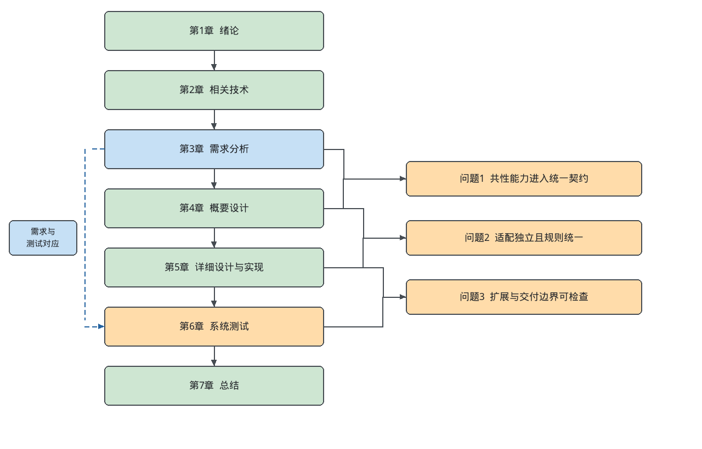
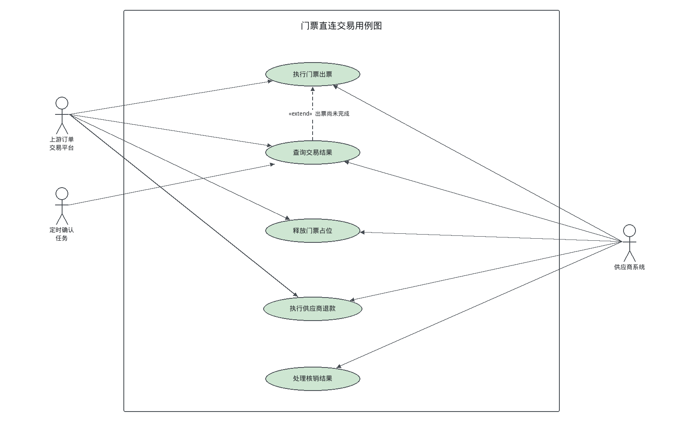
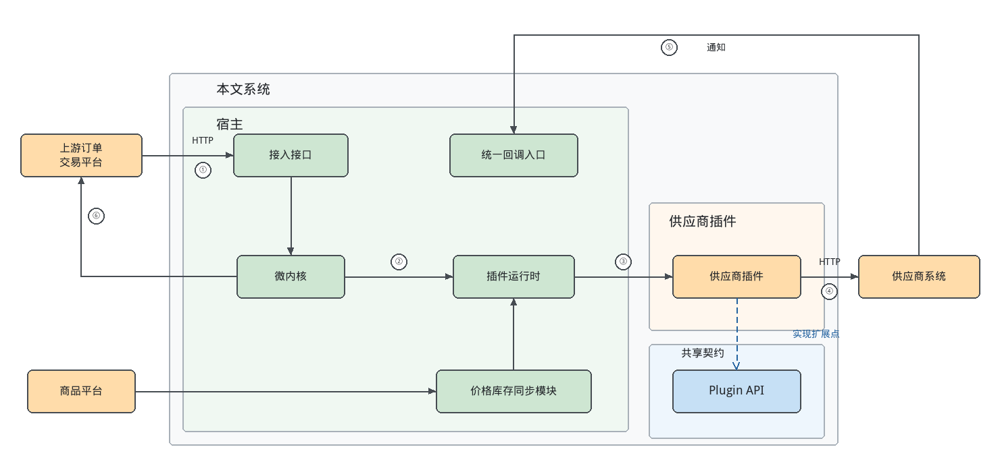
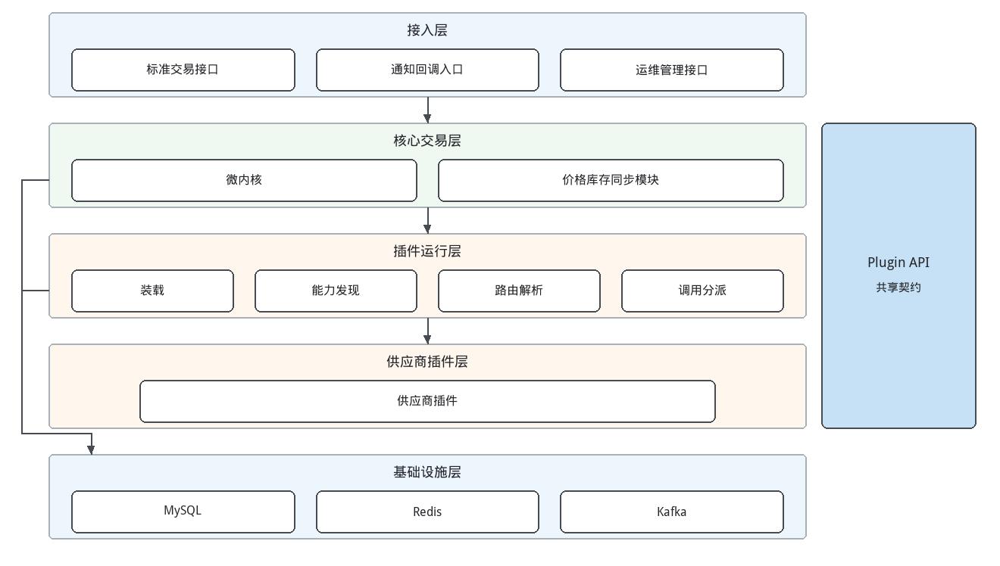
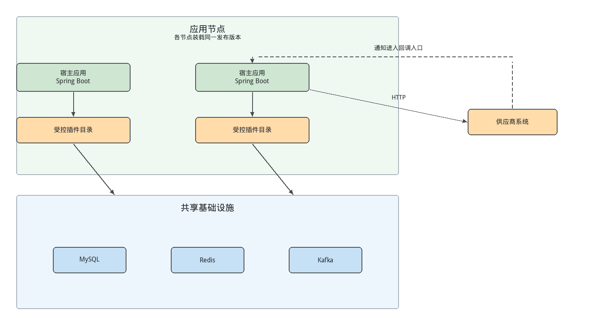
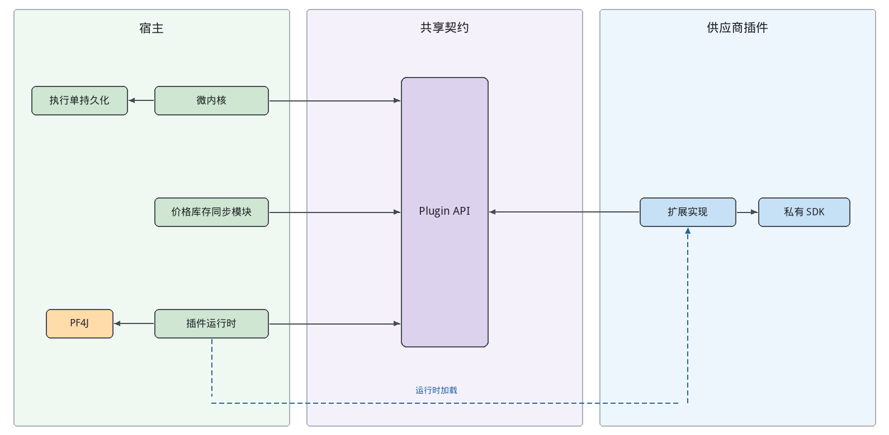
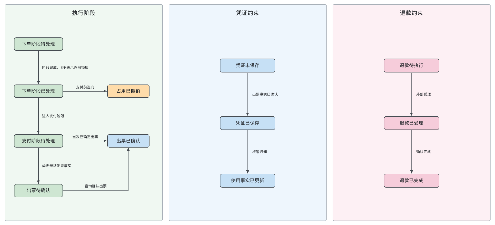
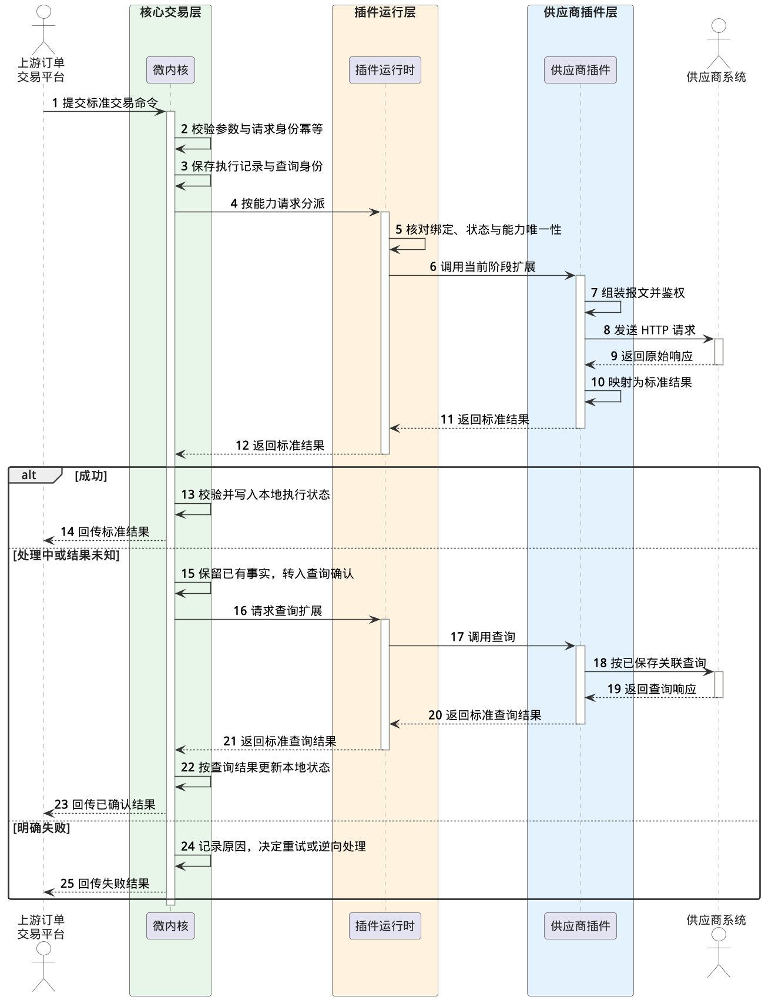
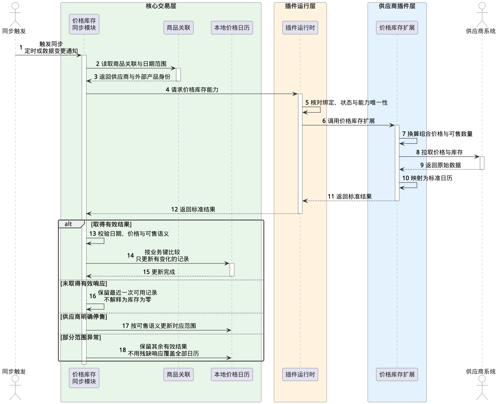
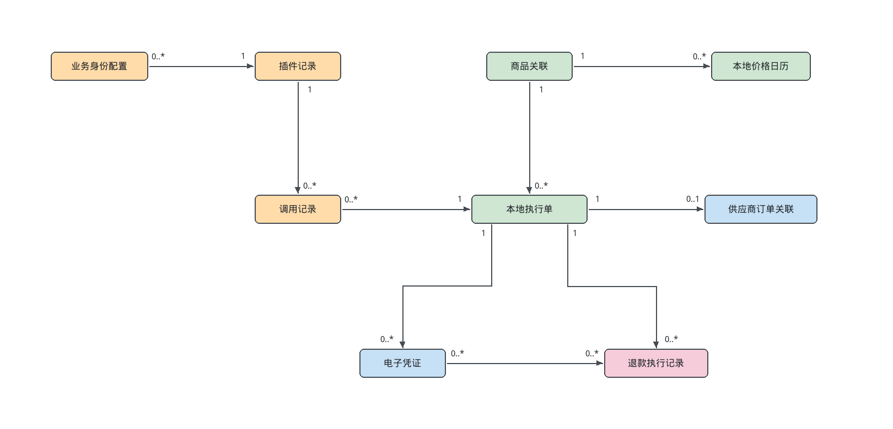

# 面向异构供应商的插件化景区门票交易系统设计与实现

**Design and Implementation of a Plugin-based Ticket System for Tourist Attractions with Heterogeneous Suppliers**

| 项目 | 内容 |
| --- | --- |
| 学生姓名 | 罗于迪 |
| 学号 | SA24225275 |
| 导师 | 邢凯 |
| 实践导师 | 汪伟 |
| 院系 | 中国科学技术大学软件学院 |
| 学科专业 | 软件工程 |
| 研究方向 | 应用系统设计 |
| 原稿提交日期 | 二〇二六年九月十七日 |
| 修改稿版本 | V0.17，2026年10月8日 |

> 本文件为V0.17修订稿，在V0.16业务口径不变的前提下，修正术语、参考文献编号顺序、若干前后矛盾之处，删减重复表述，并补入第一批图（图1-1、图3-1至图3-4、图4-1至图4-3，PlantUML 源码位于“论文图-V0.17”目录）。其余图片仍为占位。正文后的核查附记列出本轮修改和需要作者确认的事项，不属于提交正文。第6章测试用例的执行状态均为待执行；本稿尚需实际工程映射及执行记录才能形成送审终稿。

# 中国科学技术大学学位论文原创性声明

本人声明所呈交的学位论文，是本人在导师指导下进行研究工作所取得的成果。除已特别加以标注和致谢的地方外，论文中不包含任何他人已经发表或撰写过的研究成果。与我一同工作的同志对本研究所做的贡献均已在论文中作了明确的说明。

作者签名：                  签字日期：

# 中国科学技术大学学位论文使用授权声明

作为申请学位的条件之一，学位论文著作权拥有者授权中国科学技术大学拥有学位论文的部分使用权，即：学校有权按有关规定向国家有关部门或机构送交论文的复印件和电子版，允许论文被查阅和借阅，可以将学位论文编入《中国学位论文全文数据库》等有关数据库进行检索，可以采用影印、缩印或扫描等复制手段保存、汇编学位论文。本人提交的电子文档的内容和纸质论文的内容相一致，如因不符而引起的学术声誉损失由本人自负。控阅的学位论文在解除控阅后也遵守此规定。

☑ 公开　□ 控阅（　年）

作者签名：                  导师签名：

签字日期：                  签字日期：

# 人工智能工具使用说明（待按学校模板填写）

> 本页为提交材料占位，不是学校正式声明。本文修改过程中使用了生成式人工智能工具辅助结构调整和文字编辑。正式提交时，须按学校当时适用的模板如实说明使用范围，由作者核对论文内容、引用与证据后填写并签署。本页工作说明应在填写正式材料时替换。

# 摘要

在线旅游平台需要持续接入多家景区门票供应商，而各供应商在通信鉴权、数据模型、外部调用时机和结果语义上存在差异。若将适配逻辑写入交易主干，代码耦合、依赖冲突和发布范围会随接入数量扩大。本文的目的是在供应商侧交易执行系统中分离稳定的执行规则与易变的外部协议，使新增或变更供应商的影响限定在独立插件之内。

本文以位于上游订单交易平台、商品平台与外部供应商之间的执行系统为对象，按微内核思想将系统划分为供应商侧交易执行微内核（下文简称微内核）、插件运行时、共享 Plugin API 和供应商插件。微内核统一负责执行状态更新、幂等、结果确认以及失败后的重试或逆向处理决策；插件运行时基于 PF4J 插件框架完成插件装载、能力发现和调用分派；供应商插件负责鉴权、报文转换和外部调用，并返回标准结果。本文以两家脱敏供应商为案例：系统在占位阶段对供应商 A 先锁库存再建单；对供应商 B 则在支付阶段才发起外部请求，出票结果由本系统定时查询取得。

本文完成了需求分析、概要设计和详细设计，给出了插件调用分派、标准结果条件应用和组合商品价格库存计算的处理算法，并采用场景法、等价类与边界值和决策表设计了 42 项功能测试用例、5 项组合计算边界用例和 5 项非功能测试用例。已有日志材料支持供应商业务拒绝和标准价格库存响应两类局部事实，其余用例的执行记录仍待补充。

在共享契约兼容且不超出现有能力范围时，供应商协议变化可以限定在独立插件内；共享契约或执行语义发生变化时，宿主与插件仍需协同升级。

关键词：插件架构　异构供应商　微内核　景区门票交易

# ABSTRACT

Online travel platforms must keep integrating scenic-area ticket suppliers whose authentication, data models, timing of external calls and result semantics differ. Embedding supplier adaptation in the transaction mainline enlarges coupling, dependency conflicts and release scope as more suppliers are added. This thesis aims to separate stable execution rules from volatile supplier protocols in a supplier-side execution system, so that adding or changing a supplier is confined to an independent plugin.

The system sits between upstream order and product platforms and external suppliers. Following the microkernel approach, it is divided into a supplier-side transaction execution microkernel, a plugin runtime, a shared Plugin API and supplier plugins. The microkernel governs execution state updates, idempotency, result confirmation and the retry or reversal decision after failures. The PF4J-based runtime performs plugin loading, capability discovery and invocation dispatch. Supplier plugins handle authentication, message conversion and external calls, and return standard results. Two anonymized suppliers serve as cases: for Supplier A the system locks stock and then creates an order during reservation, whereas for Supplier B the external request is issued only at the payment stage and the ticketing result is obtained through periodic queries issued by the system.

The thesis completes the requirements analysis, high-level design and detailed design, presents algorithms for invocation dispatch, conditional application of standard results and combined-product price and stock calculation, and designs 42 functional test cases, 5 boundary cases for combined-product calculation and 5 non-functional test cases using scenario-based testing, equivalence partitioning with boundary values, and decision tables. Existing log evidence supports two partial facts, a supplier business rejection and a standard price-stock response; execution records for the remaining cases are still to be collected.

Under a compatible shared contract and the existing capability boundary, supplier protocol changes can be confined to independent plugins, whereas changes to the shared contract or execution semantics still require coordinated upgrades of the host and plugins.

KEYWORDS: plugin architecture, heterogeneous suppliers, microkernel, scenic-area ticket transactions

# 目录

- 第1章 绪论
  - 1.1 研究背景及意义
  - 1.2 国内外研究现状
  - 1.3 研究定位与关键问题
  - 1.4 研究内容与主要工作
  - 1.5 论文组织结构
  - 1.6 本章小结
- 第2章 相关技术分析
  - 2.1 插件化与微内核架构
  - 2.2 PF4J 插件框架
  - 2.3 Java 类加载与插件资源管理
  - 2.4 异构接口适配与契约设计
  - 2.5 系统开发相关技术
  - 2.6 本章小结
- 第3章 系统需求分析
  - 3.1 需求概述
  - 3.2 需求导出
  - 3.3 功能性需求
  - 3.4 非功能性需求
  - 3.5 本章小结
- 第4章 系统概要设计
  - 4.1 系统边界与总体架构
  - 4.2 插件化总体设计
  - 4.3 供应商侧交易执行微内核设计
  - 4.4 插件运行时设计
  - 4.5 供应商插件与价格库存设计
  - 4.6 数据模型设计
  - 4.7 设计对照与适用条件
  - 4.8 本章小结
- 第5章 系统详细设计与实现
  - 5.1 共享契约与插件运行机制
  - 5.2 供应商侧交易执行微内核
  - 5.3 典型供应商插件适配
  - 5.4 价格库存同步的详细处理
  - 5.5 对外与内部接口设计
  - 5.6 本章小结
- 第6章 系统测试
  - 6.1 测试概要
  - 6.2 测试分析
  - 6.3 测试用例设计
  - 6.4 测试执行记录与结论
  - 6.5 本章小结
- 第7章 总结与展望
  - 7.1 本文总结
  - 7.2 未来展望
- 参考文献
- 致谢

# 插图清单

- 图1-1 论文组织结构图
- 图3-1 门票直连交易用例图
- 图3-2 价格库存同步用例图
- 图3-3 插件治理子系统用例图
- 图3-4 系统运维用例图
- 图4-1 系统边界与插件化总体架构
- 图4-2 系统逻辑分层图
- 图4-3 系统部署图
- 图4-4 宿主、共享 Plugin API 与供应商插件的依赖图
- 图4-5 供应商侧交易执行的业务状态约束图
- 图4-6 一次交易经过微内核、插件运行时和供应商插件的时序
- 图4-7 价格库存同步流程
- 图4-8 核心逻辑实体关系图（E-R 图）
- 图5-1 宿主、Plugin API 与供应商插件的工程和制品关系
- 图5-2 插件装载与可调用注册流程
- 图5-3 维护窗口内插件停止与替换流程
- 图5-4 微内核职责协作图
- 图5-5 交易结果确认时序
- 图5-6 核销或退款通知进入宿主状态更新的时序
- 图5-7 A、B的阶段适配对照
- 图5-8 价格库存拉取与更新时序
- 图6-1 支付后出票处理中的原有界面
- 图6-2 出票成功与凭证展示的原有界面
- 图6-3 本地价格库存日历的原有界面
- 图6-4 原有订单锁库存业务校验失败日志
- 图6-5 原有价格库存查询与标准化结果日志

# 附表清单

- 表2-1 常见供应商接入方式比较
- 表2-2 理论或方法与分析对象的对应关系
- 表2-3 系统主要开发技术的职责与选型依据
- 表3-1 系统参与方与职责边界
- 表3-2 两家案例供应商的异构特征与契约要求
- 表3-3 系统主要需求
- 表3-4 执行门票出票用例规约
- 表3-5 查询交易结果用例规约
- 表3-6 处理核销结果用例规约
- 表3-7 执行供应商退款用例规约
- 表3-8 同步价格库存用例规约
- 表3-9 接入供应商插件用例规约
- 表3-10 非功能性需求的量化指标
- 表4-1 插件化架构的职责划分
- 表4-2 扩展能力与设计依据
- 表4-3 交易执行的状态更新约束
- 表4-4 标准结果语义与微内核决策
- 表4-5 逻辑实体与保存内容
- 表4-6 系统边界与架构设计对照
- 表5-1 共享扩展契约的业务含义
- 表5-2 PF4J 与本文工作的边界
- 表5-3 插件分派的检查与失败处理
- 表5-4 结果应用与恢复职责
- 表5-5 供应商 A 调用步骤与结果处理
- 表5-6 标准通知处理需要的信息类别
- 表5-7 标准对外接口的业务设计
- 表5-8 内部异常与宿主处理
- 表6-1 测试对象与主要观察内容
- 表6-2 测试环境配置
- 表6-3 需求与测试用例的对应关系
- 表6-4 交易场景与测试用例
- 表6-5 用例 T-12：同一业务身份重复占位
- 表6-6 用例 B-01 至 B-03：供应商 B 的阶段调用与定时查询
- 表6-7 组合计算的等价类与边界值用例
- 表6-8 插件调用分派决策表
- 表6-9 门票交易正常流程测试用例
- 表6-10 门票交易异常与幂等测试用例
- 表6-11 价格库存同步测试用例
- 表6-12 插件接入与运行测试用例
- 表6-13 非功能测试用例
- 表6-14 测试用例执行情况
- 表6-15 接入范围对照的采集口径

# 第1章 绪论

## 1.1 研究背景及意义

### 1.1.1 研究背景

随着在线旅游服务的发展，景区门票的预约、购买和凭证交付逐步转移至线上。国务院《“十四五”旅游业发展规划》提出深化“互联网 + 旅游”，推进景区数字化改造[1]。在线平台需要与景区及票务供应商协作，完成库存确认、出票、核销与退订等业务。旅游数字化研究指出，数据格式不统一和跨主体协作困难仍是系统建设中的重要障碍[2-4]。

景区供应商通常由不同组织独立建设。同一项门票业务，在不同供应商中可能具有不同的鉴权方式、数据结构、交互步骤和状态含义。例如，供应商A在占位阶段先锁库存再创建订单；供应商B在下单阶段不调用供应商，待支付完成后再发起外部请求，出票结果由本系统定时查询取得。因此，本文所称“异构”既包括接口表示的差异，也包括外部调用时机与结果获取方式的差异。

在供应商数量较少时，将适配代码集中于交易应用可以较快完成接入。随着供应商及接口版本增加，公共流程容易混入供应商特定分支，私有依赖和发布范围也随之扩大。仅有接口抽象，尚不能自然形成独立构建和交付的边界。如何隔离供应商变化，同时保持共性交易规则的一致性，是本文关注的工程问题。

本文研究的系统位于上游订单交易平台、商品平台与下游供应商之间，负责供应商侧交易执行及价格库存同步。上游承担用户订单、支付和商品主数据管理，本文系统承接占位、出票、查询、释放与退款执行，并回传标准结果。研究范围由此限定在供应商接入与执行协调层，具体业务边界在第3章展开。

### 1.1.2 研究意义

面向异构供应商划分稳定规则与可变实现，有助于减少外部协议变化对公共交易流程的影响。以插件作为接入单元，可以在公共契约兼容的条件下独立组织供应商适配代码、私有依赖和构建制品，为并行开发与局部变更提供更明确的工程边界。

门票交易的适配还涉及受理、完成与结果不确定之间的区分。系统既要允许供应商采用不同外部流程，也要使上游获得含义一致的执行结果。因此，本文的价值在于结合具体交易场景，设计统一执行规则与供应商扩展的协作关系，并建立需求、设计和验证之间的对应关系，为同类多供应商接入系统提供工程参考。

## 1.2 国内外研究现状

### 1.2.1 异构系统集成与接口适配

软件架构研究强调通过结构与交互约束组织复杂系统[5-6]。企业集成模式归纳了消息转换、路由和端点等机制，用于协调不同应用的数据表示和交互方式[7]；服务适配研究进一步关注接口及交互不一致对服务组合的影响[8]。近期异构系统研究也持续讨论互操作与集成架构问题[9-10]。

适配器模式通过接口转换连接不同实现，网关和数据映射器则将外部访问与内部模型分离[11-12]。这些方法为供应商适配提供了基础，但接口表示统一并不意味着交易语义已经统一。对于门票业务，还需要识别受理与出票完成的差别，以及不同外部步骤对内部执行规则的影响。

### 1.2.2 插件化与微内核架构

Parnas 提出的信息隐藏原则主张围绕易变设计决策划分模块[13]。组件化研究强调契约和组合边界[14]；微内核架构将相对稳定的核心与可扩展部分分离[15-16]。插件装配研究及可插拔电子商务平台实践，进一步讨论了接口约定与扩展组织方式[17-18]。

Java 生态中的开放服务网关协议（Open Service Gateway initiative，OSGi）、Java 平台模块系统（Java Platform Module System，JPMS）与 Java 插件框架（Plugin Framework for Java，PF4J）分别提供动态模块、模块依赖与应用级插件机制[19-21]。Java 类加载规则为共享接口和私有依赖的运行时边界提供基础[22]。这些机制能够支持扩展的组织与装载，但不会自动定义门票业务的核心规则。如何划分稳定执行职责与供应商适配职责，仍需要结合领域需求确定。

### 1.2.3 票务系统与跨系统交易可靠性

旅游信息化和智慧旅游研究关注数字技术、服务渠道及多方协作[23-24]。国内票务协同平台研究与铁路客票系统实践，分别从多系统协作及交易处理角度讨论票务基础设施建设[25-26]。相关工作说明，票务业务需要同时处理外部接入和交易连续性，但供应商适配的独立交付边界仍需结合具体系统进一步设计。

跨系统调用可能出现超时、重复请求及消息重复等情况，调用结果不确定也不等同于业务失败。分布式系统研究讨论了幂等、持久化状态、结果确认和恢复机制[27-28]，Saga 则提供以局部事务和补偿组织长流程的思路[29]。这些方法为门票执行协调提供依据，具体约束需要落实到业务状态及供应商能力之中。

### 1.2.4 研究现状总结

已有研究为异构转换、模块扩展和交易恢复提供了较成熟的方法。微服务可以通过独立服务形成部署与运行边界[30]；插件化则在同一应用内组织可替换扩展。

本文关注的问题是如何把通用架构方法落实到门票供应商侧执行系统：统一哪些业务语义，将哪些变化封装于插件，以及如何验证职责和交付边界。研究以已有模式的工程应用为主，相关技术原理及选择依据在第2章说明，不将插件框架自身视为交易规则的替代。

## 1.3 研究定位与关键问题

本文采用微内核与插件协作的架构思路。供应商侧交易执行微内核（下文简称微内核，在逻辑分层中对应核心交易层）位于宿主中，保留供应商无关的交易执行规则，包括本地执行状态管理、幂等、结果确认和补偿协调；供应商插件封装外部协议与供应商特定流程。插件返回标准结果，由宿主统一决定本地执行状态的更新。该定位明确了微内核承载的业务职责，其结构与行为约束在第4章展开。

围绕上述定位，本文拟解决以下三个问题。

（1）如何表达异构供应商的共性能力。不同协议和交互步骤需要进入统一业务契约，同时保留受理、完成及结果不确定等必要语义，避免外部差异直接进入公共流程。

（2）如何在独立适配的同时维持统一执行规则。供应商可以采用不同局部步骤，但本地状态推进、重复请求处理与异常恢复需要保持一致，防止业务规则分散于插件实现。

（3）如何形成可检查的扩展与交付边界。供应商适配需要具有明确的构建和运行单元；新增或变更供应商时，应能够识别改动范围、兼容条件及调用影响，并通过相应记录进行验证。

以上问题分别对应需求分析、架构与契约设计、执行实现以及系统验证。本文应用信息隐藏、微内核、适配器和状态约束等已有方法开展设计，不以提出新的架构理论为研究目标。

## 1.4 研究内容与主要工作

本文围绕异构供应商的插件化接入开展以下工作。

（1）分析门票供应商侧执行的业务范围和参与方分工，结合典型供应商案例梳理差异，导出功能与质量需求。

（2）设计宿主、共享契约和供应商插件的总体结构，明确微内核、插件运行时及协议适配之间的职责，并设计统一执行约束。

（3）基于 PF4J 组织插件机制，说明交易执行、典型供应商适配及价格库存同步的详细处理，建立设计与实现职责的对应关系。

（4）开展系统测试设计，采用场景法、等价类与边界值和决策表设计功能及非功能测试用例，给出供应商接入范围的对照口径，并区分进程内分派与外部业务链路的性能评价范围。测试结论以能够追溯的执行记录为依据。

## 1.5 论文组织结构

全文共七章，各章关系如图1-1所示。第1章介绍研究背景、相关研究、研究定位及主要工作。第2章分析支撑系统设计的相关技术，并说明技术选型依据。第3章明确业务边界，分析供应商差异并导出功能与非功能需求。第4章给出总体架构、逻辑分层与部署、交易执行约束与数据模型。第5章说明插件运行机制、交易执行及典型供应商适配的详细设计与实现。第6章进行系统测试，给出测试分析、用例设计与执行记录。第7章总结研究工作及后续方向。图中右侧同时标出1.3节三个关键问题在设计章节中的落实位置，以及需求与测试用例的对应依据。



图1-1 论文组织结构图

## 1.6 本章小结

本章从景区门票的跨系统协作出发，说明供应商异构及集中适配带来的工程问题，限定本文系统的供应商侧执行范围，并提出统一业务契约、稳定执行规则和独立扩展边界三个研究问题。后续章节依次展开技术依据、需求、设计、实现与验证。

# 第2章 相关技术分析

供应商差异会将协议、状态和依赖带入供应商侧交易执行微内核，集中式适配则会把构建、发布和并行开发范围一并放大。针对这一问题，本章分析插件化与微内核架构、PF4J、Java 类加载与资源管理、异构接口适配与公共契约，以及宿主侧开发技术，并说明各项技术的选型依据。

## 2.1 插件化与微内核架构

模块化设计需要识别相对稳定的职责和随外部环境变化的实现。Parnas 的信息隐藏原则主张围绕可能变化的设计决策划分模块，使调用方通过明确接口使用能力，而不依赖内部实现[13]。组件化进一步强调契约和组合边界[14]。这些原则为接入系统划分公共流程与外部适配提供基础。

插件化将扩展实现组织为独立制品，通过预先约定的接口接入宿主。其组成通常包括宿主、扩展契约、插件管理器与插件实现。宿主依赖公共契约，插件保存具体实现和私有资源，管理器完成发现、装载和生命周期操作。插件装配要求明确接口，而不能依靠宿主推测实现内部结构[17]。电子商务中的可插拔平台及国内平台扩展实践也采用类似的组织方式[18,31-32]。

微内核将相对精简的核心与可扩展部分分离[15-16]。它关注职责划分，插件机制则关注扩展的构建、发现和运行。二者可以结合，但框架加载能力并不自动产生业务核心：应用仍需确定哪些共性规则保留在核心，哪些变化由扩展承担。

接口解耦、独立制品和进程隔离属于不同层次。普通策略类可以隐藏实现，却通常仍随宿主编译和发布；插件增加独立制品与生命周期边界；独立服务进一步提供进程与部署边界，同时增加远程调用和运行管理成本[30]。常见接入方式如表2-1所示。

表2-1 常见供应商接入方式比较

| 接入方式 | 扩展单元 | 依赖边界 | 交付特点 | 适用限制 |
| --- | --- | --- | --- | --- |
| 条件分支 | 宿主内部代码 | 共享类路径 | 随宿主发布 | 分支随接入方增加 |
| 策略或适配器 | 普通接口实现 | 通常共享类路径 | 通常随宿主发布 | 接口解耦不自动形成独立交付 |
| 独立微服务 | 服务进程 | 进程级隔离 | 独立部署和伸缩 | 增加远程调用及运维成本 |
| 同进程插件 | 插件包 | 类加载器边界 | 独立构建，兼容条件下单独交付 | 共享进程资源 |

同进程插件适合技术栈一致、扩展主要变化于协议实现、且不要求独立伸缩的场景。宿主与插件通过方法调用交互，插件访问外部系统时仍承担网络通信成本。类加载边界可以减少私有依赖干扰，但不提供进程级故障隔离；独立交付也以共享契约兼容为前提。

本文使用的主要方法及其分析对象如表2-2所示。具体职责划分在第4章展开，工程处理在第5章说明，证据需求在第6章组织。

表2-2 理论或方法与分析对象的对应关系

| 理论或方法 | 关注问题 | 后续分析对象 |
| --- | --- | --- |
| 信息隐藏[13] | 如何封装易变决策 | 供应商协议、私有模型及依赖边界 |
| 微内核模式[15] | 如何分离稳定核心与扩展 | 共性执行规则与适配职责 |
| 适配器及企业应用网关[11-12] | 如何转换接口与数据表示 | 标准请求、响应和错误映射 |
| 幂等与补偿方法[27-29] | 如何处理重复和跨系统局部失败 | 请求身份、结果确认与恢复流程 |

## 2.2 PF4J 插件框架

PF4J是Java应用级插件框架，提供插件管理器、描述符、生命周期、类加载和扩展发现等基础机制[19]。插件入口可继承Plugin，管理器负责装载制品和管理运行状态。扩展接口通过ExtensionPoint表达能力，插件实现通过相应声明进入发现过程。

装载过程依据制品描述识别插件身份、版本、入口及依赖，再创建运行对象与类加载环境。启动阶段执行插件初始化，停止阶段提供资源清理入口。常见生命周期状态包括CREATED、DISABLED、RESOLVED、STARTED和STOPPED。应用可结合框架状态限制业务调用，但框架已启动不等于外部服务健康。

扩展发现可以利用构建期生成的META-INF/extensions.idx索引，运行时按扩展类型获得实现[19]。框架负责定位实现，宿主和扩展之间仍通过普通方法调用交互。目标业务身份与扩展类型如何组合、能力缺失如何反馈，属于应用层设计。

生命周期钩子提供资源管理时机。插件创建的客户端、线程或上下文需要按各自路径关闭，卸载返回不代表类加载器已经回收。加载与启停等管理操作的并发协调由应用负责[19]，具体受控处理流程在4.4节说明。

## 2.3 Java 类加载与插件资源管理

插件化方案能否隔离供应商私有依赖，取决于 Java 虚拟机（Java Virtual Machine，JVM）的类加载规则。JVM 在运行时完成类的加载、链接和初始化，应用可以通过自定义类加载器从目录或 Java 归档文件（Java Archive，JAR）中装入字节码[22,33]。类在运行时的身份由全限定名和定义它的类加载器共同决定[22,34]：同名类若由不同类加载器定义，JVM 将其视为两个类型。

这一规则对本文有两层约束。第一，宿主与插件之间共享的扩展接口、标准请求、标准结果和公共异常必须由同一个类加载器提供。本文将这些类型集中在宿主与插件共享的应用程序编程接口（Application Programming Interface，API）模块中，下文称 Plugin API。若插件包中再打入一份 Plugin API，即使类名和字段完全相同，也可能导致扩展无法识别或出现类型转换异常。第二，供应商私有依赖应留在各自插件的类加载器中。PF4J 默认为每个插件创建独立的类加载器，并采用插件优先的查找顺序，系统类和框架类仍由上层加载器提供[19]。两家供应商依赖不同版本的签名或序列化组件时，可以因此减少在同一类路径上的直接冲突。

多类加载器环境也改变了资源读取和组件管理方式。证书模板、映射配置等插件资源应通过插件自身的类加载器读取，不能假定它们已并入宿主类路径。插件若使用 Spring 组件，可以在启动时建立受限的子上下文，停止时随插件一起关闭，避免扫描宿主内部的业务组件。

类加载边界只解决类型可见性和依赖冲突，不提供进程级故障隔离或安全沙箱。本文的供应商插件由平台开发和审核，不需要防范恶意代码，因此选择同一 JVM 内的插件边界，而不采用进程隔离或自定义全局类加载器。

## 2.4 异构接口适配与契约设计

异构接口的差异包括消息结构、鉴权方式、交互顺序和结果含义。企业集成模式中的 Canonical Data Model 建立内部公共表示，Message Translator 完成外部表示与公共表示的转换[7]；适配器则通过接口转换连接调用方与已有实现[11]。二者共同支持在边界内隔离外部变化。

公共契约应同时约定数据形式和业务含义。技术响应正常、请求已受理和业务已完成不是同一事实，接口转换需要保留调用方作出决策所需的差别。交互适配还应容纳多步外部流程，避免要求一个内部方法必须对应一个外部HTTP接口。

契约的稳定性取决于能力粒度与类型边界。共性对象用于跨边界交互，私有模型和客户端留在适配实现内部。共享契约变更时，应检查方法形状、字段约束与语义兼容性，而非仅比较制品版本号。

跨系统操作无法由单个本地数据库事务完整覆盖。幂等通过稳定业务身份控制重复副作用，持久化记录和查询用于恢复外部事实，补偿在满足业务条件时协调已发生步骤[27-29]。这些是可靠性设计的通用原则；本系统的状态、查询和恢复规则在4.3节展开。

## 2.5 系统开发相关技术

宿主侧技术按宿主组织、插件运行、数据持久化、短期访问和异步传递五类职责选择，各项技术的职责与选型依据如表2-3所示。

运行环境采用 Java 开发工具包（Java Development Kit，JDK）17。Spring Boot 3.x 要求 JDK 17 及以上版本，二者版本因此保持一致[35]。Spring Boot 用于组织宿主的 Web 接口和业务组件，其自动配置和内嵌服务器可以减少基础工程配置[35]。插件运行选择 PF4J 而非 OSGi：本文只需要插件发现、类加载、生命周期和扩展查找，PF4J 可以直接嵌入 Spring Boot 宿主，概念少于 OSGi 的完整模块与服务模型，对既有工程的改造也更小[19-20]。

数据层选用关系数据库 MySQL 保存执行单、供应商订单关联、凭证、商品关联和价格日历，这些数据需要事务和唯一约束的支持[36]。Redis 只缓存短期场次数据和配置，用于降低高频读取压力，不作为交易事实的来源[37]。Kafka 用于结果回传等不必在主请求中同步完成的消息，消息重复和消费失败仍由应用层通过幂等处理[38]。宿主与外部供应商之间使用超文本传输协议（Hypertext Transfer Protocol，HTTP）通信，报文格式为 JavaScript 对象表示法（JavaScript Object Notation，JSON）[39]。

表2-3 系统主要开发技术的职责与选型依据

| 技术 | 在系统中的职责 | 选型依据 | 职责边界 |
| --- | --- | --- | --- |
| JDK 17 | 运行环境与类加载基础 | Spring Boot 3.x 的最低版本要求 | 不决定供应商交易语义 |
| Spring Boot 3.2.5 | 宿主 Web 接口与组件组织 | 自动配置与内嵌服务器，减少基础配置 | 不替代插件类加载机制 |
| PF4J | 插件发现、装载、生命周期和扩展查找 | 可嵌入既有 Java 应用，概念少于 OSGi | 不负责交易状态一致性 |
| MySQL | 执行记录、凭证、关联与价格日历持久化 | 需要事务与唯一约束 | 不管理内存中的扩展实例 |
| Redis | 短期场次数据与配置缓存 | 降低高频读取压力 | 不作为交易事实来源 |
| Kafka | 结果回传等异步消息传递 | 主请求之外的解耦传递 | 业务幂等仍由宿主负责 |

## 2.6 本章小结

本章分析了方案的技术依据。选择同进程插件而非条件分支或策略类，是因为插件为供应商适配提供了独立的制品与生命周期边界；不选择独立微服务，是因为各适配实现技术栈一致且无需独立伸缩，进程内调用可以避免远程调用和运维成本。选择 PF4J，是因为本文只需要插件发现、类加载和扩展查找，它比 OSGi 更易嵌入 Spring Boot 宿主。Java 类加载规则决定了 Plugin API 必须共享、私有依赖必须留在插件内。异构适配采用标准模型和双向转换，并要求契约区分受理与完成。MySQL、Redis 和 Kafka 分别承担持久化、短期访问和异步传递，交易事实以数据库记录为准。

# 第3章 系统需求分析

第1章概括了供应商异构与系统定位，本章进一步明确参与方和业务边界，以典型供应商差异为依据导出需求。分析结果包括门票交易、价格库存同步和插件化接入等功能要求，以及可扩展性、性能、可靠性、安全性和可维护性方面的质量要求。

## 3.1 需求概述

本文系统是供应商侧交易执行系统，位于上游订单交易平台、商品平台与景区供应商之间。它接收标准交易命令并执行外部履约，不覆盖面向用户的完整销售流程。系统边界如表3-1所示。

表3-1 系统参与方与职责边界

| 参与方 | 主要职责 | 与本文系统的交互 |
| --- | --- | --- |
| 上游订单交易平台 | 用户订单、支付、退款发起、接收履约结果 | 提交占位、出票、查询、释放与退款命令，接收标准结果 |
| 上游商品平台 | 商品主数据与售卖，接收或发布价格日历 | 提供商品关联所需身份，使用同步结果 |
| 本文系统 | 供应商侧交易执行、状态协调、插件调用、本地日历同步和结果回传 | 统一命令与结果，维护本地执行记录 |
| 外部供应商 | 库存、外部订单、出票、退款及核销事实 | 接收协议请求，返回响应或查询结果，并可能发送核销、退款通知 |

系统中的本地交易执行单是供应商侧执行记录，不能替代上游用户订单。本文系统可以判断供应商退款是否完成，但不因此承担平台资金退款结算；可以拉取供应商价格库存并形成日历，但不负责商品主数据建设。供应商是其外部库存、订单与核销事实的来源，宿主则负责这些事实进入本地状态时的统一解释和一致性。

相较只处理内部服务与统一数据库的典型交易系统，本文面临外部事实不可直接控制、受理与完成不一致、能力范围不同和协议持续变化的问题。业务调用方不应承担每家供应商的字段及签名适配；供应商插件也不应掌握本地状态的写入规则。因此，特殊需求集中在契约标准化、协议适配边界以及外部不确定结果的状态协调，而非重新建设用户订单和支付中台。

系统面向持续接入的多家供应商。供应商 A、B 是两家脱敏案例，用于说明异构性及对应设计，不表示系统只有两家供应商。业务身份、供应商标识和能力类型共同组成调用所需的路由上下文，由运行时解析目标插件；路由不依赖单一的供应商编码。

## 3.2 需求导出

需求导出先区分共性业务与外部变化。上游提交商品、游客、日期、数量及请求身份，系统围绕本地执行单组织交易；供应商插件依据实际协议执行外部动作并返回标准信息。案例中已有描述的差异按五个维度整理，如表3-2所示，比较仅限于材料支持的范围。

表3-2 两家案例供应商的异构特征与契约要求

| 维度 | 供应商 A | 供应商 B | 导出的需求 |
| --- | --- | --- | --- |
| 通信与鉴权 | 案例采用RSA签名 | 具体鉴权方式未纳入本案例比较 | 鉴权实现及配置保留在适配边界内 |
| 数据模型 | 场次、票种、外部产品与组合关系表达交易资源 | 支付阶段请求及后续查询需关联同一交易 | 标准请求与外部身份保持可恢复关联 |
| 业务交互 | 占位阶段先锁库存再创建供应商订单 | 下单阶段不请求供应商，支付阶段发起请求 | 统一业务阶段应容纳不同外部调用时机 |
| 结果获取 | 通过外部响应及查询取得相关执行事实 | 本系统定时查询供应商获取出票结果 | 阶段处理完成与最终出票确认分别表达 |
| 业务能力 | 涉及占位、查询、释放、价格库存及多类票种 | 已确认支付阶段调用与出票结果查询 | 按已确认能力描述案例，能力缺失明确处理 |

供应商差异不仅改变字段，还改变外部调用发生的阶段。下单阶段完成本地处理，并不必然意味着供应商已锁库存或建立外部订单。因此，统一契约需要表达当前业务阶段的结果及已有外部事实，不能强制所有供应商在相同阶段执行相同请求。

创建供应商订单失败时，插件应返回失败原因及已有执行进展，由微内核决定重试或进入逆向处理。插件只返回失败事实，不自行结束整笔交易。此时用户支付尚未发生，逆向处理针对的是供应商侧已占用的资源，不属于用户退款；后文涉及支付前失败时均按此口径处理，不再逐处重复。

供应商B的出票查询由本系统驱动。需求关注待确认交易、查询结果及其状态应用，不另行要求建设完整任务调度平台。价格库存同步与交易执行分别组织，独立插件交付则需要共享类型一致和私有依赖边界。

主要功能如表3-3所示，基础用例在3.3节展开。占位、出票与释放、查询、核销结果、退款、本地价格库存同步构成业务范围；插件装载、绑定、分派与启停提供独立交付所需运行机制。插件无相应能力时返回明确错误，不提供掩盖能力缺失的空实现，也不改调其他供应商。

表3-3 系统主要需求

| 编号 | 需求 | 说明 |
| --- | --- | --- |
| R01 | 占位、出票与释放 | 承接上游命令，执行供应商占位、出票及占位释放，维护本地执行单与凭证 |
| R02 | 交易查询 | 返回已知状态，必要时查询供应商并确认结果 |
| R03 | 核销结果处理 | 转换通知并校验幂等与核销数量 |
| R04 | 退款执行 | 接收上游退款命令，执行外部退款并回传结果 |
| R05 | 价格库存同步 | 通过插件拉取数据并更新本地价格日历 |
| R06 | 插件装载与发现 | 识别插件元数据与能力 |
| R07 | 业务身份与插件绑定 | 维护业务身份、供应商标识与可用插件的关系 |
| R08 | 扩展调用分派 | 按路由上下文与能力类型定位唯一实现 |
| R09 | 插件启停与状态查看 | 控制可调用状态，管理维护窗口内的替换 |

## 3.3 功能性需求

### 3.3.1 门票交易功能需求

门票交易功能围绕供应商侧占位、支付阶段处理、出票结果查询、占位释放及售后执行组织。上游提交标准请求并接收执行结果，系统需适配不同供应商的调用时机，保留本地执行关联，并向上游提供含义一致的进度和凭证。主要用例如图3-1所示。上游订单交易平台是执行门票出票、查询交易结果、释放门票占位和执行供应商退款的主执行者；供应商系统作为辅助执行者参与上述用例，同时是处理核销结果的主执行者。出票尚未完成时，查询交易结果以扩展关系接续执行门票出票，并可由本系统的定时确认任务发起。



图3-1 门票直连交易用例图

下单阶段，系统接收商品标识、游玩日期、数量、游客信息和请求身份，完成参数及关联检查，建立供应商侧执行记录。对于A，此阶段经占位扩展执行锁库存与建单；对于B，此阶段不请求供应商。B的阶段处理结果不能被解释为已经取得外部资源承诺。

进入支付阶段后，系统依据上游提供的阶段信息执行供应商侧处理，不承担资金支付。B在此阶段请求供应商，后续由本系统定时查询出票结果。接口响应、订单关联和有效凭证分别记录；最终出票状态需要确定的出票事实支持。

下单请求可能因上游重试而重复到达。系统按业务流水号或幂等标识识别重复请求，避免同一业务请求在供应商侧生成多笔订单。网络超时且无法确认供应商是否已经受理时，不能将订单直接判定为失败后再重新下单，而应记为结果待确认，通过供应商订单查询或人工补偿确认最终结果。

执行门票出票用例如表3-4所示。

表3-4 执行门票出票用例规约

| 项目 | 内容 |
| --- | --- |
| 用例名称 | 执行门票出票 |
| 用例描述 | 上游提交下单或支付阶段的标准命令，系统按目标供应商的阶段能力执行外部交易，取得出票结果并保存凭证 |
| 主执行者 | 上游订单交易平台 |
| 辅助执行者 | 供应商系统 |
| 优先级 | 高 |
| 触发条件 | 上游提交下单阶段或支付阶段的执行命令 |
| 前置条件 | 商品关联有效；目标插件处于可调用状态并具备当前阶段所需能力 |
| 后置条件 | 本地执行单记录当前阶段进展；取得确定出票事实时保存凭证并回传上游 |
| 基本事件流 | （1）接收阶段请求并校验参数与请求身份；（2）解析目标插件与阶段能力；（3）插件执行外部调用并返回标准结果，A 在占位阶段先锁库存后建单，B 在支付阶段请求供应商；（4）微内核按结果更新执行单；（5）出票未完成时转入查询确认，取得出票结果后保存凭证 |
| 异常事件流 | （1）重复请求返回已有执行进度；（2）锁库存或建单被明确拒绝时保存拒绝原因，由微内核决定重试或进入逆向处理；（3）调用结果未知时记为待确认，不立即重新建单 |
| 用例边界 | 不处理用户支付与资金结算；B 的下单阶段不请求供应商，该阶段结果不表示已取得外部资源 |

订单查询用来向上游提供统一的订单状态和电子凭证。系统收到查询后，先按本地执行单号读取本地执行单：状态已经终结且信息完整的，可以直接返回本地结果；仍在处理中，或上游明确要求获取最新状态时，再根据执行单中的业务身份、供应商标识和外部订单关联调用目标插件的查询扩展。

查询插件从供应商响应中取出订单状态、出票结果和凭证信息，转换为平台标准模型。微内核按合法的业务状态变化更新本地执行单，而不以供应商原始状态直接覆盖本地执行状态。已经出票的订单，还要保存二维码内容、取票码或其他形式的电子凭证。供应商查询接口暂时不可用时，可以返回本地已知状态并标明数据时效，或者返回明确的查询异常，但不能以其他供应商的结果替代。

查询交易结果用例如表3-5所示。

表3-5 查询交易结果用例规约

| 项目 | 内容 |
| --- | --- |
| 用例名称 | 查询交易结果 |
| 用例描述 | 系统按上游请求或定时确认，读取本地执行单并在必要时查询供应商，向上游提供统一的状态与凭证 |
| 主执行者 | 上游订单交易平台；定时确认由本系统发起 |
| 辅助执行者 | 供应商系统 |
| 优先级 | 高 |
| 触发条件 | 上游发起查询，或定时确认选出待确认的执行单 |
| 前置条件 | 本地执行单存在，能够定位业务身份、供应商与外部订单关联 |
| 后置条件 | 返回当前状态；取得新的确定事实时，执行单与凭证按条件更新 |
| 基本事件流 | （1）读取本地执行单；（2）状态已终结且信息完整时直接返回；（3）否则调用查询扩展；（4）校验标准结果；（5）按合法状态变化更新执行单与凭证并返回 |
| 异常事件流 | 缺少关联、能力不支持或查询失败时返回明确原因或本地已知状态，不覆盖已确认的结果，不以其他供应商的结果替代 |
| 用例边界 | 查询只确认已发生的外部事实，不再次发起出票 |

释放门票占位用于撤销尚未出票的供应商侧资源占用，例如用户超时未支付或上游取消订单。上游提交执行单号、请求身份和释放原因后，系统校验当前执行是否允许释放：已出票的执行不再走释放路径，而应走退款；建单结果尚未确认的执行，需先查询确认，不能无条件解锁或取消。校验通过后，系统调用目标插件的释放扩展，由插件转换为供应商的取消或解锁请求。外部明确完成时，执行单记为已释放并回传上游；外部只返回受理时，保留处理中进度，待后续确认。释放与退款的前置条件、外部动作和资金含义都不同，系统将两者作为独立用例处理。

核销用来记录游客实际使用门票的结果。核销动作通常发生在景区闸机或供应商票务系统中，本系统主要接收供应商发送的核销通知，也可按业务需要主动查询核销状态。通知进入宿主统一回调入口后，先根据供应商标识定位对应插件，由插件校验通知签名、解析报文，并把外部订单号、凭证标识、核销数量和核销时间转成标准核销结果。

微内核根据转换后的供应商订单号或凭证标识定位本地执行单，做幂等校验，再更新订单和凭证状态。允许分次入园或部分核销的产品，要记录累计核销数量，全部核销条件满足后才能把整笔订单更新为已完成。重复通知不得重复增加核销数量，也不得重复向上游发业务事件。无法定位订单、签名校验失败或数据格式错误的通知应拒绝处理，并保留必要的异常记录。

处理核销结果用例如表3-6所示。

表3-6 处理核销结果用例规约

| 项目 | 内容 |
| --- | --- |
| 用例名称 | 处理核销结果 |
| 用例描述 | 系统接收供应商的核销通知，经插件校验转换后，由宿主更新凭证使用数量并回传上游 |
| 主执行者 | 供应商系统 |
| 辅助执行者 | 上游订单交易平台 |
| 优先级 | 中 |
| 触发条件 | 供应商发送核销通知 |
| 前置条件 | 执行单已出票，通知能够关联本地执行单或凭证 |
| 后置条件 | 凭证累计核销数量更新；全部核销后执行单记为已完成；结果回传上游 |
| 基本事件流 | （1）统一回调入口接收通知；（2）定位目标插件；（3）插件按协议校验并转换为标准核销结果；（4）宿主关联执行单，校验事件幂等与核销数量；（5）更新凭证并回传结果 |
| 异常事件流 | 校验失败、无法关联或数量不合法时拒绝更新并保留异常记录；重复的有效通知返回已有处理结果 |
| 用例边界 | 通知只用于核销和已发起的退款，不作为出票完成的依据 |

退款处理尚未使用或符合供应商退订规则的订单。上游发起退款申请时，应提供本地执行单号、退款数量和退款原因。系统校验订单是否存在、是否已经核销、是否正在退款，以及申请数量是否超过可退数量。校验通过后，根据执行单路由上下文取得退款扩展，并提交供应商所需的订单标识和退款参数。

供应商可能同步返回退款成功、退款失败或处理中。插件把这些结果转换为平台标准退款状态，微内核据此更新本地执行单及凭证。处理中的退款要保留供应商退款流水号，后续通过查询或通知确认最终结果。重复退款请求应通过幂等控制返回原有处理结果，不得再次向供应商提交。某供应商不支持部分退款时，插件返回明确的能力限制，由微内核向上游反馈，系统内部不得擅自拆单。

执行供应商退款用例如表3-7所示。

表3-7 执行供应商退款用例规约

| 项目 | 内容 |
| --- | --- |
| 用例名称 | 执行供应商退款 |
| 用例描述 | 上游发起退款后，系统校验可退范围，调用供应商退款能力，并保存受理或完成结果 |
| 主执行者 | 上游订单交易平台 |
| 辅助执行者 | 供应商系统 |
| 优先级 | 高 |
| 触发条件 | 上游提交退款命令，包含执行单号、退款数量与原因 |
| 前置条件 | 执行单已出票且未全部核销；满足供应商退订条件；插件提供退款能力 |
| 后置条件 | 保存退款记录与供应商退款流水；完成时更新凭证有效性并回传上游 |
| 基本事件流 | （1）读取执行单；（2）校验可退数量与请求幂等；（3）调用退款扩展；（4）保存受理或完成结果；（5）回传上游 |
| 异常事件流 | 能力不支持或明确拒绝时返回原因；不支持部分退款时返回能力限制，不擅自拆单；结果未知时查询确认，不重复退款 |
| 用例边界 | 只执行供应商侧退订，不承担平台资金退款结算 |

综合以上业务，需求要求区分阶段结果、最终完成和结果不确定，并将重复请求、外部拒绝与后续处理关联起来。结果的具体解释和状态应用规则在4.3节定义。

### 3.3.2 价格库存同步功能需求

价格库存同步维护平台商品与供应商产品之间的可售数据。不同供应商对产品、票种、游玩日期、结算价格和库存的组织方式不同，系统要先建立平台商品与供应商产品的关联。关联至少包含平台商品标识、供应商编码、供应商产品标识和启用状态，以便确定数据来源以及交易请求该发给谁。价格库存同步的用例如图3-2所示：同步任务按商品关联触发同步，插件完成异构数据转换后，由宿主更新本地价格日历并记录异常范围和原因；组合商品的价格库存计算以扩展关系附加在同步用例上；运维人员维护商品关联并查看同步结果；上游商品平台获取本地价格日历。

同步任务可以由定时调度触发，也可以根据供应商提供的数据变更通知执行。任务开始后，系统根据商品关联确定供应商，并调用对应插件的价格库存扩展。插件组装供应商请求，将外部价格日历、库存数量和销售状态转换为平台标准数据。宿主同步处理对转换结果做基本校验后，再更新本地价格库存记录。


图3-2 价格库存同步用例图

价格数据至少包含销售日期、币种、结算价格和有效状态，库存数据包含销售日期、可售数量或库存状态。只提供“有库存”“无库存”标识的供应商，插件应转换为平台能够识别的库存类型，而不能虚构精确库存数量。按日期返回价格库存的供应商，插件须保证外部日期与平台销售日期之间的对应关系。

同步过程中可能遇到商品映射缺失、供应商返回数据不完整、部分日期处理失败或接口暂时不可用。系统应记录每次任务的处理范围和结果，不能因为一个商品或一个日期异常，就把其他有效数据一并覆盖。供应商明确返回停售时，更新对应日期的可售状态；因网络异常未能获取的数据，应保留原记录或将同步任务标记为失败，而不能将“未获取到”解释为“无库存”。写入前应按商品、日期或场次与已有记录做差异判断，内容未变则跳过更新。

同步价格库存用例如表3-8所示。

表3-8 同步价格库存用例规约

| 项目 | 内容 |
| --- | --- |
| 用例名称 | 同步价格库存 |
| 用例描述 | 同步任务按商品关联拉取供应商价格库存，经插件转换和宿主校验后更新本地价格日历 |
| 主执行者 | 同步任务 |
| 辅助执行者 | 供应商系统、运维人员 |
| 优先级 | 中 |
| 触发条件 | 定时调度到期，或收到供应商数据变更通知 |
| 前置条件 | 商品关联有效且插件提供价格库存能力 |
| 后置条件 | 有效变化写入本地价格日历；同步范围与异常原因被记录 |
| 基本事件流 | （1）确定同步范围；（2）定位价格库存扩展；（3）插件拉取并转换为标准日历；（4）宿主校验并与已有记录比较；（5）只写入有变化的记录 |
| 异常事件流 | 外部响应缺失时保留原有有效数据；单个商品或日期异常不影响其他有效数据；区分停售与获取失败 |
| 用例边界 | 不维护商品主数据；不经过交易状态更新入口 |

### 3.3.3 插件化接入功能需求

插件化接入是本系统区别于硬编码适配的核心功能。案例按供应商组织独立插件，这是一种便于说明适配边界的组织方式，不代表实际平台只允许这一种绑定关系。系统将每个供应商的协议模型、签名算法、HTTP 客户端、状态转换和特定业务规则都封装于独立插件包中；宿主只依赖公共 Plugin API，不直接依赖具体供应商的实现类或私有软件开发工具包（Software Development Kit，SDK）。Plugin API 按业务能力定义多个扩展点。订单占位、查询、退款和价格库存等接口类型直接对应相应业务能力，宿主依据接口类型调用目标扩展。一个供应商插件可以实现多个扩展点，但对同一种扩展点最多提供一个有效实现。供应商不具备的能力可以不实现对应扩展点，宿主应返回能力不支持，且不得改调其他供应商插件。

插件加载时，系统读取插件标识、版本和入口类等元数据，结合业务配置取得路由所需身份，检查是否完整，并为插件创建相应的类加载环境。加载完成后发现扩展实现，再建立供应商、插件和扩展类型之间的注册关系。运行时分别维护业务路由与扩展能力关系：依据业务身份、供应商标识等上下文解析当前插件，再依据插件标识与 ExtensionPoint 类型定位目标实现。版本信息用于发布管理和调用审计，业务请求不得任意选择已停止或已卸载的历史版本。

调用插件前，系统依次校验供应商映射、插件运行状态和业务扩展是否存在。目标插件不存在，返回插件未配置；已经停止，返回插件不可用；未提供当前扩展点，返回能力不支持；同一插件发现多个相同扩展实现，视为注册冲突并阻止调用。匹配失败时不得挑选扩展列表中的第一个实现，也不得将请求自动转给其他供应商。

插件应支持加载、启动、停止和状态查看。启动成功后才能注册为可调用；停止时先阻止新的交易请求进入该插件，再清理宿主对其扩展实例的引用，并关闭插件持有的上下文以及线程池、连接池等资源。插件治理用例如图3-3所示：接入供应商插件包含插件描述与契约基线校验、扩展能力的发现与注册；替换插件版本和停止插件都包含阻断新调用并释放插件资源的步骤，替换还需对新制品重新校验。


图3-3 插件治理子系统用例图

接入供应商插件用例如表3-9所示。

表3-9 接入供应商插件用例规约

| 项目 | 内容 |
| --- | --- |
| 用例名称 | 接入供应商插件 |
| 用例描述 | 运维人员部署插件制品，系统完成装载、能力发现与业务绑定，使插件进入可调用状态 |
| 主执行者 | 运维人员 |
| 辅助执行者 | 宿主插件运行时 |
| 优先级 | 高 |
| 触发条件 | 运维人员在维护窗口内部署、启动或替换插件 |
| 前置条件 | 插件符合共享契约与元数据要求，制品来源受控 |
| 后置条件 | 插件能力注册完成并启用业务绑定，后续请求可分派到该插件 |
| 基本事件流 | （1）读取插件描述；（2）装载并启动插件；（3）发现扩展能力；（4）检查能力冲突；（5）启用业务绑定；（6）业务调用时校验目标与扩展后执行 |
| 异常事件流 | 描述缺失、启动失败、绑定冲突、能力缺失或同一能力存在多个实现时拒绝注册或调用，并记录原因 |
| 用例边界 | 不提供多版本同时生效；插件之间不互相调用 |

插件化接入还要求分清宿主共享依赖和插件私有依赖。Plugin API 中的接口、标准数据传输对象（Data Transfer Object，DTO）、必要枚举和公共异常由宿主提供，插件不应再打包一份相同类型；供应商专用 SDK、签名工具和 HTTP 依赖可以随插件交付。该边界用构建产物检查来核对，避免供应商私有依赖进入宿主公共类路径。交易调用由宿主按路由上下文分派，插件之间不互相调用。

面向运维人员的运行管理用例如图3-4所示，包括查询调用记录、检索脱敏日志、人工核对待确认交易、重试结果回传和维护供应商接入配置。其中人工核对需要与供应商系统确认外部事实，重试结果回传面向上游订单交易平台。错误信息和运行日志应包含供应商编码、插件标识、插件版本、业务类型、调用耗时和结果类型，同时避免记录敏感报文全文。


图3-4 系统运维用例图

## 3.4 非功能性需求

除业务功能外，系统还须满足可扩展性、性能、可靠性、安全性和可维护性方面的要求。各项需求的量化指标在3.4.5节末尾统一给出，并与第6章的测试用例对应。

### 3.4.1 可扩展性需求

主要扩展对象是供应商适配能力。新增供应商应通过新建独立插件并实现所需的 Plugin API 扩展点完成接入，在共享契约兼容且不超出现有能力边界时，不修改宿主执行主干。供应商插件应能独立编译和构建，产物包含自身实现及必要的私有依赖。增加新插件后，系统能根据路由上下文完成定位和调用，不必在交易流程中再增加针对该供应商的条件判断。

系统还应允许供应商能力不完整。只支持下单和查询的供应商可以只实现相应扩展点，不必为不支持的退款能力提供空实现。该项需求可通过新增案例供应商插件、比较接入前后的宿主代码和构建产物加以核对。

### 3.4.2 性能需求

插件化调用发生在宿主 JVM 内部，额外开销主要来自供应商映射查找、扩展实例查找、状态校验和调用统计。和供应商 HTTP 请求相比，这部分开销应保持在较低水平，不能成为交易链路的主要耗时。稳定态调用应复用运行时已经发现的扩展能力，避免重新扫描插件制品；实例生命周期应服从插件启停，不能长期保留已停止实现的引用。

性能测试应分别测量不含外部网络请求的插件分派开销，以及包含供应商调用的端到端响应时间。与直接调用相同业务实现的基线对比，可以评估插件化机制增加的延迟和吞吐损耗。

### 3.4.3 可靠性需求

系统要对插件不存在、插件未启动、能力不支持、扩展重复、供应商超时和供应商业务拒绝等异常加以区分。单个供应商调用失败时，返回该供应商对应的错误，不得改调其他供应商。插件抛出的未处理异常应在调用边界转换为平台异常，防止直接穿透到上游，或打断宿主的公共处理流程。

订单写入、供应商调用和状态更新之间存在跨系统交互，系统应保留必要的请求流水号、供应商订单号和处理状态。下单和退款等可能产生重复副作用的操作需要幂等控制；网络超时导致的未知结果，要通过查询或补偿再确认。停止插件时禁止新调用进入，并妥善处理已经开始的调用，避免扩展引用被提前清除。

### 3.4.4 安全性需求

交易调用方访问系统接口时，应经过身份认证和权限校验，敏感接口应限制调用来源。供应商访问凭证、签名密钥和接口地址属于敏感配置，不应硬编码在插件代码中，也不应写入普通日志。对外通信使用安全传输协议，并根据供应商要求完成签名、时间戳或随机数校验。

供应商通知进入系统后，由目标插件按实际协议完成来源校验和必要的重复处理。验签失败、时间范围异常或供应商标识不匹配的请求，不得进入订单状态更新流程。日志中对身份证件号码、手机号、电子凭证和密钥等信息脱敏，避免排障时泄露游客及供应商敏感信息。

插件包能在宿主进程内执行，来源必须受控。部署由具备权限的运维人员完成，加载前校验插件标识、描述信息和文件完整性。

### 3.4.5 可维护性需求

微内核、Plugin API 和供应商插件之间应有清楚的职责边界。微内核负责订单编排、幂等、状态更新和异常补偿；插件调用分派负责供应商映射、扩展实例查找、运行状态校验和公共调用记录；供应商插件负责私有数据模型、鉴权签名、外部接口调用及状态转换。任何一层都不应承担本应由其他层处理的主要职责。Plugin API 应保持精简，只包含插件与宿主共同使用的契约类型，避免把宿主内部服务和基础设施实现暴露给插件。标准请求和响应发生变化时，要考虑对已有插件的影响。

系统非功能性需求的量化指标及对应测试如表3-10所示。表中 P95 指响应时间按从小到大排列后的第95百分位数值。性能阈值需结合业务要求和实测基线确定，暂标为【待定】。

表3-10 非功能性需求的量化指标

| 质量属性 | 需求约束 | 量化指标 | 对应测试 |
| --- | --- | --- | --- |
| 可扩展性 | 已有能力边界内新增供应商不增加宿主协议分支 | 宿主执行主干新增供应商分支数为0；Plugin API 修改数为0 | N-02 |
| 依赖隔离 | 共享契约不重复打包，私有依赖不进入宿主 | 插件制品中 Plugin API 重复类数为0 | N-01 |
| 性能 | 插件分派开销不成为交易链路的主要耗时 | 稳定态单次分派附加耗时不超过【待定】微秒 | N-03 |
| 性能 | 端到端响应满足上游调用要求 | 在【待定】并发、测试桩固定延迟下，查询与占位接口 P95 响应时间不超过【待定】毫秒 | N-04 |
| 可靠性 | 目标不可用不误调其他供应商，未知结果不盲目重放 | 目标不可用时改调其他供应商次数为0；结果未知后的重新建单次数为0 | G-05、G-06、T-11 |
| 幂等性 | 相同业务请求不重复产生供应商副作用 | 同一请求身份的外部建单与退款请求各不超过1次 | T-12、T-16 |
| 安全性 | 按供应商协议验证通知，敏感日志脱敏 | 校验失败通知引起的状态更新数为0；日志中敏感字段明文条数为0 | T-14、N-05 |
| 可维护性 | 内核、运行时、插件依赖方向明确 | 宿主对供应商实现的编译依赖数为0 | N-01 |

## 3.5 本章小结

本章明确参与方与业务范围，从A、B的交互阶段和结果获取方式导出统一执行需求，并按门票交易、价格库存同步和插件接入组织功能分析。非功能需求覆盖可扩展性、性能、可靠性、安全性和可维护性，为后续架构设计与验收条件提供依据。

# 第4章 系统概要设计

本章依据系统边界和异构需求，给出宿主、共享契约、插件运行时与供应商插件的结构。设计以面向异构供应商的插件化架构为主线：可变协议被封装在独立插件内，供应商侧稳定执行语义保留在宿主的微内核中。微内核提供插件必须遵循的业务约束，插件运行时提供装载与分派机制，两者承担不同职责。

## 4.1 系统边界与总体架构

### 4.1.1 业务边界与调用关系

系统处于上游订单交易平台、商品平台与外部供应商之间。上游订单交易平台确定用户购买、支付与退款发起等业务事实，将供应商侧执行命令提交给本文系统。本文系统不重新组织完整的用户订单流程，而是为外部交易保存执行记录，调用供应商并协调本地执行状态，最后将标准结果回传上游。商品平台维护商品主数据；本文系统保留完成供应商调用所需的商品关联，负责拉取供应商价格库存并形成本地价格日历。

系统边界不仅限定接口，还限定事实的解释权。用户是否已支付由上游支付与订单体系确定，供应商是否已出票由当次外部响应或后续查询提供证据，本地执行单如何推进由微内核决定。插件既不能代替上游决定支付结果，也不能绕过微内核直接写入本地执行状态。

例如，支付阶段调用若只返回受理或处理中，宿主只记录当前进度，不能向上游报告出票成功。出票凭证由该次调用中的确定结果或随后的查询结果支持。微内核核对结果与当前状态一致后，再保存凭证并回传。统一执行语义不要求各供应商的外部步骤相同，但要求标准结果对上游的含义一致。

价格库存同步具有不同边界。它更新商品关联下的售卖日历，不创建交易执行单，也不推动出票或退款状态。同步任务与交易命令共享插件运行时和调用记录，但走不同业务入口，防止价格同步失败被解释成某笔订单失败。

### 4.1.2 宿主与插件的组件结构

系统由宿主和供应商插件组成，宿主包括接入接口、供应商侧交易执行微内核、价格库存同步模块和插件运行时。Plugin API 是双方共享的契约模块，在编译层面连接宿主与插件，在业务层面限定跨边界的标准命令、请求、结果和通知。总体组件关系如图4-1所示。



图4-1 系统边界与插件化总体架构

图4-1中带圈序号表示一次交易命令的主要路径：上游以 HTTP 提交标准命令（①），微内核经 JVM 内调用进入插件运行时（②），运行时按扩展点类型分派到目标插件（③），插件以 HTTP 访问供应商（④），标准结果经微内核应用后回传上游（⑥）。供应商发起的核销或退款通知（⑤）经统一回调入口进入宿主。插件以虚线空心箭头指向 Plugin API，表示插件实现共享扩展点接口，而不是插件调用 Plugin API。

微内核不包含外部 SDK 或供应商报文解析，其稳定性来自供应商侧共性规则：命令前置条件、请求身份、状态更新、结果确认、补偿协调以及上游回传。这一核心相对精简，是因为完整用户订单、支付结算和商品主数据已由上游平台承担；相对精简不意味着只做请求转发。

插件运行时管理扩展的存在与可调用性。它装载插件、发现能力、解析路由并执行目标扩展，但不决定一次供应商受理是否应转为出票成功，也不判断退款完成后哪些凭证需要失效。供应商插件则处理外部参数、鉴权、调用、映射和局部流程。

表4-1 插件化架构的职责划分

| 组成部分 | 主要职责 | 跨边界约束 |
| --- | --- | --- |
| 供应商侧交易执行微内核 | 标准命令、执行记录、统一状态校验、幂等、本地一致性、结果确认、补偿决策、通知收敛与上游回传 | 不引用供应商 DTO、SDK、原始状态常量或签名实现 |
| 插件运行时 | 装载、生命周期、业务身份绑定、能力发现、路由解析、调用分派和记录、类加载边界 | 不决定订单或退款业务状态，不拼装外部报文 |
| Plugin API | 标准请求、标准结果、扩展点、公共异常与受控上下文 | 不暴露执行单持久化入口，不携带供应商私有类型 |
| 供应商插件 | 鉴权签名、外部 DTO、客户端、错误与状态映射、供应商局部步骤和特定恢复动作 | 不直接更新本地执行状态，不选择其他供应商 |
| 宿主价格库存同步模块 | 同步范围、商品关联、标准数据校验、本地日历更新与同步结果记录 | 不进入交易状态机，不承担商品主数据管理 |

标准命令的调用方向为微内核到运行时、运行时到插件、插件到供应商。返回方向相反，但返回数据不携带修改本地状态的权限。通知是外部发起的交互，仍应先由运行时定位解析能力，再由插件转换为标准通知，最终交由微内核处理。因此，调用方向发生变化不意味着状态写入职责发生变化。

### 4.1.3 技术组织与部署方式

系统采用 JDK 17、Spring Boot 与 PF4J 的技术组合。Spring Boot 组织宿主的 HTTP 接口和业务组件，PF4J 管理插件制品、类加载器、生命周期与扩展发现。宿主与供应商插件位于同一 JVM，扩展调用是进程内方法调用；上游到宿主以及插件到供应商采用外部接口通信。

持久化保存执行单、供应商订单关联、凭证、退款执行结果、配置和价格日历。缓存用于短期场次信息、配置和访问优化，不替代持久化交易事实；异步事件用于结果回传与非即时处理。插件制品独立归档并在受控目录中装载。具体配置和版本应随工程基线一并记录，不由架构模式自动决定。

工程依赖应满足：宿主依赖共享契约与插件运行框架，插件依赖共享契约和自身私有组件，宿主不依赖供应商实现模块。公共类型由共享类加载边界提供，供应商私有依赖随插件交付。该组织使协议代码与宿主构建边界分离，但不能保证未来任意新增能力都不影响共享契约。

### 4.1.4 逻辑分层与部署视图

按调用方向，系统自上而下分为五层，如图4-2所示。接入层提供面向上游的标准交易接口、供应商通知回调入口和运维管理接口，负责身份认证、参数校验和请求身份提取。核心交易层由微内核与价格库存同步模块组成：前者负责执行单、幂等、状态校验、结果确认和失败决策，后者负责本地价格日历的同步；两者共用插件运行层，但同步模块不经过交易状态更新入口。插件运行层负责插件装载、能力发现、路由解析和调用分派。供应商插件层由各供应商插件组成，负责协议转换、鉴权和外部调用。基础设施层提供 MySQL、Redis 和 Kafka 的访问能力。

上层只调用相邻下层或基础设施层：核心交易层不直接调用供应商插件，必须经过插件运行层；供应商插件层不访问核心交易层的持久化入口，只能经 Plugin API 提供的受控上下文读取配置或访问短期缓存。Plugin API 跨越核心交易层、插件运行层与供应商插件层，是三者共同依赖的契约，不构成单独的调用层次。



图4-2 系统逻辑分层图

系统的部署视图如图4-3所示。宿主应用以 Spring Boot 可执行包部署在应用节点上，插件制品放在节点的受控插件目录中，由宿主启动时或维护窗口内装载。多节点部署时，各节点装载相同版本的插件制品，插件版本由发布流程统一控制；节点内的插件运行状态分别维护，持久化的插件记录只作为管理视图。MySQL、Redis 和 Kafka 作为共享基础设施，供各节点访问。宿主通过外部网络以 HTTP 访问供应商接口，供应商通知经统一回调入口进入宿主。



图4-3 系统部署图（节点数量与网络分区以实际部署为准）

## 4.2 插件化总体设计

### 4.2.1 从供应商差异划分扩展点

扩展点从业务阶段和操作目的导出。下单阶段处理可以包含供应商占位，也可以仅完成本地阶段衔接；发生占位时，返回实际取得的资源或订单关联。支付阶段处理用于执行该阶段的供应商请求，查询用于获取外部事实；释放与退款分别对应不同逆向目的。前置条件和副作用不同的能力保留为独立扩展。

支付阶段调用与出票完成分开表达。出票完成取自当次调用中的确定结果或后续查询，不把供应商出票通知当作完成路径。扩展按业务目的适配外部操作，不要求每家供应商提供同名接口。两家案例的调用步骤在第5章说明。

通知解析扩展处理核销，以及上游已发起退款时的供应商通知，完成鉴权与转换后把标准事件交给核心，不直接写执行单，也不承担出票完成。价格库存扩展只返回标准售卖信息，与交易命令分开。一个插件按实际能力实现多个扩展点；没有能力的扩展点不提供空成功实现。

表4-2 扩展能力与设计依据

| 能力 | 宿主需要的标准语义 | 插件允许封装的差异 | 主要约束 |
| --- | --- | --- | --- |
| 下单阶段／占位 | 阶段结果与实际取得的外部关联 | A锁库后建单，B无外部请求 | 本地阶段处理不伪造外部占位事实 |
| 支付阶段处理／出票确认 | 当前外部处理结果及后续确认依据 | 支付阶段请求与最终结果分阶段获取 | 阶段响应与出票完成分别判断 |
| 查询 | 外部订单事实与凭证 | 多字段组合状态、查询协议和错误语义 | 查询失败不覆盖已确认结果 |
| 释放 | 资源占用的取消结果 | 解锁、取消未完成订单 | 校验前置状态与外部确定性 |
| 退款 | 退款受理或完成情况 | 退订接口、部分退款限制、后续查询 | 资金结算仍属于上游平台职责 |
| 通知解析 | 核销或已发起退款的标准事件 | 签名、字段、回执与原始状态 | 不用于完成出票；经宿主幂等与状态校验后更新 |
| 价格库存 | 标准日期、场次、价格与可售信息 | 产品编码、场次结构、组合换算 | 不进入交易状态机 |

扩展契约只表达共性业务字段，外部票种对象、签名参数和 SDK 对象不跨越边界。受控扩展信息可以保存后续查询所必需的外部关联，但不应成为将任意供应商字段全部转移到宿主的渠道。其解释仍由对应插件承担。

### 4.2.2 依赖与类型边界

类加载设计服务于共享契约一致和私有依赖隔离。宿主与插件必须将同一个扩展接口视为同一种运行时类型；若双方各定义一份同名接口，扩展可能无法识别或转换。构建阶段因此需要排除插件制品中的共享 API 重复类。供应商 SDK 和转换所需私有库保留在插件制品中，避免全部进入宿主公共依赖树。

PF4J 默认使用独立插件类加载器并采用插件优先策略，但系统类和框架类型由相应上层加载路径提供[19]。框架还支持插件依赖查找，本文按供应商独立组织适配，不以插件互调为业务前提。不能仅由使用 PF4J 推断任意第三方库冲突都已经消除，依赖边界需要由构建产物检查佐证。



图4-4 宿主、共享 Plugin API 与供应商插件的依赖图

图4-4用实线表示编译依赖或宿主内部调用，用虚线表示运行时加载。微内核、价格库存同步模块和插件运行时都编译依赖 Plugin API，扩展实现同样编译依赖该契约并实现扩展点。插件运行时另外编译依赖 PF4J。私有 SDK 留在插件包内。宿主业务模块没有指向供应商实现的编译依赖，插件也没有指向执行单持久化模块的依赖。

插件在同一进程内共享堆、线程调度和其他运行资源，类加载器不是故障或安全沙箱。插件抛出普通异常可在调用边界转换，严重进程故障仍可能影响宿主。架构比较和结论应据此限定隔离的含义。

### 4.2.3 独立交付与契约演进

在现有能力边界内接入供应商，主要新增插件实现、外部模型、客户端、描述与配置。宿主已有流程通过共享接口调用，不增加供应商私有分支。一个供应商的协议字段或签名变化，若不改变公共契约，可以调整对应插件并开展兼容性回归。

公共契约新增必填字段、删除字段、改变方法签名或状态语义时，原有插件可能失去兼容性。此时需要协同升级，不能把“插件独立构建”解释为“宿主永远不变”。版本管理应同时记录插件制品版本和所依赖的共享契约基线，发布前检查二者兼容关系。

独立交付仍需要宿主回归。单个插件改动可以缩小直接修改范围，但路由、共享类型和标准结果处理仍属共同路径。回归范围应由变更影响确定，不能预先给出适用于所有发布的固定缩减比例。

## 4.3 供应商侧交易执行微内核设计

### 4.3.1 标准命令与本地执行记录

微内核围绕本地执行单承接占位、出票、查询、释放和退款命令。命令携带上游业务身份、请求标识、所需商品关联和执行上下文；首次受理建立执行记录，后续命令读取同一业务关联。供应商返回的外部订单号用于查询和恢复，凭证保存实际出票结果，退款执行记录保存逆向请求及其进展。

本地执行单与上游用户订单的区别体现在生命周期和职责。上游订单包含用户销售流程及支付事实，本地执行单只包含供应商侧的执行事实。上游可以发起退款，宿主负责执行与确认供应商退款，并回传结果；宿主不能仅因外部退款成功就假定上游资金流程也已完成。

调用前的标准业务校验至少应覆盖请求身份、关联对象、当前操作的合法性及必要参数。校验通过后才进入运行时分派。对已完成或已受理的重复命令，优先返回现有结果。插件不可用等技术错误也应保持与执行记录的关联，避免上游在重试时丢失原请求身份。

### 4.3.2 状态约束与业务不变量

所有交易型插件调用经过统一执行规则，插件不能直接修改本地执行状态。统一不等于把出票、凭证核销与退款强行合为单一线性枚举；它表示状态决策由宿主集中掌握，相关记录之间遵循一致的业务约束。价格库存属于独立同步业务，不纳入交易状态迁移。

状态约束以当前阶段、已知外部事实和更新条件表达。表4-3使用业务含义描述迁移条件，代码中的状态名称与存储值通过工程映射表另行对应。

表4-3 交易执行的状态更新约束

| 操作或事件 | 更新前必须核对的事实 | 可以采用的更新依据 | 不允许的处理 |
| --- | --- | --- | --- |
| 下单阶段处理 | 请求身份有效，当前阶段尚未处理 | 本地阶段结果；实际发生外部调用时保存其结果与关联 | 将无需外部调用的阶段完成解释为外部锁库或建单成功 |
| 支付阶段处理／出票确认 | 上游阶段信息有效，执行允许当前操作；按能力核对必要关联 | 当前请求结果；最终出票依据取自确定响应或查询等 | 强制B先有外部占位，或把阶段响应直接视为出票完成 |
| 结果查询 | 关联身份可恢复，当前结果尚未确定或需刷新 | 插件转换后的外部事实与当前合法状态 | 查询失败清除有效凭证，处理中覆盖已确认结果 |
| 占位释放 | 当前操作允许释放，外部结果具备确定性 | 供应商取消或解锁结果 | 外部建单未知时无条件解锁或重建 |
| 退款执行 | 退款身份和数量有效，符合当前可退约束 | 受理、查询或通知中的退款结果 | 仅受理就标记最终成功，重复提交同一退款 |
| 核销或退款通知 | 协议校验通过且能够关联；退款通知对应上游已发起的退款 | 核销数量或退款进展 | 用通知完成出票；插件绕过宿主落库；重复累加核销数量 |
| 迟到或冲突结果 | 当前已经具有确定事实，比较事件语义 | 合法后续操作的确定证据 | 普通迟到中间结果使已确认事实倒退 |

终态保护需要按照业务范围解释。出票成功表示出票阶段已确认，不意味着该订单此后绝不能核销或退款。上游发起的退款是新的业务操作，允许按规则更新对应退款和凭证记录；禁止的是旧的出票查询或迟到的核销通知将已确认出票事实回退。若把所有成功状态都定义为永久不可变，会阻断正常售后，因此设计以操作范围和业务不变量约束更新。

业务不变量包括：同一请求身份不应产生重复供应商副作用；供应商订单关联必须能回到正确执行单；有效凭证的保存需要可确认出票事实；已核销数量不因重复通知重复增加；退款受理与退款完成必须区分；插件返回值不能跳过宿主状态校验；查询失败和不确定响应不能抹除已有确定事实。

这些不变量与当前状态共同构成写入前置条件。宿主读取当前记录，判断命令与结果是否允许改变状态，再执行条件更新。唯一约束用于身份及关联的去重，业务条件用于判断阶段与结果含义，两者分别承担数据和业务约束。



图4-5 供应商侧交易执行的业务状态约束图

图4-5把执行阶段、凭证约束和退款约束分开画出，不并成一条状态链，也不使用代码中的状态枚举。下单阶段已处理对供应商 B 只表示本地衔接完成，不表示外部锁库或建单成功。支付阶段若只被受理，则进入出票待确认；查询失败或仍在处理中时保留已有事实。出票已确认后，迟到的中间结果不能把该事实退回。凭证只有在出票事实确认后才保存，核销只更新使用数量。退款受理与退款完成分开，资金结算仍在上游。价格库存同步不出现在本图中。

### 4.3.3 幂等与本地一致性

平台级幂等由宿主负责。幂等身份与一次业务意图关联，应在上游重试中保持稳定。宿主收到重复命令时读取已有执行记录：已确认完成则返回已有结果，已受理但未完成则返回当前进度，结果未知则进入确认流程。插件自己的签名随机数或某次 HTTP 连接标识不能替代业务幂等身份。

不同操作的幂等范围应区分。例如，同一上游订单可以合法产生一次占位和之后一次退款，两者不能因为属于同一订单就被误认为重复操作。退款重复应围绕退款请求身份判断；核销重复应围绕稳定事件或可验证业务身份判断。具体复合键应与实现及协议一致，设计不预设所有供应商都提供同一字段。

本地一致性覆盖执行状态与关联、凭证和退款记录的协调。当确定出票成功时，不能只更新状态而遗漏已有凭证；确定退款结果时，需要同步维护相应执行记录，并按退款范围处理凭证。适合本地事务的更新在事务内完成，外部 HTTP 调用不被纳入本地数据库事务。

一次跨系统执行可分为调用前的持久化准备、事务外的供应商调用和调用后的本地结果应用。准备阶段保留请求身份及查询所需信息，外部阶段由插件组织协议，结果阶段由微内核校验并写入。该结构避免数据库事务长期等待外部响应，但并不能消除外部成功而本地写入失败的窗口，必须由后续查询确认和恢复处理。

缓存可以提高重复读取效率，但缓存过期不能导致已执行业务重新开始。恢复时应回到持久化事实与外部查询。消息发送与本地事务也可能存在间隙，结果回传需要保留可核对的执行身份和重试依据；回传消息可以由已保存的执行事实重新生成，因此回传可靠性不依赖消息本身的持久性。

### 4.3.4 标准结果解释与查询确认

宿主依据当前命令及插件返回信息区分成功、处理中、明确失败和结果未知。该分类服务于状态更新和后续决策：相同技术响应在不同业务阶段可能具有不同含义，必须结合已有执行事实解释。

表4-4 标准结果语义与微内核决策

| 语义 | 判断依据 | 宿主处理 | 插件职责 |
| --- | --- | --- | --- |
| 成功 | 外部操作按当前命令具有确定完成证据 | 校验状态，保存结果，必要时回传上游 | 提供标准业务信息与必要关联 |
| 处理中 | 外部明确受理，但最终执行尚未完成 | 保留执行记录并进入结果确认；出票完成依赖当次确定结果或后续查询 | 如实区分受理与完成，保留后续查询所需关联 |
| 明确失败 | 能确定当前外部动作被拒绝或未完成 | 保存原因与已有进展，由微内核决定重试或进入逆向处理 | 转换失败原因及已有外部事实 |
| 结果未知 | 未取得足够信息判断是否受理或完成 | 保留上下文，先查询确认，避免盲目重放 | 保留可查询身份，执行查询并转换结果 |

成功需要以命令和阶段语义判断。B的下单阶段不调用外部系统，该阶段处理完成只说明本地流程可以继续，不表示供应商已占位；A的外部占位结果也不当然表示出票完成。支付阶段调用完成后，若尚未取得最终出票事实，仍需继续结果确认。HTTP 200不能单独作为出票成功依据。

微内核决定何时查询确认以及如何更新状态，插件负责调用供应商查询接口并返回标准结果。查询确认首先使用已保存的供应商关联；外部订单号尚未返回时，需要依协议使用能够恢复原请求的业务身份。若协议不支持按该身份查询，系统不应虚构查询能力，而应保留人工核对或明确的不确定结果。

B的后续确认由本系统定时查询驱动：待确认执行进入查询流程，插件访问供应商并转换结果，微内核应用合法的状态变化。定时查询是结果确认的一种触发方式，与即时查询使用相同业务规则，不另设调度子系统。查询失败保留原有事实；查询频率和结束条件由执行策略及对端约束确定。

### 4.3.5 失败处理与补偿决策

创建订单失败时，插件向微内核返回失败原因、当前阶段和已有外部进展。微内核决定重试或进入逆向处理，插件不自行结束整笔交易。是否重试不能只依据接口抛出异常，而要结合当前阶段和已有外部事实。

结果未知时先查询或核对外部事实，取得确定依据后再决定后续动作，避免同一交易重复建单。重试保持原业务身份，并核对先前步骤是否已经形成副作用。

支付前的逆向处理在业务上对应撤销供应商侧已占用的资源，例如解锁库存或取消未完成的外部订单，可复用释放扩展；具体触发条件和动作选择属于执行策略配置，本章只规定决策权归属微内核。上游另行发起的退款执行仍按表4-3处理，资金结算保留在上游。

外部恢复动作若已执行，插件仍须返回结果。微内核据此记录进度，不把“已经发出恢复请求”记成“恢复已经完成”。A、B的具体调用步骤见第5章。

补偿可借鉴长流程恢复的思想[29]，在本系统中落为业务决策和相应动作，而非独立补偿引擎。状态决策、动作执行和结果确认形成闭环；同一恢复动作的重复触发也应接受请求身份及当前状态检查。

### 4.3.6 通知收敛与上游回传

已确认的出票完成路径是当次调用中的确定结果，或随后的查询。供应商主动通知不用于完成出票。通知用于核销，以及上游已经发起退款且供应商提供退款通知时的结果更新。

通知进入宿主入口后，由插件完成协议校验和转换，微内核再关联执行单并核对幂等与状态。核销通知只更新使用事实，不把执行单改为已出票。退款通知只更新已发起退款的进展。重复有效事件返回已有处理结果。无法关联的通知不写入任意执行单。

上游回传发生在本地结果得到应用之后。回传内容应包含稳定业务身份、标准结果与必要凭证信息，使上游能与用户订单关联。回传失败不应反向将已经确认的供应商出票改为失败；它属于结果传递问题，需要围绕已保存事实重试或核对。该区分避免将履约事实与消息送达状态混为一体。



图4-6 一次交易经过微内核、插件运行时和供应商插件的时序

图4-6按核心交易层、插件运行层和供应商插件层分栏。调用前先做参数校验、请求身份幂等，并保存执行记录与查询身份；发往供应商的 HTTP 不放在本地事务里。返回后按成功、处理中或结果未知、明确失败三条分支处理。处理中或结果未知时改为查询确认，图中不把供应商通知画成出票完成。

## 4.4 插件运行时设计

### 4.4.1 装载、能力发现与可调用状态

插件制品包含入口、描述信息、扩展实现、资源与私有依赖。运行时读取描述、检查基础元数据及共享契约兼容性，再交由 PF4J 装载与启动。扩展能力以接口类型发现，不根据宿主猜测供应商类名，不向全体插件广播一次交易请求。

装载成功、启动成功和供应商可调用是不同条件。PF4J 状态描述本节点插件生命周期，业务绑定决定当前请求是否可进入该插件，外部配置和服务可用性决定实际调用是否成功。持久化管理视图不能代替节点内实际运行状态。

一个目标插件对同一能力出现多个实现时，运行时应拒绝模糊选择并报告冲突；未提供能力时返回能力不支持。运行时不得为了成功返回而选取列表第一个扩展或改调另一供应商。能力缺失既可能是正常供应商限制，也可能是制品配置错误，处理时应保持可追踪原因。

### 4.4.2 路由上下文与调用分派

宿主根据业务身份、供应商标识和能力类型形成路由上下文，由插件运行时解析目标插件及扩展实现。路由可以涉及供应商、技术服务商、接入身份或业务配置，因此设计不把单一字段限定为所有实际场景的唯一键。

案例按供应商组织适配便于说明协议封装，绑定关系由业务配置决定，设计上允许多个接入身份绑定同一插件；绑定基数、缓存键和配置字段以工程配置为准。

调用分派依次核对目标绑定、当前节点插件状态、能力存在与实现唯一性，通过后执行类型化扩展并记录调用结果。插件版本、业务能力、链路身份、耗时和异常摘要可用于排障，日志避免记录完整证件、手机号、密钥和凭证。

扩展发现应复用框架的运行时管理，不在每次交易中重新扫描制品。对象是否由框架缓存及宿主如何持有引用属于实现细节，但停止或重载后不能继续调用旧实现，这是生命周期必须满足的约束。Redis 等外部缓存只保存业务关联，不能序列化保存 Java 扩展实例作为长期业务数据。

### 4.4.3 维护窗口内的生命周期与替换

本文采用维护窗口内单活替换的设计范围。停止前阻断新调用，按既定策略处理在途调用，然后释放宿主持有的扩展引用与插件自有资源，再卸载旧制品。新制品装载失败时，按发布流程恢复已有可用版本。单活意味着不以两个版本同时处理同一业务身份为默认方案。

生命周期钩子提供资源清理时机，不证明清理已经完成。插件持有的连接、线程、定时任务及 Spring 上下文需要各自执行关闭。宿主缓存和线程上下文还可能保留类加载器引用，因此不能把 unload 返回成功等同于类已被垃圾回收或元空间已下降。

存量执行单保存必要外部关联，使当前兼容插件能够继续查询、释放或退款。调用版本可以作为审计信息，但不应在每次请求中任意选择停止的历史插件。升级时应验证历史关联的解释是否保持兼容，不以版本号存在为充分证明。

## 4.5 供应商插件与价格库存设计

### 4.5.1 外部协议转换与阶段适配

供应商插件组织请求转换、鉴权、外部通信及响应映射。协议私有类型留在插件内，跨边界传递标准结果和后续处理所需关联。

扩展能力按业务阶段划分，不复制外部接口顺序。当前阶段没有外部调用时，插件返回本地阶段结果，不伪造锁库存或外部订单。真正缺少所需能力时，按能力缺失处理。A的锁库与建单、B的支付阶段调用见第5章。

宿主通过公共阶段契约驱动流程，插件将当前阶段映射为供应商实际操作。差异封装于适配边界，微内核仍依据4.3节规则决定状态与后续处理。具体扩展名称和阶段配置通过工程映射确定。

### 4.5.2 本地价格日历同步

同步任务读取商品关联与日期范围，经价格库存扩展拉取外部数据，插件转换场次、票种、价格和库存，宿主同步模块校验后更新本地日历。商品主数据仍由上游商品平台维护，日历结果可供其接收或发布。

同步失败与停售需要区分。没有取得有效响应不能解释为库存为零；供应商明确停售则按可售语义更新对应范围。部分范围异常时应保留其他有效结果与最近一次可用记录，不能用不完整响应覆盖全部日历。更新可结合稳定业务键和内容差异判断，避免重复任务产生多份相同记录。

组合票可售数量由必要子票种及组合配比共同约束，组合价格由子票种价格加权形成。该计算由知道外部产品结构的插件承担。宿主只保存标准聚合结果，不在同步主干中解析供应商产品编码。



图4-7 价格库存同步流程

图4-7与交易执行分开。同步任务先读取商品关联，再经插件运行时调用价格库存扩展；组合价格和可售数量在插件内换算。宿主收到标准结果后做校验，只把有变化的记录写入本地价格日历。没有取得有效响应时保留最近一次可用记录，不把它写成库存为零；供应商明确停售时只更新对应范围；部分范围异常时不覆盖其余有效日历。本流程不创建执行单，也不进入交易状态机。

## 4.6 数据模型设计

### 4.6.1 逻辑实体与关联

交易执行事实需要事务、唯一约束和条件更新的支持，因此执行单、外部订单关联、凭证、退款记录和价格日历保存在 MySQL 中。Redis 只保存短期场次数据和配置的副本，缓存失效后可以从数据库或供应商重新取得；Kafka 只承载结果回传消息，消息内容可以由数据库中的执行事实重新生成。数据模型围绕供应商侧执行事实组织。主要逻辑实体包括业务身份及供应商配置、插件制品与运行记录、商品关联、本地执行单、供应商订单关联、电子凭证、退款执行记录、调用记录和本地价格日历。以下按逻辑实体及关联说明数据职责。

表4-5 逻辑实体与保存内容

| 实体 | 主要保存内容 | 关联与约束 |
| --- | --- | --- |
| 业务身份与供应商配置 | 接入身份、供应商标识、接口配置引用、启用范围 | 提供路由和协议配置依据，敏感密钥不进入普通日志 |
| 插件记录 | 制品身份、版本、契约基线、管理状态及错误摘要 | 区分持久化管理视图与节点实际运行状态 |
| 商品关联 | 上游商品身份、外部产品身份、产品类型及必要组合关系 | 服务交易与同步，不替代商品主数据 |
| 本地执行单 | 上游关联、业务请求身份、执行进度及必要上下文 | 重复业务请求指向同一已受理执行 |
| 供应商订单关联 | 执行单与外部订单身份 | 可按外部结果准确反查执行单 |
| 电子凭证 | 标准凭证、来源关联、使用情况及有效性 | 支持一笔执行对应多个凭证，重复结果不重复生成 |
| 退款执行记录 | 退款请求身份、作用范围、外部关联与进度 | 区分受理与完成，支持核对重复请求 |
| 调用记录 | 业务身份、插件版本、能力、结果与脱敏异常摘要 | 支持恢复、排障与发布审计 |
| 本地价格日历 | 商品关联下的日期或场次、价格、库存、可售情况和同步信息 | 同一业务维度幂等更新，获取失败不清空有效数据 |

供应商订单关联是逻辑关系，可以在执行记录中保存主要外部订单标识，也可以在一笔执行对应多个外部身份时独立持久化。退款记录与调用记录同样按职责划分，物理表结构在实现中按查询与事务需要确定。

凭证从执行单中区分出来，是因为一笔交易可能有多张凭证，其使用与失效并不总同步。部分核销、部分退款需要以对应范围处理，不能对单个凭证事件无条件关闭整个执行单。复杂度来自真实业务约束，而不是为展示模型而预设所有场景。

实体之间的关联如图4-8所示。一个本地执行单对应零个或一个供应商订单关联，对应零个或多个电子凭证、退款执行记录和调用记录；一个商品关联对应多个本地执行单和多条价格日历记录；一个插件记录对应多条调用记录。退款执行记录与电子凭证之间按退款范围关联，一次退款可以涉及同一执行单下的多张凭证。



图4-8 核心逻辑实体关系图

图4-8只标逻辑基数，不给出物理外键和字段名。1:N 包含零个。本地执行单与供应商订单关联是 1:0..1，与电子凭证、退款执行记录、调用记录都是 1:N。商品关联与本地执行单、本地价格日历都是 1:N。插件记录与调用记录是 1:N，一个插件记录也可以被多个业务身份配置绑定。退款执行记录和电子凭证按退款范围形成多对多，同一次退款可以对应同一执行单下的多张凭证。

### 4.6.2 持久化约束与恢复依据

幂等依赖稳定业务身份与可恢复执行记录。执行单身份、外部关联和凭证身份应满足相应唯一性要求，状态写入必须带上当前业务前置条件。数据库约束用于防止重复记录，应用层规则用于判断业务是否允许变化，两者承担互补职责。

高频访问围绕本地执行身份、外部关联、商品关联和售卖时间组织，索引设计对应实际查询条件。价格日历的唯一业务维度根据商品模型确定，包含日期和场次等必要信息。

结果未知的恢复需要保存原请求身份、目标业务身份、所执行能力和可查询关联。只记录一条异常文本不足以恢复外部交易。查询和补偿还应保留处理进展与确定证据，使宿主在重试或重启后能够区分未调用、已受理和尚未确认的情况。

外部专有信息应受控保存。必要标识由插件解释，不用于允许宿主绕过插件直接构造供应商报文。敏感凭证和认证材料应按配置与访问权限要求管理。

## 4.7 设计对照与适用条件

架构比较包含两类对象。第一类是典型内部交易系统或完整交易中台，用于解释研究边界；第二类是把供应商适配写入宿主的集中式接入，用于解释插件交付边界。二者不能混为同一个性能基线，也不能据设计描述推出本系统优于所有交易系统。

表4-6 系统边界与架构设计对照

| 比较维度 | 典型内部交易系统或完整交易中台 | 集中式供应商接入 | 本文插件化供应商侧执行系统 |
| --- | --- | --- | --- |
| 主要对象 | 用户订单、支付及内部领域协作 | 外部协议接入与执行流程共同组织 | 上游命令到供应商履约事实的执行与协调 |
| 外部差异 | 可通过统一内部服务降低 | 私有分支、DTO 和 SDK 进入宿主 | 外部差异留在供应商插件 |
| 状态决策 | 随业务域组织 | 容易与供应商分支交织 | 微内核统一掌握，插件返回标准结果 |
| 构建交付 | 按订单、支付等域组织 | 单家协议改动可能带动宿主发布 | 兼容与既有能力边界内可单独交付插件 |
| 扩展附加机制 | 依业务架构确定 | 通常没有独立插件生命周期 | 共享契约、路由解析、能力发现、生命周期 |
| 运行代价 | 按实际部署与调用路径衡量 | 直接分支或策略调用 | 增加进程内分派，具体代价须实测 |
| 隔离边界 | 依服务或模块部署确定 | 常共用应用依赖路径 | 私有依赖的类加载边界，共享宿主进程 |

插件化没有减少外部协议转换本身的必要工作，而是改变这些工作影响的模块、制品和发布范围。它增加契约管理、运行时分派与生命周期治理，因此需要在接入持续发生、协议独立变化且适配无需独立伸缩的场景下评估收益。

设计对照用于解释职责和交付差异；修改范围与调用代价的定量评价按6.4.4节在一致基线下进行。

## 4.8 本章小结

本章确定组件职责、逻辑分层与部署方式、阶段契约和状态应用条件，并将查询确认及建单失败后的决策集中于微内核。运行时负责目标定位和受控生命周期，数据模型保留执行与恢复依据。上述设计为第5章处理步骤及第6章验收条件提供结构基础。

# 第5章 系统详细设计与实现

本章说明共享契约、插件运行流程、核心交易处理及典型供应商适配。第4章定义职责与约束，本章按输入、处理步骤、数据关联和输出展开。供应商接口以已知的服务提供者接口（Service Provider Interface，SPI）名称说明；宿主内部组件以功能名称表示，真实入口与字段的工程映射集中列于文末核查附记。

## 5.1 共享契约与插件运行机制

### 5.1.1 Plugin API 的组织

Plugin API 保存跨宿主与插件边界必须共享的扩展接口、标准业务对象、公共异常及受控调用上下文。它不包括执行单持久化入口、宿主内部交易服务、供应商客户端或私有 SDK。宿主根据接口类型表达业务能力，插件以实现扩展的方式提供对应能力。

已有供应商侧接口包括 `ForwardOrderOccupySpi`、`ForwardOrderQuerySpi`、`ForwardOrderReleaseSpi` 和 `PullPriceStockSpi`，分别承载占位、查询、释放和价格库存能力。各项能力的业务含义如表5-1所示，其中支付阶段处理、退款及通知能力只按业务含义说明，其实际接口名称与标准对象需在工程映射中对应。一个扩展可组织多个外部步骤，也可在当前阶段不发生外部调用；输出需准确反映已有业务事实。

表5-1 共享扩展契约的业务含义

| 能力 | 标准输入 | 标准输出 | 处理边界 |
| --- | --- | --- | --- |
| 下单阶段／占位 | 执行身份、商品关联、日期、数量和所需游客信息 | 当前阶段结果及实际取得的外部关联 | A组织锁库与建单；B此阶段不调用外部系统 |
| 支付阶段处理／出票确认 | 执行关联及上游阶段信息 | 当前外部处理结果及后续确认所需关联 | B在此阶段调用供应商；凭证由确定出票结果支持 |
| 查询 | 执行身份与可恢复外部关联 | 外部状态归一化结果、凭证及必要信息 | 不直接覆盖本地终结事实 |
| 释放 | 允许撤销执行的关联与原因 | 外部释放或取消结果 | 宿主校验是否允许释放 |
| 退款 | 退款请求身份、关联和作用范围 | 受理或完成情况与外部关联 | 不代替上游资金结算 |
| 通知解析 | 原始报文与协议所需上下文 | 可关联的核销或退款事件 | 不用于完成出票；插件验签转换，宿主去重和更新 |
| 价格库存拉取 | 商品关联、日期或场次范围 | 标准价格库存集合 | 同步业务独立于交易状态机 |

标准请求保留调用方已经确定的业务事实，插件转换不应反向修改宿主原始请求。调用上下文可提供链路身份和受控配置视图，不开放数据库事务对象。标准对象不携带供应商私有 DTO，外部标识只有在后续查询或恢复确有需要时才作为受控关联传递。

扩展输出保留阶段结果、外部关联及错误信息，供微内核按表4-4处理。未发生外部调用的阶段不填写虚构外部订单，查询结果中的凭证与订单关联应对应同一执行。

公共契约兼容性包括接口形状和业务含义。增加可选字段可以在有默认语义时保持兼容；改变字段必填性、方法签名或枚举含义需要检查宿主与插件。契约版本不是只用于展示的制品编号，而是兼容性回归的依据。新增能力超出现有契约时，需要同步调整契约与相关实现。

### 5.1.2 制品构建与类加载

宿主、共享 API 与供应商插件按 Maven 模块职责组织。宿主编译时依赖共享 API 和 PF4J，供应商插件编译时依赖共享 API，并将外部客户端、转换和私有资源封装在自身制品中。正式供应商插件不与供应商测试桩混列；测试桩只服务第6章的故障与响应模拟。

插件制品由业务实现、描述信息、扩展索引、资源和私有依赖组成。描述信息用于确定插件身份、入口和版本，扩展索引用于发现实现。PF4J 支持插件描述与扩展发现机制[19]，工程需要按选定装载方式提供对应描述，不要求同时使用多种描述文件。

插件使用普通 JAR 或合并私有依赖的 Fat JAR 交付，与宿主 Spring Boot 可执行 JAR 的启动职责不同。共享 API 由宿主侧提供，插件包中排除其重复类；供应商专用依赖可以随插件交付。制品是否正确需要检查归档内容与依赖范围，不能只因为构建成功就认定共享类型没有重复。

> 【图5-1占位】宿主、Plugin API 与供应商插件的工程和制品关系。标明共享 API 的编译依赖、插件私有依赖、描述与扩展索引位置；使用模块职责名称；取得实际工程命名后补充对应。

装载时，PF4J 为插件建立类加载环境并发现扩展。共享接口类型应在宿主与插件之间保持同一运行时身份，供应商私有依赖在插件边界内解析。插件资源通过所属类加载器读取，不能假定资源已并入宿主类路径。

若插件使用 Spring 组件，可将组件组织与插件生命周期结合，采用插件类加载器创建所需上下文，限定扫描范围，通过明确接口获得允许共享的配置与监控能力。关闭上下文和清理资源必须对应创建路径；不能为了简化依赖注入而让插件扫描全部宿主业务 Bean。上下文的创建与关闭对应同一插件生命周期。

### 5.1.3 装载、发现与启停处理

插件从制品到可调用扩展经历元数据读取、装载、启动、能力发现和业务绑定启用。框架承担类加载与生命周期操作，宿主运行时负责检查业务绑定和能力是否满足调用要求。插件描述缺失、启动失败或共享类型不兼容时，应保留明确错误并阻止新业务进入。

启动后，按扩展接口发现目标实现。某个插件没有提供退款能力是可识别能力缺失，不应通过空实现返回成功。一个插件对同一能力发现多个候选实现时，需要拒绝冲突，不能任意选取。能力集合是当前运行时事实，持久化元数据可以用于展示与审计，但不代替实际发现结果。

停止过程首先阻止新的调用进入，再按维护策略处理在途调用；随后移除宿主持有的扩展引用，关闭插件自有资源，最后卸载。PF4J 生命周期操作的返回值不能证明线程、连接和类加载器已完全释放，需要检查资源关闭逻辑及运行记录。

> 【图5-2占位】插件装载与可调用注册流程。展示制品检查、PF4J 装载启动、扩展发现、能力冲突检查与业务绑定启用，失败分支不得进入业务调用。

> 【图5-3占位】维护窗口内插件停止与替换流程。展示调用阻断、在途处理、引用清理、资源关闭、旧制品卸载、新制品装载及失败恢复。采用维护窗口内单活替换。

单活替换限制每个受控业务绑定的当前版本，存量交易继续需要查询、释放和退款，因此新版本必须能够解释已有外部关联。不能仅核对新下单成功就认定版本升级兼容，也不能让上游任意指定历史插件版本绕过运行状态。

PF4J 提供的是通用插件机制，本文在其上补充了面向门票交易的运行时约束。二者的分工如表5-2所示。

表5-2 PF4J 与本文工作的边界

| 环节 | PF4J 提供的机制 | 本文补充的工作 |
| --- | --- | --- |
| 装载 | 读取插件描述，创建插件类加载器，执行插件启动与停止 | 装载前检查描述完整性和共享契约基线；装载失败时阻止业务绑定启用 |
| 扩展发现 | 依据扩展索引按 ExtensionPoint 类型返回实现列表 | 检查同一插件对同一能力是否存在多个实现，冲突时拒绝注册 |
| 调用定位 | 不涉及业务路由 | 按业务身份、供应商标识和能力类型解析唯一目标，失败时返回明确语义且不改调其他插件 |
| 生命周期 | 维护插件状态并提供启停钩子 | 停止前阻断新调用、处理在途调用、清理扩展引用和插件自有资源，按维护窗口单活替换 |
| 业务语义 | 不涉及 | 定义标准请求与标准结果、四类结果语义，由微内核应用状态更新 |

### 5.1.4 路由上下文与调用入口

分派输入包含业务身份、目标关联和当前能力类型。运行时读取有效绑定，定位插件，再检查当前能力是否可调用。业务阶段决定本次能力，已有外部关联用于存量执行；具体身份字段通过实际路由配置对应。

调用入口首先解析目标，再检查当前节点的插件可用性、能力存在和实现唯一性，随后执行类型化扩展。上游不传入任意 Java 类名或选择停止版本；业务层也不根据供应商私有动作字符串反射调用外部方法。

表5-3 插件分派的检查与失败处理

| 检查环节 | 通过条件 | 失败处理 | 禁止的替代行为 |
| --- | --- | --- | --- |
| 目标解析 | 上下文能够定位当前有效插件 | 返回目标配置或绑定错误 | 随机选择供应商 |
| 节点状态 | 插件在当前节点允许业务调用 | 返回插件不可用 | 仅凭持久化管理状态强行调用 |
| 能力检查 | 目标实现当前所需能力 | 返回能力不支持 | 提供空成功或改调其他插件 |
| 唯一性检查 | 当前能力有确定实现 | 返回扩展冲突 | 取候选列表第一项 |
| 协议执行 | 扩展按标准契约返回可解释信息 | 转换异常并保留业务关联 | 把未知结果一律判定明确失败 |
| 调用结束 | 记录结果并完成运行时清理 | 保留可追踪异常 | 留存已停止实现继续处理请求 |

表5-3中的检查按固定顺序执行，任一检查失败即返回，不进入后续环节。处理过程如算法5-1所示，算法中的名称表示职责，不对应实际方法名。

```text
算法5-1 插件调用分派检查
输入：路由上下文 ctx（业务身份、供应商标识），能力类型 cap，标准请求 req
输出：标准结果 res
1  binding ← 读取 ctx 对应的有效业务绑定
2  if binding 不存在 then return 失败(目标未配置)
3  plugin ← 当前节点中 binding 指向的插件
4  if plugin 不处于可调用状态 then return 失败(插件不可用)
5  impls ← plugin 中类型为 cap 的扩展实现集合
6  if impls 为空 then return 失败(能力不支持)
7  if |impls| > 1 then 记录冲突; return 失败(扩展冲突)
8  登记在途调用(plugin)
9  try
10     res ← impls[0].execute(req)
11 catch 异常 e
12     res ← 转换为标准异常语义(e, 外部调用阶段)
13 finally
14     注销在途调用(plugin); 记录调用(ctx, plugin 版本, cap, 耗时, res 摘要)
15 return res
```

路由缓存可保存业务身份到制品关联，扩展对象则属于节点内运行管理。停止和重载后应使后续调用取得当前有效实现，不把扩展实例长期保存为外部缓存值。缓存失效及活动调用处理应与插件启停流程一致。

调用记录关联业务请求、插件身份、版本、能力、耗时与结果。它有助于区分错误目标、外部拒绝、未知结果和宿主写入失败，但不是交易状态的最终来源。敏感字段只保留排障所需摘要。

## 5.2 供应商侧交易执行微内核

### 5.2.1 统一命令入口与执行单关联

微内核是宿主中稳定的业务执行职责集合，不等同于 PF4J 管理器。占位、出票、释放、退款和交易查询进入统一命令处理规则：先识别业务意图和执行关联，再校验状态与幂等，随后通过运行时调用扩展，最后解释标准结果并应用本地更新。

下单阶段根据上游请求身份和商品关联建立或读取本地执行记录，检查该阶段是否已经处理。A经占位能力发起外部请求；B此阶段完成本地处理，等待支付阶段。重复请求读取既有进度，不重新建立相同执行。

本地执行身份与上游订单身份保留关联，外部供应商订单身份用于后续查询和恢复。三者含义不同，不应在描述中一律称为平台订单号。调用记录中的插件版本为审计提供依据，而外部订单关联提供业务恢复依据，版本号不能替代订单关联。

命令入口保持供应商无关。它不直接判断某个外部支付常量、不构造 RSA 原文、不解析场次编码；这些信息由插件解释。统一入口也不意味着所有命令使用完全相同的前置条件：释放与退款分别校验自身操作范围，但执行状态的写入规则集中在宿主。

> 【图5-4占位】微内核职责协作图。用统一命令入口、幂等、状态校验、执行记录、凭证、退款执行、结果确认和补偿协调等职责展示协作；真实类名取得证据后再替换功能名称，供应商 DTO 不出现在微内核内部。

### 5.2.2 调用前校验与宿主幂等

调用前校验分为标准参数、业务关联和当前状态三部分。参数校验检查数量、日期和所需游客信息等；关联检查保证命令指向正确商品、供应商侧执行与外部订单；状态校验判断当前命令是否允许执行。任一必要条件不成立时，不应先调用供应商再处理本地错误。

幂等处理先定位当前操作的请求身份，再读取对应记录，决定返回既有结果或进入尚未结束的确认流程。重复占位和退款需要核对外部调用次数，重复通知需要核对应用次数，持久化记录为这些判断提供依据。

重复请求的返回应保持原业务语义。已完成请求返回已有结果，已受理请求返回处理中，未知请求返回需要确认的进度；不能一律以冲突错误拒绝正常重试，也不能因为上游没有收到响应就允许再次提交副作用动作。

幂等身份还需与操作范围匹配。一次订单占位和之后一次退款不是重复命令；不同退款申请是否可接受由退款范围和业务约束判断。若把所有动作都按同一订单号去重，会阻断合法后续操作。请求身份字段应与上游契约和对应操作一致。

### 5.2.3 标准结果解释与本地应用

插件执行后，微内核对返回信息进行语义解释。外部明确完成才可以应用当前命令的完成结果；明确受理但尚未完成保留处理中；确定拒绝保留失败原因；没有足够判定信息则保留未知结果。该规则跨供应商一致，不依赖供应商原始状态字面值。

结果应用首先确认当前命令及执行关联，再读取当前状态，检查标准结果是否具备本阶段所需事实。取得确定出票结果时保存凭证；尚待出票时保存进度；建单失败时转入核心决策；信息不足时保留确认依据。B下单阶段的本地完成不能进入凭证保存路径。

状态应用按照“读取当前事实、检验结果是否可应用、满足条件后更新”的顺序。已有确定出票事实不能被中间查询结果抹除；退款完成的记录不能因旧通知又退回受理。合法后续退款与核销仍按各自业务范围处理，不把阶段成功误解为整个执行单永远不可变。

本地事务用于相关记录的原子应用，例如出票结果与凭证保存。外部调用在事务外执行，因此必须区分外部失败、本地应用失败和回传失败。外部已经出票而本地写入失败时，应利用执行身份和外部关联恢复确认，不能让上游重试直接导致重复出票。

表5-4 结果应用与恢复职责

| 场景 | 宿主需要保存或核对的内容 | 后续职责 |
| --- | --- | --- |
| 外部明确完成 | 当前命令、执行关联、完成事实与凭证或退款信息 | 校验后应用本地结果并回传 |
| 外部受理未完成 | 已受理身份与当前执行进度 | 进入结果确认，由后续查询取得出票事实 |
| 响应未知 | 原请求身份、目标能力与可恢复关联 | 先确认外部事实，避免重复副作用 |
| 外部完成、本地应用失败 | 已有请求及外部关联 | 恢复本地结果，不重新发起原交易 |
| 本地已确认、回传失败 | 已确认结果与上游业务关联 | 重试结果传递，不回退履约事实 |
| 建单失败待处理 | 失败原因、已有外部步骤及核心决策 | 由微内核决定重试或进入逆向处理 |

标准结果的应用以条件更新完成：更新语句同时携带执行身份和更新前的状态，只有当前状态仍与读取时一致才写入，从而避免并发的查询结果或迟到事件覆盖已确认事实。处理过程如算法5-2所示。

```text
算法5-2 标准结果的条件应用
输入：执行身份 id，当前命令 cmd，标准结果 res
输出：应用后的执行进度
1  rec ← 读取执行单(id)
2  if rec 已具有 cmd 范围内的确定事实 then return rec.进度
3  switch res.语义
4    case 成功:
5      if res 不含 cmd 所需的完成事实 then 按结果未知处理
6      开启本地事务
7        n ← 条件更新执行单(id, 期望状态 = rec.状态, 新状态 = cmd 的完成状态)
8        if n = 0 then 回滚; 重新读取 rec 并返回
9        保存凭证或退款结果(res)
10     提交事务; 登记上游回传
11   case 处理中:
12     条件更新执行进度并保存受理关联; 加入待确认集合
13   case 明确失败:
14     保存失败原因与已有外部进展; 按5.2.5节进行失败决策
15   case 结果未知:
16     保存原请求身份与可恢复关联; 加入待确认集合
17 return 读取执行单(id).进度
```

### 5.2.4 出票查询与结果确认

确认流程接收尚未取得最终结果的执行关联，读取原请求与已有外部身份，经运行时调用查询扩展。插件取得供应商响应后生成标准结果，微内核按4.3节规则更新执行进度和凭证。

B的查询由本系统定时任务触发。任务将需要确认出票的交易交给上述查询流程，不再次执行支付阶段请求。查询仍未取得出票结果时保留进度，取得有效出票事实时保存结果；查询异常记录本次失败，不清除先前事实。任务只承担触发职责，供应商协议解析和本地状态应用仍沿用既有路径。

对于原操作结果未知的执行，查询还需要恢复原请求是否已经完成。查询所用身份取自原执行关联，具体能力遵守供应商协议。轮询间隔、次数和任务筛选字段属于工程配置，集中列入核查附记，不在此扩展调度平台设计。

> 【图5-5占位】交易结果确认时序。画出本系统定时触发、读取待确认执行、查询扩展、供应商查询和宿主状态应用；区分尚未出票、取得出票结果与查询异常。不得画成定时任务再次发起出票。

### 5.2.5 建单失败后的微内核决策

插件返回建单失败后，微内核读取当前阶段、失败信息和已有外部关联，决定重试或进入逆向处理。该步骤承接4.3.5节，不由插件选择整笔交易的结束方式。

结果未知先进入5.2.4的查询确认。确定失败才进入上述决策。重试保持原业务身份。逆向动作通过释放扩展撤销供应商侧占用，触发条件按执行策略配置。决策之后的结果仍回到微内核记录。

恢复动作尚未确认完成时，执行记录保留待处理进度，不直接清除原关联。

### 5.2.6 通知处理、凭证与退款执行

通知入口先定位解析能力，插件完成协议校验和转换，微内核再校验关联、重复性和当前状态。已确认的通知范围是核销，以及上游已发起退款时的退款结果。出票凭证不从通知写入。供应商私有字段只在解析阶段使用。

重复核销通知不再次增加核销数量。部分使用时，宿主维护已使用数量，不因一次单凭证使用结束整笔交易。无法关联的事件不更新业务数据，并保留可核对信息。重复的出票查询结果不新增凭证，该约束由结果确认路径执行，不依赖出票通知。

退款由上游发起，宿主校验可退条件与请求身份，经插件执行供应商退订。受理结果保持处理中，明确完成后更新对应退款结果并处理相关凭证有效性；部分退款按作用范围处理，不擅自对不支持部分退款的供应商拆分请求。资金退款结算仍由上游承担。

迟到的核销或退款通知不覆盖已经确认的出票事实。协议回执表示外部通知是否被接受，上游回传表示执行结果是否送达平台。回传失败不把已经确认的出票改为失败。

> 【图5-6占位】核销或退款通知进入宿主状态更新的时序。插件只做协议校验和转换，宿主做关联、幂等和条件更新。图中不画出票完成；标出重复通知及无法关联的分支。

## 5.3 典型供应商插件适配

### 5.3.1 供应商 A 的占位调用链

供应商A通过 `ForwardOrderOccupySpi` 承接占位。插件读取标准请求中的商品、日期、数量与游客信息，结合外部产品、票种和场次生成请求，按供应商协议调用 `lockOrder`。锁定成功后执行 `createOrder`，形成外部订单关联，再向微内核返回本次结果。

分时票需要匹配场次，日历票按游玩日期组织，组合票按子票种配比展开数量。例如一份组合需要两个同种子票，购买三份对应六个该子票。场次转换和数量展开在插件内完成，微内核无需解析外部票种结构。

锁库存被明确拒绝时，当前调用返回对应失败，不继续建单。建单成功后保留外部订单标识；已有材料使用 `tradeNo` 与 `longOrderId` 的关联支持后续访问。建单失败时，插件返回失败状态和已有执行信息，由微内核决定重试或进入逆向处理。

表5-5 供应商 A 调用步骤与结果处理

| 步骤或结果 | 插件处理 | 微内核处理 |
| --- | --- | --- |
| 输入转换 | 解析外部票种、场次和数量 | 提供当前标准请求与业务关联 |
| `lockOrder` | 调用锁库存接口 | 接收当前扩展的标准结果 |
| 锁库明确失败 | 转换失败原因，不继续建单 | 记录结果并决定后续业务处理 |
| `createOrder`成功 | 返回外部订单关联及当前结果 | 应用当前阶段结果 |
| `createOrder`失败 | 返回失败状态及已有执行信息 | 由微内核决定重试或进入逆向处理 |
| 建单结果不确定 | 保留原请求及可恢复关联 | 查询或核对后决定后续动作 |
| 后续查询 | 通过查询SPI转换供应商结果 | 应用状态并保存有效凭证 |

请求转换、外部调用及结果转换组成一次占位扩展。微内核调用这一能力并消费标准结果，不分别组织供应商锁库与建单接口。

### 5.3.2 供应商 A 的查询、释放与错误转换

查询适配需要先检查响应是否具备可解释业务信息，再把外部状态归一化。案例中的支付且出票完成可以对应确定出票结果，支付失败或取消属于相关动作失败或取消事实，退款完成对应退款结果，其余中间信息不能被强行解释为完成。宿主根据当前操作和状态检查是否允许应用。

状态映射不是简单将一个外部整数拷贝到本地字段。有时需要结合多个外部信息判断，有时需要凭证存在与否佐证出票。映射应在插件内集中，宿主不持有供应商原始常量。

释放扩展负责将执行或外部关联转换为供应商取消、解锁请求，再返回标准结果。它区别于已受理交易的退款能力，调用前由宿主校验当前允许操作。外部接口返回成功需按该接口语义解释，不能将取消受理误记为已完成释放。

A使用RSA相关工具完成协议签名，签名原文与字段组织遵守供应商约定。鉴权错误与业务拒绝分别转换，返回供核心判断的错误信息。

### 5.3.3 供应商 B 的支付阶段调用与定时查询

供应商B在下单阶段不请求外部系统，也不调用 `ForwardOrderOccupySpi`。系统只完成本地执行关联及阶段处理，随后等待支付阶段请求。此时没有供应商建单事实，不能按A的锁库存流程填入虚构外部订单。

进入支付阶段后，使用单独的阶段能力请求供应商，不借用占位 SPI。该能力的接口名称在工程映射中对应。插件组织协议参数并转换响应，微内核记录当前进展及后续查询所需关联。资金支付由上游承担。

本系统定时任务随后查询供应商以获取出票结果。任务触发查询能力，插件取得外部结果并转换，微内核按当前状态应用。当查询取得确定出票结果时，保存有效凭证并向上游回传；查询尚未取得最终结果时继续保留待确认进度。这里的任务查询已经发生的交易结果，不再次请求供应商执行出票。

A与B的差异分别落在占位阶段的两步外部操作，以及支付阶段调用后的结果查询。两者通过公共能力和核心结果应用路径协作，无须要求每个业务阶段发生相同外部动作。

> 【图5-7占位】A、B的阶段适配对照。按下单、支付阶段处理和结果确认三个阶段排列；A在占位处标出锁库与建单，B在下单处标注无外部调用且不调用占位SPI，在支付处标出单独阶段能力，随后标出本系统定时查询。A未确认的支付阶段细节不补画；失败结果回到核心的重试或逆向处理，不画插件自动退款或解锁，也不画出票通知。

### 5.3.4 协议通知与标准事件的区别

外部通知字段属于供应商协议，不应规定每家供应商必须都有相同 notificationId、nonce 和 signature。宿主所需的是能够校验来源、关联执行并识别事件语义的标准信息；插件根据实际字段形成这些信息。协议未提供某项保障时，宿主不假定其存在，而以执行关联和当前状态进行保守处理。出票结果不通过本节通知完成。

表5-6 标准通知处理需要的信息类别

| 信息类别 | 宿主处理用途 | 供应商插件的适配职责 |
| --- | --- | --- |
| 接入身份 | 定位目标配置与解析能力 | 按接口路径或协议上下文解释身份 |
| 订单或执行关联 | 定位正确本地执行 | 转换外部订单身份及必要关联 |
| 事件类型和业务结果 | 选择核销或退款处理，不用于完成出票 | 解释外部事件和状态含义 |
| 事件身份或可去重依据 | 避免重复应用 | 使用协议支持的稳定身份或可验证信息 |
| 凭证或数量范围 | 更新核销数量或退款范围 | 转换外部使用或退款明细；出票凭证不由通知写入 |
| 协议验证与回执信息 | 判断报文是否可处理并正确应答 | 按对端规则校验并生成协议所需应答 |

表5-6是标准化需求，不是 A、B 的真实外部字段表。时间戳、随机数和签名只有在对端协议确有约定时才按约定校验。重复有效事件应返回协议允许的成功处理结果，不能在随机数校验与业务去重之间产生“正常重试被当作恶意重放”的语义冲突。

## 5.4 价格库存同步的详细处理

### 5.4.1 场次与产品模型转换

同步任务按商品关联与时间范围发起，运行时取得价格库存扩展，插件读取外部产品、场次与票种信息，并将有效结果转换为标准日历。宿主同步模块负责校验与保存，不经过交易状态机。

供应商 A 案例涉及分时票、日历票、期票与组合票。不同产品的外部身份可能包含不同维度，插件根据关联解析并取得必要数据。分时票按实际场次时间区分，不将一天多个场次压成一条无法下单的日历；日历票按游玩日期组织；期票按有效范围与协议约定表达。各模型转换遵守外部协议。

返回的数据先校验完整性与有效性，再进行聚合。外部票种缺失、场次不可售或价格无效时，不能输出完整可售组合。供应商返回明确不可售时转换对应可售语义；接口失败或响应缺失时保留获取失败，不当成停售事实。

> 【图5-8占位】价格库存拉取与更新时序。同步任务、商品关联、运行时、插件、外部场次接口和本地日历分别标明；图中不经过交易命令状态更新入口。

### 5.4.2 组合商品价格与库存

组合商品由若干必要子票种构成，每份组合需要第 i 个票种数量为 q_i。子票种当前库存为 S_i,t，价格为 P_i,t，则当前场次 t 的可售组合份数由最紧缺子票种约束，组合价格由所需子票种价格加权求和。

$$
S_{p,t}=\min_{1\le i\le n}\left\lfloor\frac{S_{i,t}}{q_i}\right\rfloor \tag{5-1}
$$

$$
P_{p,t}=\sum_{i=1}^{n}P_{i,t}q_i \tag{5-2}
$$

其中 q_i 必须大于零，子票种价格与库存属于相同场次和有效配置。必要子票种缺失或被供应商标记为停售时，不生成组合可售结果；子票种可售但库存为零时，按式（5-1）得到的组合可售份数为零。该计算只是对案例业务规则的表达，不扩展为新的理论模型，也不能替代供应商实际下单时的资源确认。

例如，一份组合需要 A 票两张与 B 票一张，A 库存十张、B 库存六张，则可售组合为五份；A 单价八十元、B 单价五十元，则组合价格为二百一十元。这是公式的确定性算例，不是实测价格或测试通过记录。同步值可能随外部库存变化，最终占位仍由供应商确认。

插件按场次遍历必要子票种，换算每种可支持的份数并取最小值，同时累计价格，如算法5-3所示。宿主不为 A 的票种代码编写组合分支：插件掌握外部组合结构，宿主只保存标准结果。

```text
算法5-3 组合商品可售份数与价格计算
输入：场次 t，组合配置 {(i, q_i)}，子票种日历 {(S_i,t, P_i,t)}
输出：组合可售份数 S_p,t 与组合价格 P_p,t，或配置异常
1  if 组合配置为空 then return 异常(配置错误)
   S ← +∞; P ← 0
2  for each (i, q_i) in 组合配置 do
3    if q_i ≤ 0 then return 异常(配置错误)
4    if 子票种 i 在场次 t 缺失或被标记停售 then return 异常(子票种不可售)
5    S ← min(S, ⌊S_i,t / q_i⌋)
6    P ← P + P_i,t × q_i
7  return (S, P)
```

### 5.4.3 缓存与日历更新

场次转换得到的必要外部标识与价格可以用于后续占位请求，因此案例使用短期场次数据减少重复拉取。缓存必须包含足以区分业务身份或供应商的命名空间，不能让不同插件同名票种互相覆盖。缓存失效时，应重新取得有效数据或返回可解释错误，而不是使用推测场次。

本地日历按照稳定商品关联与售卖维度更新。相同同步结果不应产生重复记录，内容未变可以跳过不必要写入。内容差异、供应商数据时间与完整性检查共同服务正确更新。

异常范围应精确。单个场次无效不必导致其他有效场次被清空，外部空响应也不能覆盖最近一次有效数据。任务应记录实际处理范围和失败原因，使商品平台或运维能区分正常无库存与同步未完成。

## 5.5 对外与内部接口设计

### 5.5.1 面向上游的标准交易接口

对外接口面向上游订单交易平台与商品相关调用方，提供稳定的业务命令和结果。请求身份用于重试与关联，不允许上游任意传入插件实现类或外部 SDK 对象。响应使用标准语义，不把供应商私有错误码变成长期上游契约。

对外接口按业务输入、操作条件及返回结果组织。实际HTTP路径、字段和错误码与接口文档对应，业务契约如表5-7所示。

表5-7 标准对外接口的业务设计

| 接口 | 主要输入 | 主要输出 | 操作约束 |
| --- | --- | --- | --- |
| 下单阶段／占位 | 请求身份、商品、日期、数量及所需游客信息 | 本地阶段进度与实际外部结果 | 宿主幂等，按当前阶段及能力适配 |
| 支付阶段处理／出票确认 | 执行关联、上游阶段信息及所需参数 | 当前处理结果、出票进度和确定凭证 | 支付阶段调用与最终出票分别确认 |
| 查询 | 本地执行关联 | 标准进度、凭证及相关退款情况 | 必要时查询外部并校验结果 |
| 释放 | 请求身份、执行关联与原因 | 释放结果 | 与退款分开，满足当前操作条件 |
| 退款执行 | 退款身份、执行关联、数量或明细 | 退款受理或完成结果 | 不承担平台资金结算 |
| 供应商通知 | 供应商原始报文及接口上下文 | 协议回执 | 仅用于核销或已发起的退款，不用于完成出票 |
| 价格库存同步 | 商品关联与时间范围 | 同步进度或标准日历结果 | 不进入交易状态机 |

原请求重试应返回既有执行身份和已有结果；参数不合法、关联缺失、当前状态不允许、目标插件不可用和供应商明确拒绝需要区分。结果未知应明确表达确认需求，不能伪装成普通成功，也不能诱导调用方更换请求身份重复提交。

凭证信息根据调用方数据权限返回，日志不输出完整二维码或其他可使用凭证。上游展示的支付状态来源于其订单与支付体系，本文系统回传的是供应商出票及履约执行结果。

### 5.5.2 内部调用与异常语义

内部接口连接微内核、运行时与供应商插件。调用上下文表达目标所需业务身份，扩展类型表达能力，标准对象表达输入输出；供应商私有对象不得作为返回类型越界。运行时只完成目标选择与执行治理，不成为另一套交易编排。

表5-8 内部异常与宿主处理

| 情况 | 标准语义 | 宿主处理 |
| --- | --- | --- |
| 参数或商品关联缺失 | 执行前提不成立 | 拒绝调用，反馈可修正原因 |
| 插件未配置或不可用 | 目标能力暂不可执行 | 记录路由及状态，不改调他家 |
| 能力缺失或实现冲突 | 契约能力不可确定 | 拒绝当前调用并处理配置 |
| 外部明确业务拒绝 | 确定失败 | 保存原因，按当前操作决定结束或补偿 |
| 外部响应无法判断 | 结果未知 | 保留身份并查询确认 |
| 转换或客户端异常 | 技术或协议异常 | 根据外部调用阶段判断是否还存在未知结果 |
| 已受理重复请求 | 不新增外部操作 | 返回已有结果或当前进度 |

不能把所有网络异常一律分类为相同结果。能够确定请求尚未发送和请求可能已到达供应商，其外部确定性不同；在没有足够证据时采用保守确认路径。转换异常发生在调用前或响应后也可能意味着不同执行事实，宿主需要保留关联，而非只根据异常类名重试。

协议回执按各供应商约定生成，标准事件则服务宿主内部语义，二者不能混合为一份对所有供应商强制相同的通知字段表。公共错误含义稳定，原始外部码在必要审计范围内保留，不让上游长期依赖某家对端实现。

## 5.6 本章小结

本章按运行步骤说明契约、制品、装载与分派，明确了 PF4J 提供的机制与本文补充工作的边界，并展开核心交易的输入校验、结果应用、失败处理和查询确认；插件调用分派、标准结果条件应用和组合商品计算分别以算法5-1至算法5-3给出。A以锁库与建单调用链体现多步协议适配，B以支付阶段调用和本系统定时查询体现阶段差异。相关接口与业务关联为第6章的测试设计提供依据。

# 第6章 系统测试

本章依据第3章的需求和第4、5章的设计组织系统测试，包括测试概要、测试分析、测试用例设计以及测试执行记录与结论。现有材料包括两张日志截图和若干界面截图，尚无与全部用例对应的执行报告。因此，本章对已有证据和待执行用例分别说明，不以用例的期望结果代替执行结果。

## 6.1 测试概要

### 6.1.1 测试对象与范围

测试对象包括微内核的执行规则、插件运行时、供应商 A 与 B 的适配插件以及价格库存同步。上游支付、用户订单和商品主数据不属于本文系统，测试只把它们作为输入来源。外部供应商在集成测试中由测试桩替代，测试桩可以按场景返回成功、明确拒绝、处理中、超时和异常报文。测试桩是测试工具，不属于正式插件，其结果也不能代表真实供应商的全部行为。测试对象及观察内容如表6-1所示。

表6-1 测试对象与主要观察内容

| 对象 | 测试范围 | 主要观察内容 |
| --- | --- | --- |
| 交易执行 | 占位、出票、查询、释放、退款与核销结果 | 业务身份、外部调用、执行进度、凭证和退款记录 |
| 价格库存 | 场次转换、组合计算、异常响应与重复同步 | 标准日历、缓存所需信息、更新范围和异常原因 |
| 插件运行时 | 装载、能力发现、绑定、调用与启停 | 节点状态、目标扩展、拒绝原因和生命周期记录 |
| 接入边界 | 新增已有能力供应商的修改与交付范围 | 代码差异、依赖、构建产物和发布记录 |
| 调用性能 | 稳定态分派与完整业务调用 | 基准输入、参数、原始输出及统计范围 |

### 6.1.2 测试环境

测试环境由宿主应用、供应商插件、供应商测试桩和基础设施组成，配置项如表6-2所示。软件版本取自工程选型，硬件、网络和工具配置在测试执行时按实际记录填写。

表6-2 测试环境配置

| 类别 | 配置项 | 取值 |
| --- | --- | --- |
| 硬件 | 处理器、内存、存储 | 【按执行记录填写】 |
| 操作系统 | 测试节点操作系统及版本 | 【按执行记录填写】 |
| 运行环境 | JDK | 17 |
| 宿主框架 | Spring Boot | 3.2.5 |
| 插件框架 | PF4J | 【按构建记录核对版本】 |
| 数据与中间件 | MySQL、Redis、Kafka | 【按执行记录填写版本】 |
| 外部依赖 | 供应商测试桩 | 按用例配置返回结果与延迟 |
| 测试工具 | 接口测试、基准测试、覆盖率统计工具 | 【按执行记录填写】 |
| 网络 | 宿主与测试桩之间的网络条件 | 【按执行记录填写】 |

### 6.1.3 测试方法

功能测试以黑盒方法为主，分别采用场景法、等价类与边界值、决策表设计用例。幂等和结果确认无法只从接口响应判断，因此交易用例同时采用灰盒方式：观察接口输出的同时，检查测试桩收到的外部请求次数和本地执行单的前后状态。组合价格库存计算和状态映射适合单元测试；宿主、插件与测试桩之间的协作通过集成测试检查；插件替换后的影响通过回归测试检查。代码覆盖度按单元测试与集成测试的语句覆盖率和分支覆盖率统计。

## 6.2 测试分析

### 6.2.1 测试需求获取

显性测试需求来自第3章的功能需求 R01 至 R09，以及表3-10中的非功能需求。隐性测试需求来自跨系统执行的特点，主要包括：同一请求重复到达；建单或退款调用结果未知；查询失败或迟到结果不能覆盖已确认事实；插件停止时存在在途调用；插件替换后旧实现不再被调用。这些情况在正常流程中不出现，却决定幂等和状态约束是否成立，因此单独设计用例。

### 6.2.2 需求与测试用例的对应

需求与测试用例的对应关系如表6-3所示。用例编号中，T 表示门票交易，B 表示供应商 B 的阶段流程，P 表示价格库存同步，G 表示插件接入与运行，N 表示非功能测试。

表6-3 需求与测试用例的对应关系

| 需求 | 内容 | 对应用例 | 测试级别 |
| --- | --- | --- | --- |
| R01 | 占位与出票 | T-01、T-02、T-04、T-09、T-10、T-12、T-13、T-17、B-01、B-02 | 集成、系统 |
| R02 | 交易查询 | T-03、T-11、B-03 | 集成 |
| R03 | 核销结果处理 | T-05、T-06、T-14、T-15 | 集成 |
| R04 | 退款执行 | T-07、T-08、T-16 | 集成 |
| R05 | 价格库存同步 | P-01 至 P-09 | 单元、集成 |
| R06 | 插件装载与发现 | G-01、G-02、G-13 | 集成 |
| R07 | 业务身份与插件绑定 | G-03、G-05 | 集成 |
| R08 | 扩展调用分派 | G-04、G-07、G-08、G-09 | 单元、集成 |
| R09 | 插件启停与状态查看 | G-06、G-10、G-11、G-12 | 集成、回归 |
| 可扩展性 | 新增供应商不增加宿主协议分支 | N-02 | 系统 |
| 依赖隔离、可维护性 | 共享契约不重复打包，依赖方向明确 | N-01 | 配置项 |
| 性能 | 分派开销与端到端响应 | N-03、N-04 | 系统 |
| 可靠性、幂等性 | 不误调其他供应商，不盲目重放，不重复产生副作用 | T-06、T-11、T-12、T-16、G-05、G-06 | 集成 |
| 安全性 | 通知校验与日志脱敏 | T-14、N-05 | 集成 |

## 6.3 测试用例设计

### 6.3.1 场景法：交易主流程

场景法用于覆盖供应商 A 和供应商 B 的主流程及其备选流。A 的基本流为锁库存、建单、查询出票；备选流包括锁库存被拒绝、建单明确失败、建单结果未知和请求重复提交。B 的基本流为下单阶段本地处理、支付阶段请求供应商、定时查询取得出票结果；备选流为查询多次仍未完成。各场景与用例的对应如表6-4所示。

表6-4 交易场景与测试用例

| 场景 | 流程 | 对应用例 |
| --- | --- | --- |
| A 基本流 | 锁库存成功，建单成功，查询取得出票结果 | T-01、T-03 |
| A 备选流 1 | 锁库存被明确拒绝 | T-09、T-17 |
| A 备选流 2 | 锁库存成功，建单明确失败 | T-10 |
| A 备选流 3 | 锁库存成功，建单结果未知，转入查询确认 | T-11 |
| A 备选流 4 | 同一请求重复提交 | T-12 |
| B 基本流 | 下单阶段无外部调用，支付阶段请求供应商，定时查询取得出票结果 | B-01、B-02、B-03 |
| B 备选流 | 定时查询先返回未完成，再返回出票结果 | B-03 |

重点场景给出完整用例规约，如表6-5和表6-6所示。

表6-5 用例 T-12：同一业务身份重复占位

| 项目 | 内容 |
| --- | --- |
| 用例编号 | T-12 |
| 测试目的 | 验证同一请求身份不会在供应商侧产生重复订单 |
| 前置条件 | A 插件已启动并完成业务绑定；商品关联有效；测试桩的锁库存和建单接口均返回成功 |
| 输入数据 | 请求身份、商品、游玩日期、数量和游客信息完全相同的两次占位请求 |
| 测试步骤 | （1）提交第一次请求并等待返回；（2）以相同请求身份提交第二次请求；（3）读取测试桩的调用记录；（4）读取本地执行单和外部订单关联 |
| 期望结果 | 两次请求返回同一执行关联；测试桩收到的锁库存请求和建单请求各 1 次；本地只存在一条执行单 |
| 判定准则 | 期望结果三项同时满足判为通过，任一项不满足判为不通过 |
| 终止条件 | 第二次请求返回，或超过测试设定的请求超时时间 |

表6-6 用例 B-01 至 B-03：供应商 B 的阶段调用与定时查询

| 项目 | 内容 |
| --- | --- |
| 用例编号 | B-01、B-02、B-03（同一交易串联执行） |
| 测试目的 | 验证 B 在下单阶段不调用供应商，支付阶段只调用一次，出票结果由定时查询取得 |
| 前置条件 | B 插件已启动并完成业务绑定；测试桩的查询接口第一次返回未完成，第二次返回出票成功及凭证 |
| 输入数据 | 一笔下单阶段请求，以及同一执行的支付阶段请求 |
| 测试步骤 | （1）提交下单阶段请求，读取测试桩调用记录；（2）提交支付阶段请求，读取测试桩调用记录和本地执行单；（3）等待定时查询执行两次；（4）读取本地执行单、凭证和测试桩调用记录 |
| 期望结果 | 步骤（1）后供应商调用次数为 0；步骤（2）后支付阶段请求为 1 次，执行单不记录已出票；步骤（4）后查询请求为 2 次，支付阶段请求仍为 1 次，执行单记录已出票并保存凭证 |
| 判定准则 | 各步骤的期望结果全部满足判为通过 |
| 终止条件 | 取得出票结果，或定时查询达到测试设定的最大次数 |

### 6.3.2 等价类与边界值：组合商品计算

组合商品的可售份数和价格由式（5-1）与式（5-2）计算。输入按有效等价类和无效等价类划分，并在库存与配比的整除边界上取值。以一份组合需要 A 票两张、B 票一张为例，用例如表6-7所示，期望输出由公式直接算出。

表6-7 组合计算的等价类与边界值用例

| 编号 | 等价类或边界 | 输入（A 库存，B 库存，q_A，q_B） | 期望输出 |
| --- | --- | --- | --- |
| P-03 | 有效类，库存充足 | 10，6，2，1；单价 80、50 | 可售 5 份，组合价格 210 |
| P-03a | 边界：A 库存比 q_A 的整数倍少 1 | 9，6，2，1 | 可售 4 份 |
| P-03b | 边界：A 库存恰好等于 q_A | 2，6，2，1 | 可售 1 份 |
| P-03c | 边界：A 库存小于 q_A | 1，6，2，1 | 可售 0 份 |
| P-03d | 边界：B 可售但库存为 0 | 10，0，2，1 | 可售 0 份（不按异常处理） |
| P-03e | 无效类：配比不大于 0 | 10，6，0，1 | 不生成可售组合，记录配置错误 |
| P-04 | 无效类：缺少必要子票种 B | 10，缺失，2，1 | 不生成可售组合，记录异常 |

### 6.3.3 决策表：插件调用分派

调用分派依次检查目标绑定、节点状态、能力是否存在以及实现是否唯一，这些条件的组合决定分派结果。按决策表设计的用例如表6-8所示，“—”表示前一条件不满足时该条件不再检查。

表6-8 插件调用分派决策表

| 条件与动作 | 规则 1 | 规则 2 | 规则 3 | 规则 4 | 规则 5 |
| --- | --- | --- | --- | --- | --- |
| 存在有效绑定 | 否 | 是 | 是 | 是 | 是 |
| 插件处于可调用状态 | — | 否 | 是 | 是 | 是 |
| 提供当前能力 | — | — | 否 | 是 | 是 |
| 能力实现唯一 | — | — | — | 否 | 是 |
| 动作 | 返回目标未配置 | 返回插件不可用 | 返回能力不支持 | 返回扩展冲突 | 执行扩展 |
| 对应用例 | G-05 | G-06 | G-07 | G-08 | G-03 |

### 6.3.4 其余功能测试用例

其余功能用例按场景与输入、期望结果和检查对象列出，如表6-9至表6-12所示。表中的数量和状态是输入条件或期望结果，不是执行结果。

表6-9 门票交易正常流程测试用例

| 编号 | 场景与输入条件 | 期望结果 | 主要检查对象 |
| --- | --- | --- | --- |
| T-01 | A 插件可用，商品关联有效，库存充足，首次占位 | 按协议先锁库后建单，保存正确外部关联 | 外部步骤顺序、执行单与关联 |
| T-02 | 已受理执行，外部返回确定出票结果和凭证 | 宿主校验后保存凭证与确认结果 | 本地更新、凭证及上游结果 |
| T-03 | 出票尚未完成，外部查询返回成功 | 查询结果进入同一状态校验并补齐凭证 | 查询、状态应用与凭证 |
| T-04 | 当前执行允许释放，外部返回完成 | 执行外部释放并应用正确结果 | 释放前提、外部结果与执行进度 |
| T-05 | 首次有效核销通知，凭证尚未使用 | 协议转换后按范围更新使用事实 | 通知关联、凭证与核销数量 |
| T-06 | 重复提交 T-05 的同一有效事件 | 返回已有处理结果，不重复累加 | 事件身份、使用数量与回传 |
| T-07 | 可退款执行，外部只返回退款受理 | 保存退款进度，不提前标记最终完成 | 退款记录及原凭证范围 |
| T-08 | 退款处理中，取得明确完成事件 | 校验后更新退款结果与相关凭证 | 退款事实、凭证有效性 |

表6-10 门票交易异常与幂等测试用例

| 编号 | 场景与输入条件 | 期望结果 | 主要检查对象 |
| --- | --- | --- | --- |
| T-09 | 锁库明确返回库存不足 | 不继续建单，保留标准拒绝原因 | 外部建单次数与错误转换 |
| T-10 | A锁库成功，建单明确失败 | 插件返回失败与已有进展，由微内核决定重试或进入逆向处理，不产生用户退款记录 | 原操作、标准返回、微内核决策及后续动作 |
| T-11 | 建单可能成功但响应丢失 | 保留未知结果，先确认，不立即重建或解锁 | 原调用、后续查询及副作用次数 |
| T-12 | 同一业务身份重复占位 | 返回同一执行关联，不重复建立外部订单 | 请求身份、执行单及外部调用 |
| T-13 | 对不允许释放的当前执行提交释放 | 状态校验拒绝，不执行外部释放 | 前置条件与供应商调用记录 |
| T-14 | 通知被篡改而认证信息未相应更新 | 按实际协议拒绝，业务记录不变 | 协议校验、持久化状态与脱敏日志 |
| T-15 | 通知外部身份无法关联本地执行 | 不更新任意执行单，保留核对信息 | 关联判断、回执和记录 |
| T-16 | 退款可能已受理但响应未知 | 不重复退款，查询或核对原结果 | 退款身份、外部请求和进度 |
| T-17 | A 锁库请求命中供应商项目未激活条件 | 保留明确拒绝信息，不能误判为出票成功 | 原始拒绝与标准处理 |

表6-11 价格库存同步测试用例

| 编号 | 场景与输入条件 | 期望结果 | 主要检查对象 |
| --- | --- | --- | --- |
| P-01 | 有效商品返回连续日期场次、票种、价格和库存 | 形成正确标准日历及后续占位所需数据 | 输入、标准输出与日历 |
| P-02 | 同日多个有效场次 | 保留场次维度，不混成单一日期记录 | 场次转换及业务唯一维度 |
| P-03 | 组合需 A 票两张、B 票一张；单价80、50，库存10、6 | 按公式得到组合价210、可售五份；边界取值如表6-7所示 | 计算输入、插件输出与保存结果 |
| P-04 | 组合缺少必要 B 票数据 | 不生成完整可售组合，记录异常 | 完整性与可售输出 |
| P-05 | 返回数据含停用和日期范围外场次 | 过滤无效范围，保留其他有效数据 | 过滤结果与更新范围 |
| P-06 | 重复同步相同数据，再输入部分变化 | 不增加重复记录，仅应用有效变化 | 前后记录、唯一维度与内容差异 |
| P-07 | 已有有效数据时外部响应缺失 | 保留有效日历，不解释为停售 | 同步错误与本地记录 |
| P-08 | 同步后对对应场次发起占位 | 外部场次、票种与数量关联正确 | 短期数据、转换请求与外部调用 |
| P-09 | 价格库存查询返回有效标准结果 | 识别场次、可售、库存和价格字段 | 查询输出与业务范围 |

表6-12 插件接入与运行测试用例

| 编号 | 场景与操作 | 期望结果 | 主要检查对象 |
| --- | --- | --- | --- |
| G-01 | 装载描述完整的插件制品 | 元数据识别与框架装载正常 | 制品与节点运行记录 |
| G-02 | 启动并发现提供的能力 | 能力集合与制品一致 | 描述、扩展索引与实际发现 |
| G-03 | 配置业务绑定后发起交易或同步 | 按真实上下文进入目标插件能力 | 配置、路由与调用关联 |
| G-04 | 交替调用 A、B 的现有能力 | 不串用外部 DTO、配置与鉴权 | 目标调用及外部请求 |
| G-05 | 缺少有效目标绑定 | 返回明确错误，不调用其他插件 | 解析失败与外部次数 |
| G-06 | 停止目标后发起业务 | 拒绝新调用，不进入供应商 | 节点状态、拒绝与调用记录 |
| G-07 | 调用未提供的能力 | 返回能力不支持，不空成功 | 能力检查及客户端记录 |
| G-08 | 同一目标能力存在冲突实现 | 拒绝模糊选择并记录冲突 | 实现集合与拒绝记录 |
| G-09 | 插件执行发生普通异常 | 转换为稳定语义，保留业务关联 | 异常边界、宿主与外部事实 |
| G-10 | 存在在途调用时停止 | 阻断新调用，按维护策略处理在途 | 启停与活动调用记录 |
| G-11 | 停止重载后再次调用 | 使用当前有效实现，旧实现不继续处理 | 实例身份与实际调用 |
| G-12 | 停止自有上下文与资源 | 按创建路径主动关闭资源 | 上下文、连接和线程关闭证据 |
| G-13 | 制品描述缺失或不符合准入要求 | 拒绝装载或启用并保存原因 | 制品校验与业务绑定 |

### 6.3.5 非功能测试用例

非功能测试与表3-10的量化指标一一对应，如表6-13所示。

表6-13 非功能测试用例

| 编号 | 质量属性 | 测试方法 | 判定准则 |
| --- | --- | --- | --- |
| N-01 | 依赖隔离、可维护性 | 检查宿主依赖树和插件制品内容 | 插件制品中的 Plugin API 重复类为 0；宿主对供应商实现的编译依赖为 0 |
| N-02 | 可扩展性 | 在同一代码基线上新增一个复用既有能力的供应商插件，统计宿主、Plugin API 和插件的代码差异 | 宿主执行主干新增供应商分支为 0；Plugin API 修改为 0 |
| N-03 | 性能（分派开销） | 在同一 JVM 中比较直接调用与经插件分派调用同一业务实现，预热后多轮测量 | 单次分派附加耗时不超过表3-10的设定值 |
| N-04 | 性能（端到端） | 测试桩设置固定延迟，按设定并发调用订单查询和占位接口 | P95 响应时间不超过表3-10的设定值；结论仅适用于该模拟配置 |
| N-05 | 安全性 | 执行含证件号、手机号和凭证的交易后检索日志 | 敏感字段明文条数为 0 |

## 6.4 测试执行记录与结论

### 6.4.1 已有执行证据

已有订单锁库存日志截图可以识别外部响应 success=false、错误码 1125 以及“请先激活项目”这一业务拒绝信息，如图6-4所示。它表明该次调用取得了可解释的供应商拒绝响应，业务拒绝不能等同于出票成功。单张截图不包含同一次执行的建单记录、本地执行单和标准错误码，因此只能作为 T-17 的响应材料，不能据此判定 T-17 通过。截图中的局部时间戳也没有统一计时边界，不用于性能评价。

已有价格库存日志截图可以识别返回 code=200、msg=success，结果包含场次时间、可售标记、剩余库存和价格等字段，如图6-5所示。它说明该次响应具有可识别的标准价格库存表示，但不能证明价格日历已经正确写入、重复同步未产生重复记录或组合规则适用于所有商品。原有材料对查询日期范围是否包含端点没有交代，本章不报告固定的自然日数量。

界面截图用于辅助说明上游展示的执行进度，如图6-1至图6-3所示。它们不证明本文系统实现了上游支付，也不证明数据库事务、幂等或全部出票链路已经通过测试。

> 【图6-1占位】支付后出票处理中的原有界面。凭证、订单身份与内部链接脱敏。

> 【图6-2占位】出票成功与凭证展示的原有界面。

> 【图6-3占位】本地价格库存日历的原有界面。展示可售与关闭日期。

> 【图6-4占位】原有订单锁库存业务校验失败日志。截取可辨认的请求与拒绝响应，脱敏真实供应商、订单、票种、服务和链路身份。

> 【图6-5占位】原有价格库存查询与标准化结果日志。保留可辨认的标准字段，脱敏真实商品、合作方、内部动作、服务与链路信息。

### 6.4.2 执行情况统计

测试用例的执行情况如表6-14所示。功能用例共 42 项（T 类 17 项、B 类 3 项、P 类 9 项、G 类 13 项），另有表6-7中的 5 项组合计算边界用例和 5 项非功能用例。

表6-14 测试用例执行情况

| 类别 | 用例数 | 已有证据 | 执行状态 |
| --- | --- | --- | --- |
| 门票交易（T） | 17 | T-17 有锁库存拒绝日志截图 | 待执行 |
| 供应商 B 阶段流程（B） | 3 | 无 | 待执行 |
| 价格库存同步（P） | 9，另含 5 项边界用例 | P-09 有价格库存响应日志截图 | 待执行 |
| 插件接入与运行（G） | 13 | 无 | 待执行 |
| 非功能（N） | 5 | 无 | 待执行 |

优先执行的最小用例集为 T-12、T-11、T-10 和 B-01 至 B-03。每个场景使用可关联的业务身份，记录输入、目标能力、外部调用次数、标准输出、微内核处理以及本地状态的前后值；B 的三个用例串成同一笔交易执行，才能说明从下单、支付阶段到出票确认的完整衔接。

### 6.4.3 覆盖度与缺陷统计

代码覆盖度、缺陷数量及其处理方式在用例执行后统计。覆盖度按单元测试和集成测试的语句覆盖率与分支覆盖率计算；缺陷按功能、可靠性、性能和安全性分类，记录发现缺陷的用例、原因和修复方式。目前尚无执行记录，本节不给出数值。

### 6.4.4 接入范围与性能评价口径

集中式适配把供应商实现编入宿主，协议变化通常需要重新构建宿主；插件式适配把供应商实现交付为独立制品，在契约兼容且不超出现有能力范围时，可以限定直接修改范围。这一判断需要用同一代码基线、相同业务范围的代码差异和构建发布记录核实，采集口径如表6-15所示。

表6-15 接入范围对照的采集口径

| 对比项 | 采集口径 | 解释边界 |
| --- | --- | --- |
| 宿主业务源码修改 | 同一代码基线下宿主有效差异 | 区分协议分支与通用能力演进 |
| 共享 API 修改 | 接口、对象和语义的差异 | 不兼容变化仍需要协同升级 |
| 供应商实现修改 | 排除生成与测试后的适配变更 | 插件不会消除协议转换工作 |
| 受影响构建单元 | 实际构建日志与依赖关系 | 不把声明的工程数当作构建影响数 |
| 交付产物 | 制品身份与发布记录 | 独立插件仍需宿主兼容验证 |
| 回归范围 | 变更影响与实际执行报告 | 不预设所有发布具有固定缩减比例 |

性能评价分为两层。N-03 在同一 JVM 中比较直接方法调用与插件分派调用，固定请求、业务实现、代码版本和 JVM 参数，并区分插件安装、首次类加载和稳态调用；需要保存基准代码、预热与测量方式、机器配置和原始输出。N-04 在测试桩固定延迟下测量端到端响应时间，包含 HTTP、数据库和测试桩耗时，结论只适用于该模拟配置，不能据此推断插件框架本身增加的开销。

### 6.4.5 测试结论与局限

已有证据支持两类局部事实：供应商锁库存可以返回明确业务拒绝，价格库存响应可以使用标准化字段表示。统一执行规则、重复副作用控制、定时查询收敛以及非功能指标，都需要上述最小用例集及 N 类用例的执行记录证明。测试桩可以控制故障输入，但其结果不能自动推广到真实供应商的全部异常行为；类加载设计也不能代替双版本依赖冲突或长期资源回收实验。

## 6.5 本章小结

本章按测试概要、测试分析、测试用例设计和测试执行记录组织系统测试。用例设计采用场景法、等价类与边界值和决策表三种方法，形成 42 项功能用例、5 项组合计算边界用例和 5 项非功能用例，并建立了与需求 R01 至 R09 及表3-10量化指标的对应关系。已有日志截图支持供应商明确拒绝和标准价格库存响应两类局部事实；其余用例的执行记录、代码覆盖度和缺陷统计须在测试执行后补充。

# 第7章 总结与展望

## 7.1 本文总结

本文围绕异构景区门票供应商的持续接入，设计宿主与独立插件协作的供应商侧执行系统。系统在上游订单及商品平台与下游供应商之间承接外部交易执行和价格库存同步，研究范围限定于接入、执行协调与结果回传。

本文的主要工作是将供应商差异转化为可设计和可检查的边界。公共契约表达共性阶段与能力，供应商插件封装外部协议及局部步骤，微内核统一处理执行状态、幂等、结果确认及失败后的业务决策。PF4J提供插件装载与扩展发现，使适配具有独立制品和运行管理单元。

A、B案例说明，统一执行并不要求每个阶段发生相同外部请求。占位阶段的多步调用和支付阶段调用后的定时查询可以通过阶段契约协作，微内核仍掌握结果应用和后续处理。该设计有助于避免协议差异进入公共流程，同时保留跨系统执行所需的业务事实。

架构适用条件是共享契约兼容、供应商变化处于既有能力范围。满足条件时，协议变更可以集中于插件；公共能力或执行语义变化仍需协同升级。进程内插件共享宿主资源，类加载边界不等于进程隔离。

系统测试采用场景法、等价类与边界值和决策表设计了42项功能测试用例、5项组合计算边界用例和5项非功能测试用例，并分析了已有的业务拒绝与价格库存响应材料。现有证据支持局部适配事实，尚不能证明全部机制均已通过测试或取得性能优势。进一步结论需要实际入口与条件更新的工程映射，以及关联输入、外部调用和本地状态的运行记录。

## 7.2 未来展望

后续首先补齐核心交易入口、阶段适配、状态应用和失败决策的工程映射，明确已有接口、调用身份与持久化记录的对应关系。对建单失败后的重试或逆向处理，应核对触发条件及具体动作，并明确支付前逆向动作与支付后供应商退订的衔接方式。

验证优先覆盖重复占位、建单结果未知和B的阶段调用与查询链路。在同一版本下保存输入、调用次数、标准返回和状态前后值，再扩展到逆向执行、重复通知及本地应用失败等情况。插件接入收益另以代码差异、制品和发布记录评价，调用开销使用固定实现与输入的可复现基准测量。

随着供应商能力演进，可以加强共享契约兼容检查和插件制品检查，将类型重复、依赖越界及扩展冲突提前暴露。运行方案继续以受控维护为基础，只有在业务确有需要且取得验证记录后，再扩大版本共存或更复杂的调度机制。扩展范围应围绕供应商接入问题确定，避免以外围平台建设替代核心论证。

# 参考文献

[1] 国务院. “十四五”旅游业发展规划 [EB]. (2022) [2026-09-14].

[2] Inversini A, Chen M M, Keller A, et al. Hot topics in travel digital transformation: a swiss perspective [C]//Information and communication technologies in tourism 2024. Cham: Springer, 2024: 195-206.

[3] Dang T D, Nguyen M T. Systematic review and research agenda for the tourism and hospitality sector: co-creation of customer value in the digital age [J]. Future Business Journal, 2023, 9: 94.

[4] Koo C, Shin S, Gretzel U, et al. Ai-powered smart tourism 2.0: a 10-year retrospective and updated model [J]. Electronic Markets, 2025, 35: 108.

[5] Garlan D, Shaw M. An introduction to software architecture [M]//Advances in software engineering and knowledge engineering: v. 1. Singapore: World Scientific, 1993: 1-39.

[6] Perry D E, Wolf A L. Foundations for the study of software architecture [J]. ACM SIGSOFT Software Engineering Notes, 1992, 17(4): 40-52.

[7] Hohpe G, Woolf B. Enterprise integration patterns: designing, building, and deploying messaging solutions [M]. Boston: Addison-Wesley, 2003.

[8] Autili M, Di Salle A, Perucci A, et al. On the automated synthesis of enterprise integration patterns to adapt choreography-based distributed systems [C]//Electronic proceedings in theoretical computer science: v. 201. 2015: 33-47.

[9] Koukaras P. Data integration and storage strategies in heterogeneous analytical systems: architectures, methods, and interoperability challenges [J]. Information, 2025, 16(11): 932.

[10] Fusco G, Aversano L. An approach for semantic integration of heterogeneous data sources [J]. PeerJ Computer Science, 2020, 6: e254.

[11] Gamma E, Helm R, Johnson R, et al. Design patterns: elements of reusable object-oriented software [M]. Boston: Addison-Wesley, 1994.

[12] Fowler M. Patterns of enterprise application architecture [M]. Boston: Addison-Wesley, 2002.

[13] Parnas D L. On the criteria to be used in decomposing systems into modules [J]. Communications of the ACM, 1972, 15(12): 1053-1058.

[14] Szyperski C. Component software: beyond object-oriented programming [M]. 2nd ed. Boston: Addison-Wesley, 2002.

[15] Buschmann F, Meunier R, Rohnert H, et al. Pattern-oriented software architecture, volume 1: a system of patterns [M]. Chichester: John Wiley & Sons, 1996.

[16] Richards M. Software architecture patterns [M]. Sebastopol: O’Reilly Media, 2015.

[17] Chatley R, Eisenbach S, Magee J. Modelling a framework for plugins [C]//Proceedings of the specification and verification of component-based systems workshop. 2003: 49-57.

[18] Aulkemeier F, Paramartha M A, Iacob M-E, et al. A pluggable service platform architecture for e-commerce [J]. Information Systems and e-Business Management, 2016, 14(3): 469-489.

[19] Suiu D. PF4J: Plugin Framework for Java [EB/OL]. [2026-09-14]. https://pf4j.org/.

[20] OSGi Alliance. OSGi Core Release 8 specification [EB/OL]. (2020) [2026-09-14]. https://docs.osgi.org/specification/osgi.core/8.0.0/.

[21] OpenJDK. JEP 261: module system [EB/OL]. (2017) [2026-09-14]. https://openjdk.org/jeps/261.

[22] Lindholm T, Yellin F, Bracha G, et al. The java virtual machine specification, java se 17 edition [EB/OL]. (2021) [2026-09-14]. https://docs.oracle.com/javase/specs/jvms/se17/html/.

[23] Buhalis D, Law R. Progress in information technology and tourism management: 20 years on and 10 years after the internet—the state of etourism research [J]. Tourism Management, 2008, 29(4): 609-623.

[24] Gretzel U, Sigala M, Xiang Zheng, et al. Smart tourism: foundations and developments [J]. Electronic Markets, 2015, 25(3): 179-188.

[25] Zhao Q C. Research on collaborative service platform of ticket business oriented to multiple-terminal heterogeneous system [J]. Advanced Materials Research, 2014, 926: 2385-2389.

[26] Zhu Jiansheng, Shi Xinghua, Zhang Liangjin. The research and implementation of China railway ticketing and reservation system (TRS) version 5.0 [J]. China Railway Science, 2006, 27(6): 95-103.

[27] Kleppmann M. Designing data-intensive applications [M]. Sebastopol: O’Reilly Media, 2017.

[28] Nygard M T. Release it!: design and deploy production-ready software [M]. 2nd ed. Raleigh: Pragmatic Bookshelf, 2018.

[29] Garcia-Molina H, Salem K. Sagas [C]//Proceedings of the 1987 acm sigmod international conference on management of data. New York: ACM, 1987: 249-259.

[30] Dragoni N, Giallorenzo S, Lafuente A L, et al. Microservices: yesterday, today, and tomorrow [M]//Present and ulterior software engineering. Cham: Springer, 2017: 195-216.

[31] 于辰云, 刘旸, 周金枝. 基于插件技术的数据挖掘平台设计与实现 [J]. 辽宁石油化工大学学报, 2010, 30(2): 46-49.

[32] 李鸣亚, 邹晓峰. 浅谈插件化软件开发 [J]. 广西轻工业, 2009, 25(8): 81-82.

[33] 周志明. 深入理解 Java 虚拟机: JVM 高级特性与最佳实践 [M]. 3 版. 北京: 机械工业出版社, 2019.

[34] Liang Sheng, Bracha G. Dynamic class loading in the java virtual machine [C]//Proceedings of the 13th acm sigplan conference on object-oriented programming, systems, languages, and applications. New York: ACM, 1998: 36-44.

[35] Spring. Spring Boot reference documentation, version 3.2.5 [EB/OL]. (2024) [2026-09-14]. https://docs.spring.io/spring-boot/docs/3.2.5/reference/html/.

[36] Oracle. MySQL 8.0 reference manual: innodb transaction model [EB/OL]. [2026-09-14]. https://dev.mysql.com/doc/refman/8.0/en/innodb-transaction-model.html.

[37] Redis. Redis data types [EB/OL]. [2026-09-14]. https://redis.io/docs/latest/develop/data-types/.

[38] Kreps J, Narkhede N, Rao Jun. Kafka: a distributed messaging system for log processing [C]//Proceedings of the netdb. Athens, Greece, 2011: 1-7.

[39] Bray T. The javascript object notation (json) data interchange format: rfc 8259 [EB/OL]. (2017) [2026-09-14]. https://www.rfc-editor.org/rfc/rfc8259.

# 致谢

论文完成之际，回望在中国科学技术大学软件学院攻读工程硕士的这段日子，心中既有收获，也有感激。这篇论文能够顺利完成，离不开老师们的指导，也离不开身边许多人的帮助。

首先，我要向导师邢凯老师致以最诚挚的感谢。从选题确定、方案梳理到系统实现和论文撰写，邢老师始终给予耐心、细致的指导。每当课题推进遇到困难，老师总能及时指出问题所在，帮助我把工程细节重新放到整体目标下来看，既不回避实现中的难点，也不让工作偏离论文应有的问题意识。老师严谨的治学态度、务实的工程判断和认真负责的指导方式，使我在完成论文的同时，也逐渐学会如何把实际系统中的问题写清楚、做扎实。老师为此付出的时间和心力，我一直铭记在心。

感谢实践导师汪伟老师在工程实践阶段给予的指导。老师结合实际业务提出了许多中肯意见，使课题能够真正落到可运行、可验证的系统上，而不是停留在抽象设计。老师在实践环节中的帮助，对论文工作的完成同样重要。

感谢软件学院各位老师在课程学习和培养过程中的教诲，也感谢同学、同事在讨论、联调和论文修改中给予的帮助。感谢家人一直以来的理解与支持，使我能够安心完成学业。

受个人能力所限，论文仍有不足之处，恳请各位老师批评指正。再次向所有关心和帮助过我的人表示衷心的感谢。

2026 年 9 月

# 本轮修改核查附记（不属于论文提交正文）

## A0. V0.17 本轮修改

业务口径与 V0.16 一致：A 占位先 lockOrder 后 createOrder；B 下单阶段不请求供应商，支付阶段请求后由本系统定时查询出票结果；建单失败由微内核决定重试或进入逆向处理，支付前不记为用户退款；通知只用于核销和已发起的退款。

| 问题 | 位置 | 处理方式 |
| --- | --- | --- |
| 参考文献编号未按首次引用顺序排列（如[5]首次出现在[10]之后），不符合 GB/T 7714 顺序编码制 | 全文引用、参考文献表 | 按首次出现顺序重排为[1]至[39]，正文引用同步改号 |
| 同一对象有“核心交易部分”“核心”“供应商侧交易执行微内核”三种叫法 | 摘要、第1、3至7章 | 1.3节定义“供应商侧交易执行微内核（下文简称微内核）”，其余统一为“微内核”；分层视图中称“核心交易层” |
| 4.1.2节称宿主只由微内核与插件运行时组成，与表4-1的价格库存同步模块、4.1.4节的接入层矛盾 | 4.1.2、4.1.4 | 宿主改为由接入接口、微内核、价格库存同步模块和插件运行时组成；核心交易层说明两者关系 |
| 表4-4“处理中”行的“插件职责”一栏写成了禁止行为（“将受理写成完成……”） | 表4-4 | 改为“如实区分受理与完成，保留后续查询所需关联” |
| 释放占位只在表3-1和测试中出现，需求表和用例分析中没有对应内容 | 表3-3、3.3.1、图3-1 | R01 改为“占位、出票与释放”；3.3.1补释放用例说明；图3-1加入“释放门票占位” |
| 算法5-3把“库存为0”与“不可售”混为一谈，与表6-7 P-03d“可售0份”矛盾；组合配置为空时会返回 +∞ | 5.4.2、算法5-3、表6-7 | 区分“缺失或停售（异常）”与“可售但库存为0（结果0份）”；增加空配置检查 |
| “支付前的失败不记为用户退款”在正文出现约10次 | 第3至7章 | 在3.2节一次性说明口径，其余位置删除，测试用例 T-10 保留为判定条件 |
| 正文多处出现“论文不宣称……”“不能由设计推断为实际表结构”等面向审稿的说明性文字 | 4.3.3、4.4.2、4.6.1、4.6.2、5.3.1、5.3.2、5.3.4、5.4.3、5.5.1、5.6 | 改写为正面的设计陈述，或删除；待核对事项仍保留在附记C |
| 摘要中“供应商 B 在支付阶段才调用供应商”主语不当；测试用例数与第6章口径不一致 | 摘要、ABSTRACT | 改为“对供应商 B 则在支付阶段才发起外部请求”；补“5项组合计算边界用例” |
| 图片均为占位 | 第1、3、4章 | 补入图1-1、图3-1至图3-4、图4-1至图4-3，PlantUML 源码与 PNG 位于“论文图-V0.17”目录，各图前后补充读图说明 |

## A. V0.16 按写作规范完成的修改（保留备查）

V0.16 在 V0.15 已确认的业务口径上，按《毕业论文skill》逐章调整写法和结构。

| 规范要求 | 修改位置 | 处理方式 |
| --- | --- | --- |
| 摘要约600字，含目的、方法、结果、结论 | 摘要、ABSTRACT | 重写为四段；关键词中文用空格分隔，英文用逗号分隔 |
| 英文缩写首次出现给出全称 | 第1至5章 | 补充 OSGi、JPMS、PF4J、JVM、JAR、API、JDK、HTTP、JSON、SDK、DTO、SPI 的全称 |
| 第2章为相关技术分析，说明选型依据 | 第2章 | 章名改为“相关技术分析”；2.3 精简；2.5 改为职责与选型依据表，补 PF4J 与 OSGi 的取舍 |
| 第3章不出现“模块”，用例为动宾短语，规约完整 | 第3章 | 用例改名；表3-4至表3-9补齐主执行者、优先级、触发条件、前置后置条件、基本流、异常流和用例边界 |
| 非功能需求量化 | 表3-10 | 增加量化指标列，结构类指标给出确定值，性能阈值标为【待定】 |
| 概要设计包含分层与部署、E-R 关系 | 第4章 | 新增4.1.4逻辑分层与部署视图；数据模型补存储选型依据和实体基数 |
| 详细设计有伪代码，并说明与框架的工作边界 | 第5章 | 新增表5-2 PF4J 与本文工作的边界；新增算法5-1至算法5-3 |
| 第6章为系统测试，至少两种用例设计方法 | 第6章 | 改为测试概要、测试分析、用例设计、执行记录；采用场景法、等价类与边界值、决策表；执行状态如实标为待执行 |
| 图表编号与引用格式 | 全文 | 编号改为“图3-1”“表3-1”式；表题去除加粗；“下表”改为具体编号；引用标记置于标点前 |

## B. 需要作者确认或补充的事项

1. 性能阈值：表3-10中分派附加耗时、端到端 P95 响应时间与并发数为【待定】，需按业务要求或实测基线确定。
2. 用例优先级：表3-4至表3-9的“高／中”优先级按业务影响初定，需作者确认。
3. 测试环境：表6-2中硬件、操作系统、中间件版本、PF4J 版本和测试工具按实际执行记录填写。
4. 测试执行：表6-14全部为待执行；执行后补充结果、代码覆盖率、缺陷统计，并据实修改6.4.5和7.1的结论。
5. 篇幅：学校对专业硕士论文一般要求正文不少于3万字、60至80页，需按最终排版核对。
6. 参考文献：2024年及以后文献约4篇，无2026年文献，建议补充近两年的插件化架构、异构系统集成或分布式事务文献；[2]、[8]、[17]、[29]、[34] 缺会议地点，[3]、[4]、[10] 缺期号，[1] 缺网址（编号已按 V0.17 重排后的序号给出）。转入 LaTeX 时引用改用上标形式；若改用 BibTeX 与 gbt7714 样式，编号会自动按引用顺序生成。
7. 图片：全部图片需自绘并脱敏；取得真实类名后，在第5章补充 Plugin API 扩展点类图与宿主核心类图，这是“详细设计与实现”章节评审最常要求的内容。
8. 致谢由作者本人撰写和确认，不使用 AI 生成；人工智能工具使用说明按学校模板如实填写。
9. 提交前完成查重（重复率低于10%），并按盲审格式隐去个人信息。
10. 支付前逆向动作：4.3.5和5.2.5节按业务逻辑写为“撤销供应商侧占用（解锁库存或取消未完成外部订单），可复用释放扩展”，需按实际实现确认；若实际动作不同，请据实修改这两处及图4-5。
11. 释放用例：3.3.1节新增的释放说明以“用户超时未支付或上游取消订单”为触发示例，需确认与实际业务一致。
12. 实体基数：图4-8已按“一个插件记录可被多个业务身份配置绑定”画出 1:N，该基数仍需作者确认。
13. 实现证据：第5章仍缺少真实类名、关键代码片段和数据库表结构，第6章全部用例待执行。这是送审前最大的风险项，建议优先补齐，否则“设计与实现”中的“实现”部分支撑不足。

## C. 实现映射与待核对事项

| 对象 | 当前能够说明的内容 | 后续需要核对 |
| --- | --- | --- |
| 占位SPI | ForwardOrderOccupySpi及A的锁库、建单链路 | 接口签名、返回对象、异常分支 |
| 查询／释放／价格库存SPI | ForwardOrderQuerySpi、ForwardOrderReleaseSpi、PullPriceStockSpi对应业务能力 | 以实际声明统一名称、输入与输出 |
| A外部身份关联 | 已有材料描述tradeNo与longOrderId关联 | 保存范围、持久化或缓存位置、恢复方式 |
| 微内核统一入口 | 作者确认共性交易规则由微内核承担 | 实际入口、状态更新方法及依赖边界 |
| 请求幂等 | 作者确认由微内核承担 | 实际身份字段、重复判断与并发更新条件 |
| B下单阶段处理 | 无外部请求 | 对应入口、扩展返回或阶段配置的实际实现 |
| B支付阶段调用 | 单独阶段能力，不调用ForwardOrderOccupySpi | 触发信息、能力名称及标准结果 |
| B定时查询 | 本系统查询供应商出票结果 | 筛选条件、关联字段、查询周期及结束规则 |
| 建单失败后处理 | 微内核决定重试或进入逆向处理；支付前不记为用户退款 | 可重试条件、是否先查询、重试哪一步、逆向动作是否复用释放扩展 |
| 退款动作归属 | 决策在微内核，资金结算在上游 | 失败后具体是供应商退订、上游退款衔接还是两者组合 |
| 路由及数据结构 | 正文按业务上下文与逻辑实体说明 | 真实字段、绑定基数、表结构及事务边界 |
| 插件启停与制品 | 正文说明受控装载、分派与单活替换设计 | 实际描述文件、构建产物、启停和资源关闭记录 |

算法5-1至算法5-3是按设计写出的伪代码，不代表实际方法名；取得代码后应按真实实现修订。

## D. 优先补充的测试记录

1. T-12：同一身份重复占位的输入、外部建单次数与本地执行关联。
2. T-11：建单响应未知后的原调用、查询结果及本地状态，确认没有盲目重放。
3. T-10：建单失败的插件返回、微内核决策、后续动作及结果；验收分支依据真实策略确定。
4. B-01至B-03：用同一交易串联下单无外部调用、支付阶段供应商请求、定时查询及最终凭证保存。
5. N-01、N-02：与上述版本一致的宿主依赖、共享API、插件构建产物及新增供应商的代码差异。

每条记录至少关联业务身份、时间顺序、输入、目标能力、外部调用次数、标准结果及本地状态前后值。测试桩记录必须与真实供应商联调记录区分。

## E. 图表补充

图4-4至图4-8已补入“论文图-V0.17”目录。图4-6、图4-7为时序图，保留 PlantUML 源码。图4-4、图4-5、图4-8按分栏样式重绘，用颜色区分宿主、契约、插件、凭证和退款，图上不放图例。原稿中的图1-1、图3-1至图3-4、图4-1至图4-3仍未随本文件提供。下一批为图5-1至图5-8。图5-7不补画A尚未确认的支付阶段细节，也不将B的定时查询画成再次发起出票。第6章截图需脱敏，并保持请求与结果可关联核对。
